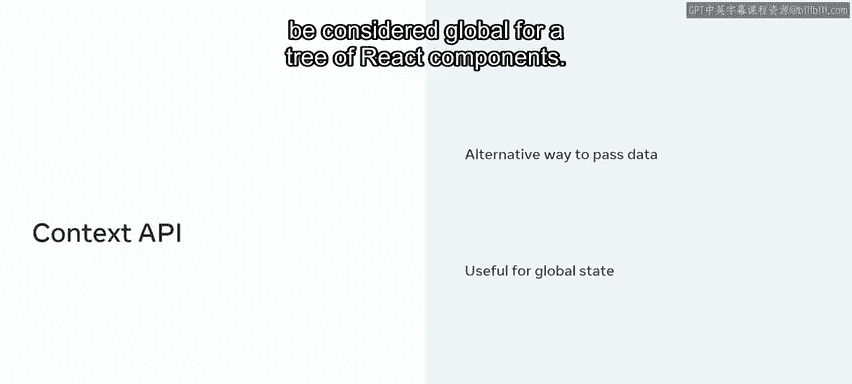
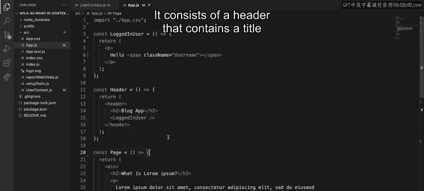
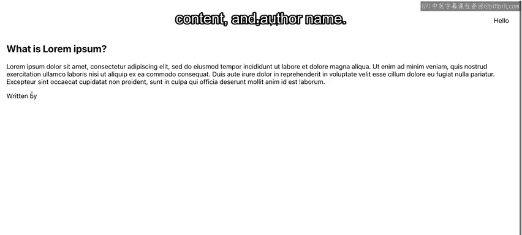
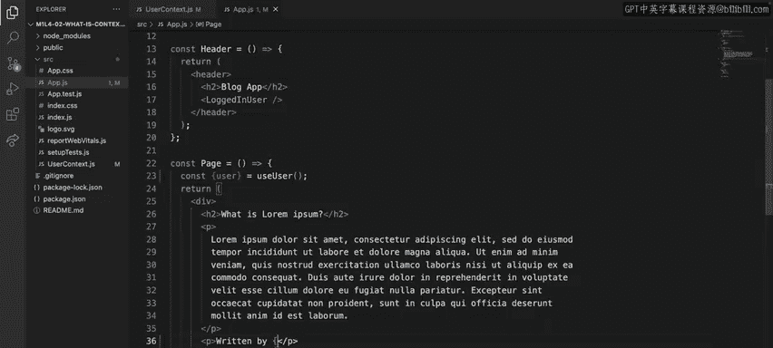

# Meta《前端开发（React／UI、UX／毕业项目／code review）｜Meta Front-End Developer》中英字幕 - P54：12_什么是上下文,为什么使用它.zh_en - GPT中英字幕课程资源 - BV1uJ4m1e7HT

In a typical react app， data is passed from parents to children via props in a top down fashion。

 however， there are certain types of data that may be needed by many components within an app In these scenarios using props which is what react offers us to pass data down is not always effective so in this video you'll be introduced to an alternative way of passing data called context you will learn more about what it is and why it was introduced and explore it in action。

Let's imagine Little Lemon's Food ordering app offers a light or dark theme that changes the background and text colorss of all elements。

 or some general preferences， like a specific locale。

 depending on the visitorsor's geolocation that multiple components should be aware of。

 And what do these pieces of data have in common。 Well。

 they represent a global state for your entire application。😊，Now， as your app grows in size。

 the same will happen with a tree of components your app is composed of， as mentioned earlier。

 props is what Re offers you to pass data down， but in this scenario they can be cumbersome since you will have to explicitly pass that data through every level of the tree having intermediary components that don't really need the data and just act as a proxy。

This issue is commonly referred to as the prop's drilling problem。

 and the name says everything you need to know about the problem。

 Parent components have to drill down props all the way to the children that need to consume them。

The way React has solved this problem is by introducing the context application programming interface or API Conext provides an alternative way to pass data through the component tree without having to pass props down manually at every level。

It is the right tool when you need to share data that can be considered global for a tree of react components。

Let's take some time to examine context API in action。In this demonstration。

 I am going to use a simple app I created previously with C React app。

 It represents a simple blogging platform that Little Le has to publish new innovative recipes to its subscribers。

 It consists of a header that contains a title and the current user that is authenticated on the top right。

 The rest is rendered by the page component， which itself consists of the user blog entries。

 Each one with a title， content and author name。

Note that there are two components that need to know the authenticated user。

 the logged in user component inside the header and the page component。

 because an authenticated user falls into the nature of global data that needs to be shared across several components。

 This is a clear example where context is the perfect tool for the job。

 So let's go ahead and create the needed context， which I am going to call user context。 Now。

 within the user context file， you must follow the next steps。 First， you need to import。

 create context from react。 This is the function that gives you a new context object back。

The function argument is the default value， which in this case I will declare as undefined since the app doesn't know beforehand who the logged in user will be。

Second， you need to create a provider component to do so。

 I will call it user Provider and render the user context dot Pro component。

The Use context dot Pro component is what allows consuming components to subscribe to context changes。

This component accepts a value prop， which is what will be passed to consuming components that are descendants of this provider。

Now for this application， the value Pro should be the authenticated user。

 so I am going to define a new piece of state for it。

Note that this is an oversimplification that already assumes a specific user。

 as in a real world scenario， you will have to fetch the authenticative user first and then set it as state。

 you will learn about fetching data later in the course。All right， so now that the state is defined。

 I will hook it to the value prop。 Next， it's necessary to provide a way for components to subscribe to the context For that。

 I am going to create a custom hook that wraps the use context hook。

 which is the way to consume a context value。This external function is created just for convenience。

 so there's no need to export the user context to external components。As a side note。

 don't worry if you are not very familiar with hooks yet。

 they will be covered in depth in future lessons。The user context is now defined。

 but the app is still not aware of it for that the provider component is needed。

 so I'll go ahead and wrap the whole app with it。 The last step is to consume the user context in the places where the username has to be displayed。

 which are in the logged in user component and the page component。

I'll go ahead and use the custom hook defined find earlier， use user。

 and destructure the authenticated user from there。Finally。

 that information can be embedded in both render methods。

The app now successfully displays the name of the authenticated user， great work。

You've learned about context and why it's used and worked through a practical example of how to use it。

 but keep in mind that although context is useful for a global state。

 it's still recommended that you stick to props and state as much as possible that way your app data flow will be easier to follow。

