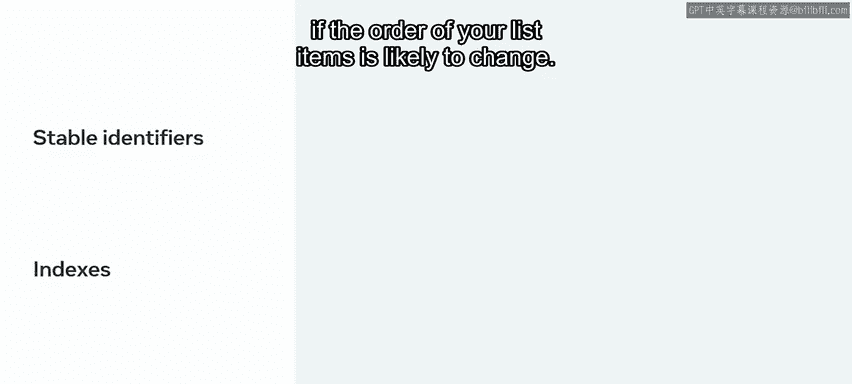
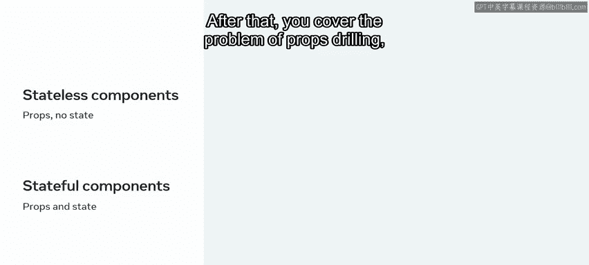

# Meta前端开发课程：P55：13_组件模块总结

在本节课中，我们将回顾React组件模块的核心知识点，包括列表渲染、表单处理、Props与State的区别以及Context API的应用。

## 🎯 模块回顾

恭喜你完成了React组件模块的学习。现在，让我们花几分钟时间来回顾一下到目前为止所学到的内容。

上一节我们介绍了Context API，本节中我们来对整个模块进行总结。

## 📋 列表渲染与Keys

你首先学习了如何使用React渲染列表。课程介绍了JavaScript中的`map`方法，该方法可用于对数组执行转换操作。当你需要以不同方式显示来自外部提供者的数据时，`map`方法是一个非常有用的工具。

以下是使用`map`方法转换列表的示例：
```javascript
const numbers = [1, 2, 3];
const doubled = numbers.map((number) => number * 2);
// 结果: [2, 4, 6]
```

接下来，你学习了如何结合`map`方法与JSX来渲染组件列表，并使用React转换元素集合。

最后，你理解了**Keys**的概念，并学习了一套实用的指导原则，帮助你根据具体用例选择合适的Key。

你了解到，Keys是帮助React识别哪些项目被更改、添加或删除的标识符。它们还指示React在更新发生时如何处理特定元素，以及是否应保留其内部状态。

在处理项目列表时，当你需要提供明确信息来告诉React在UI变化时如何表现，可以使用Keys。

关于Keys的一般规则是：使用一个在其兄弟元素中**稳定且唯一**的标识符。这就是为什么最常用的Key是数据中的唯一ID。



你也了解到，在万不得已时可以使用索引作为Key，但如果列表项的顺序可能改变，这可能会对性能产生负面影响。

## 📝 表单处理：受控组件

接下来，你学习了关于表单的课程，以及React处理表单与传统HTML方式的区别。


你首先认识了**受控组件**。这是一组提供声明式API的组件，允许你在任何时候使用React状态完全控制表单元素的状态。

你学习了如何使用一组受控组件将任何传统的HTML表单转换为React表单。换句话说，你学会了如何使用本地状态、`onChange`事件和`onSubmit`属性，将非受控表单转换为受控版本。

你还发现了受控组件相较于非受控组件的一些优势。例如，它使你能更好地控制表单提交，例如在表单无效时禁用提交按钮。

最后，你学习了如何实现一个反馈表单，以及如何在表单提交前执行任何自定义的验证逻辑。

## ⚖️ Props与State辨析

最后一课首先回顾了Props和State。你学会了清晰地区分Props和State，以及何时使用其中之一。

请记住，尽管Props和State有相似之处（例如，它们都是React用来保存信息的普通JavaScript对象），但Props是传递给组件的，而State是在组件内部管理的。

关键要点包括：如果一个组件需要在某个时间点更改其某个属性，那么该属性应成为其State的一部分；否则，它应该只是该组件的一个Prop。此外，**无状态的组件更可取**。

你还学习了无状态组件（有Props但无State）和有状态组件（两者都有）的概念。

## 🔗 Context API与Props Drilling

之后，你了解了**Props Drilling**问题及其如何影响组件的模块性，因为父组件必须将Props一直向下传递到需要消费它们的子组件。



课程介绍了**Context API**作为此问题的解决方案，并展示了如何使用它来封装任何全局状态片段，从而避免在组件之间手动传递Props。

React Context的强大功能被阐述为本地状态的一个可行替代方案。

## 📚 总结

本节课中我们一起学习了React组件模块的核心概念：从使用`map`方法和Keys高效渲染列表，到利用受控组件处理表单，再到清晰区分Props与State，最后通过Context API解决Props Drilling问题。这些知识为你掌握React奠定了坚实的基础。

期待在下一个模块中继续与你一同学习。