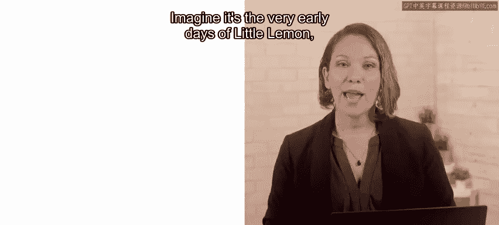
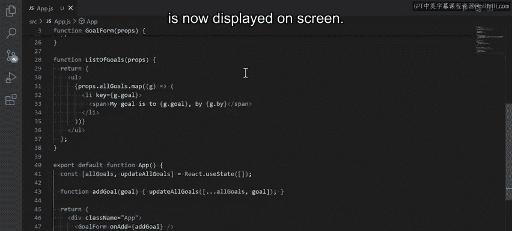
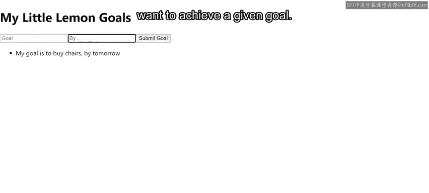
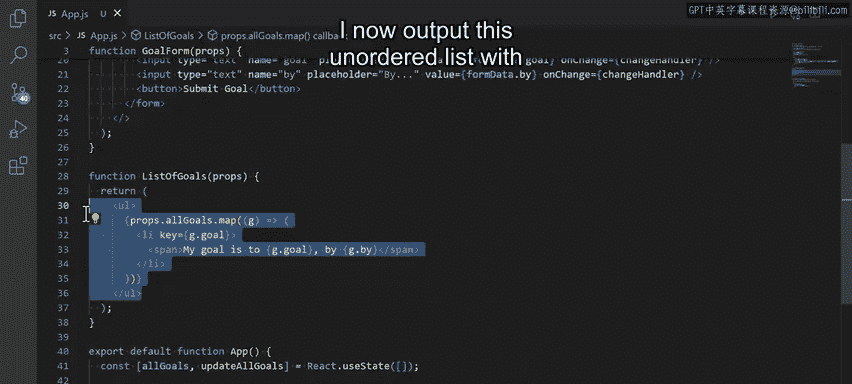

# Meta《前端开发（React／UI、UX／毕业项目／code review）｜Meta Front-End Developer》中英字幕 - P58：16_使用 useState 钩子.zh_en - GPT中英字幕课程资源 - BV1uJ4m1e7HT

Imagine it's the very early days of little lemon with the restaurant only existing on paper。

 The owner would like an app to track the development of the restaurant business and the achievement of all related goals。

 Let's explore how to build a goals app with the described requirements in react using the used state hook in a component and updating the state。

😊。

The completed app is now displayed on screen When this code is compiled。

 I get a heading that reads my little lemon goals， and then I have a simple form with two inputs。

 goal and buy The first input field is there to let the owner type out their goal and the second input field is there to let them type out the time frame within which they want to achieve a given goal。

 The code itself consists of three separate components。 goal form。

 which captures a new goal using a form。 list of goals。

 which loops over all the previously added goals and displays them as an unordered list of list items。

 and the app component， which puts those two components together， and allows me to render them。

 as well as pass the functions that they'll be working with through their props。😊。

Let's explore these。 The first component， namely， the goal form component accepts the props objects in the body of the goal form function。

 I start by declaring a state variable of form data。

 which is destructured from a call to the use state hook。

 I initialize this form data variable as an object with two properties。

 goal and by both assign the values of empty strings。 Next， I declare two functions。

 Change handler and submit handler。 First is the change handler function。

 which accepts an E parameter。 This E parameter is a readily available event object。 In other words。

 I don't have to pass this object from my change handler。

 It's provided to me by a mechanism outside of react。

 Even in plain jascript whenever an event is fired。

 This creates an event object with many different pieces of data related to the event。

 I can then use this event object by simply assigning it a custom name， such as E。😊。

EVT or even event I'm using the letter E here to keep my code concise。

In the body of the change handler function， I update the state of my form data variable by emvoking the previously destructured state setting variable of set form data。

 which was destructured from a call to the use state hook。

The set form data function accepts a shallow clone of the previous value of the form data variable。

 that's the form data variable with the spread operator before it here。

Remember that you should not work with a form data variable directly， which is why I'm making a copy。

This is because of how Re optimizes its virtual Dom。

 keeping state immutable makes it possible to compare a previous version of the virtual Dom with the updated version more efficiently and cost effectively。

Next， I update this new copy of the form data object by adding this code。

 it reads the E target name using the brackets notation。

 then sets the value of this property to whatever is inside that E dot target dot value property of the instance of the event object。

 which was built when that specific event was fired。

The reason why this works with the brackets notation is that it allows me to set the value of the e target name dynamically。

In other words， it allows me to set it as goal。 If the user typed into the input with the name attribute set to goal or to set it as by。

 If the user typed into the input with the name attributes set to buy。 Second。

 I declare a submit handler function， which also accepts the event attribute。

 The goal form component receives the prop named on add。

 and I'm giving the function add goal to it as the props value。 But it's not just any function。

 It's actually a function that's declared right here on line 43 inside the app component itself。

This add goal function accepts a goal entry and updates the value of add goal state variable that's kept inside the app function。

It does this by adding this goal entry to the list of previous goals saved and tracked inside the all goal state variable of the app component。

The update of any state variable must go through the previously destructured state updating function。

In the case of the app component， the state updating function is the Up All Go function。

 that's why I'm invoking this state updating function inside the add goal function。

To make it all work， I also need to pass the add goal function definition to the goal Form JSX element in the app components return statement That's why the add goal function is now available as a prop named on add inside the goal Form function。

 and that's why I can now use it inside the submitit handler function starting up here On line 10。

So I'm back in the Go Form function declaration once the Pros dot on add function is invoked here on line 12。

 it receives the form data variable， which triggers the update of the All Go state variable in the app component as described previously。

😊，But now I still have the form showing the values that the user entered to deal with this。

 I need to reset the form data state variable to an empty string。

 both on the goal property of the form data state object and the buy property of the form data state object。

 This now brings me to the return statement of the goal form function。Here。

 I want you to focus on the form element that has the on submitubmit event handling attribute set to the submitit handler function。

The first and second inputs both follow the same structure of having the type， name， placeholder。

 value， and on change attributes， which hook into the previously described functionality。

Moving on to the list of goals component， this component receives the All goal state variable as a prop from its parent app component。

The purpose of this is to map over the All Go array of objects where each object holds the two properties that describe a single goal。

 as explained earlier。By mapping over the All goals array of objects。

 I now output this unordered list with a list item entry for each individual goal。

 having now worked through coding a goals app in React。

 you should have greater insight into using the Use state hook within a component including how to declare。

 read， and update state。

