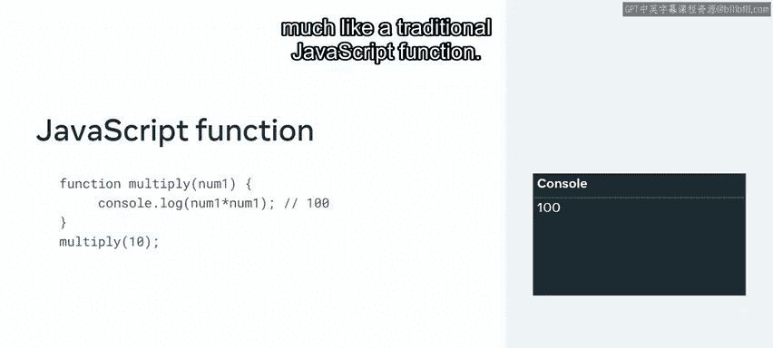
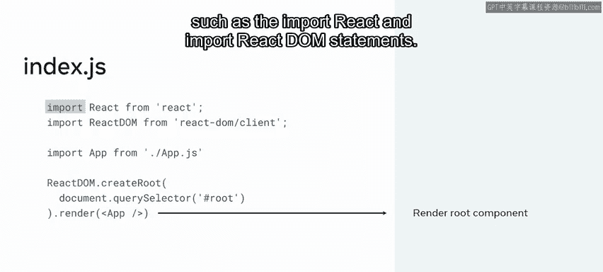
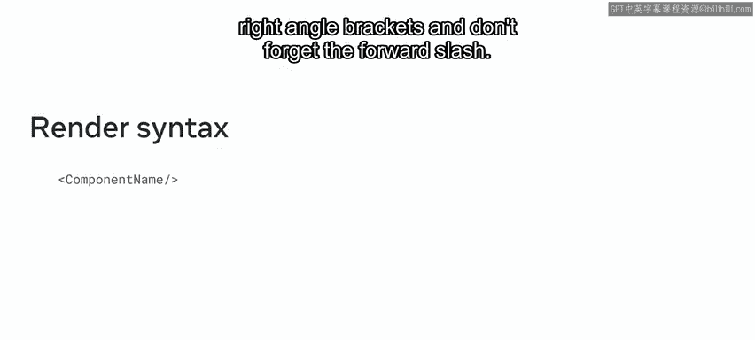
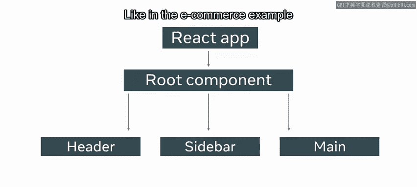
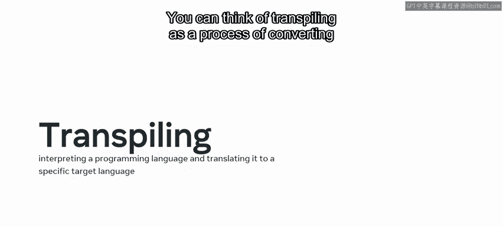

# Meta《前端开发（React／UI、UX／毕业项目／code review）｜Meta Front-End Developer》中英字幕 - P5：4_函数组件简介.zh_en - GPT中英字幕课程资源 - BV1uJ4m1e7HT

Recall how you learned about functions in JavaScript。

 they are reusable blocks of code that can take an input， perform some procedure or calculation。

 and then return an output Well a react component acts much like a traditional JavaScript function。

In this video， you'll continue your exploration of the structure of the react architecture by learning about functional components。

 component types， JSX， and transpiling。React provides two types of components。

 functional components and class components， they behave very similar in react to traditional functions and classes in JavaScript。

Don't worry about class components for now， you'll learn more about them later。😊。

Instead let's just focus on functional components which acts like a JavaScript function in the default react application only one component is rendered and it's the app component located inside the index do JS file that's located inside the source folder it's important to know that every react app must contain at least one component and it's called the rootot component this component is loaded using the import statement you'll learn more about the import statement and react later。

For now， just know that it's used to import code needed for react to work， such as the import。

 React and Im React DoM statements。

The syntax to render a component is very similar to a self closing tag in HTML you just place the component name inside the left and right angle brackets and don't forget to the forward slash。

The root component can contain other components that developers create to represent the various UI parts of the application。

 like in the E-commerce example that you learned about earlier。

 and recall that this component is ultimately converted to a Dom fragment and placed into the existing Dom as a child of the HTML div element with an ID of roots。

This div element is then rendered to the browser。If you analyze the app component。

 you'll notice that it looks very similar to a JavaScript function with some HTML code inside。

You may also notice an export default statement you'll learn more about this soon for now just know that you need it to make your components available Okay so now that you're familiar with the concept of functional components。

 let's explore how web developers create them and react React is scripted using a special kind of syntax called JavaScript XML or JSX for many react developers。

 this is known as a syntax extension to JavaScript。

So what is JSX syntax like let's find out by going back to our react default app component recall that in the return statement of the app function。

 it seemed that some HTML content is returned well this content is not exactly HTML it's JSX。

JSX syntax looks very similar to HTML and one of its advantages is that it allows you to write JavaScript code inside what looks like HTML elements。

In fact， you can think of JSX as a combination of custom HTML and JavaScript。😊。

This allows you to make your website dynamic You'll learn more about the differences between HTML and JSX later For now just know that you can place this syntax inside the return statement of a functional component It's also important to know that a react component won't render until it's used as a JSX element just like a JavaScriptscript function declaration won't run until it's called or invoked Okay so now you know what JSX is let's explore the steps involved to create a react component which will contain some JSX code inside a heading one HTML element to display some text on a webpage。

First， you create the component which is basically just a JavaScript file。

 since its purpose is to return some heading text， you name the file heading。

jS notice that the first letter of the component name is capitalized。

This is because there's a difference in how react treats capitalizeized and noncapitalized component names。

 so it's important to remember that all component names in react must be capitalizeized。

 why is this well because react treats lowercase components as regular HTML elements。

Capitalizing a component name helps react to distinguish JSX elements from HTML elements。

Now let's continue with our component。Next， inside the app。tjS file， create a function named heading。

The function name must also be declared using a capsule letter for the first letter of the function。

Then inside the function body， you create a variable named title and assign it the string value of this is some heading text Now you're ready to create the return statement of the function In the parentheses of the return。

 insert a heading one tag and inside it， place the variable named title to make react evaluate the title variable you need to place it inside curly brackets if you didn't use curly brackets。

 you'd get the word title instead of this is some heading text At this point it's worth remembering that while you are creating HTML like syntax you are actually coding inside a JavaScriptscript file。

And because of this， you can output a variable inside your JSX code。

 something you cannot do when writing static HTML， the overall syntax instructs react to render the heading HTML element with whatever text value that is stored within the variable named title。

This rendering happens behind the scenes because of something called transpiling。

You can think of transpiring as a process of converting JSX to HTML and you'll learn more about this later in this video you learned about functional components and how to create them in react you also learned about JSX which acts like a combination of HTML。

 CSS and JavaScript that you can use to generate dynamic content inside your functional components。

Finally， you'll explore the concepts of rendering and transpiring if you would like to learn about these concepts in more detail。

 there's a link to an additional reading at the end of this lesson。😊。

