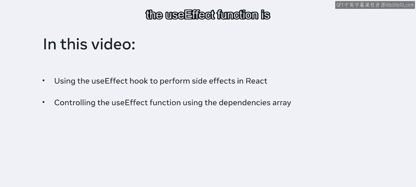
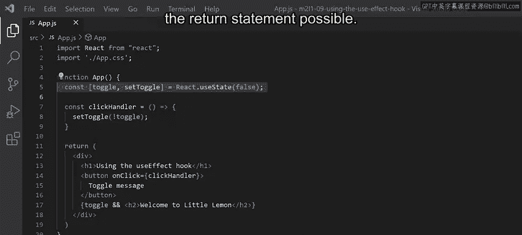
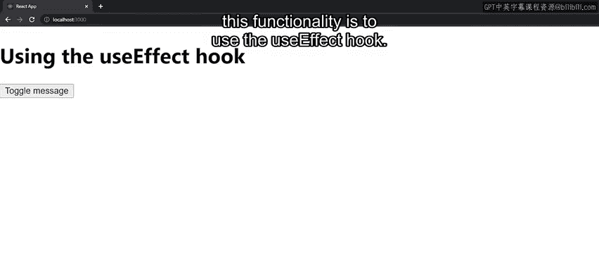
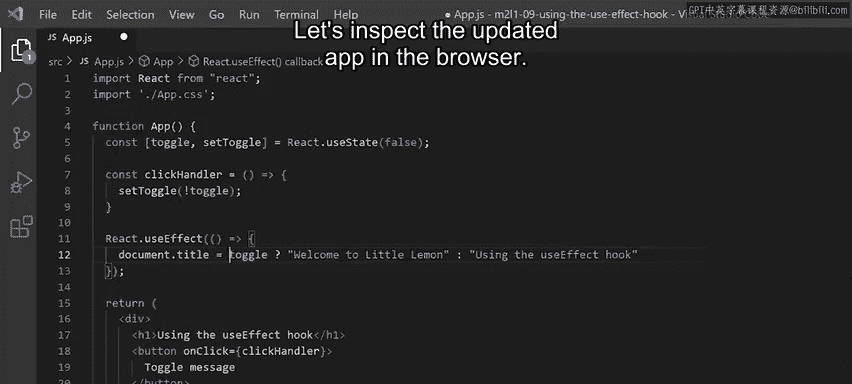
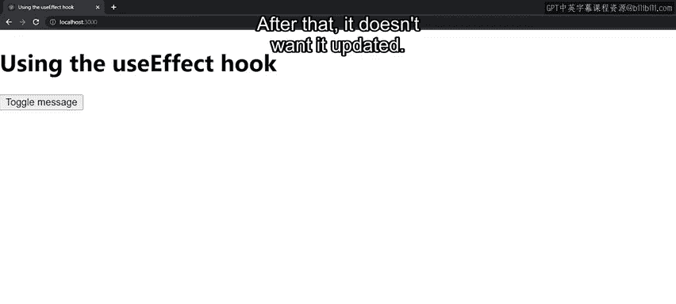
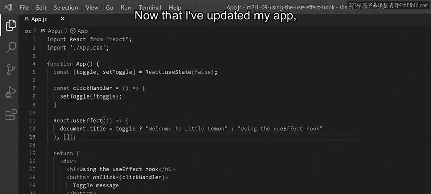
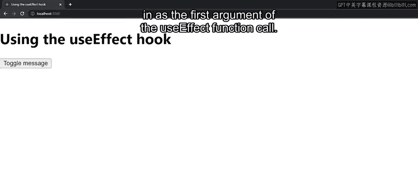
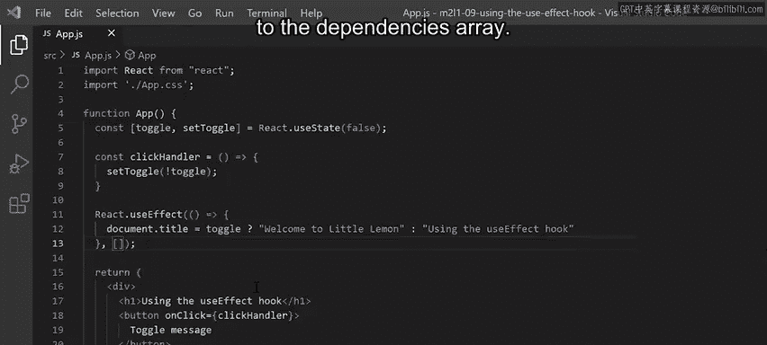
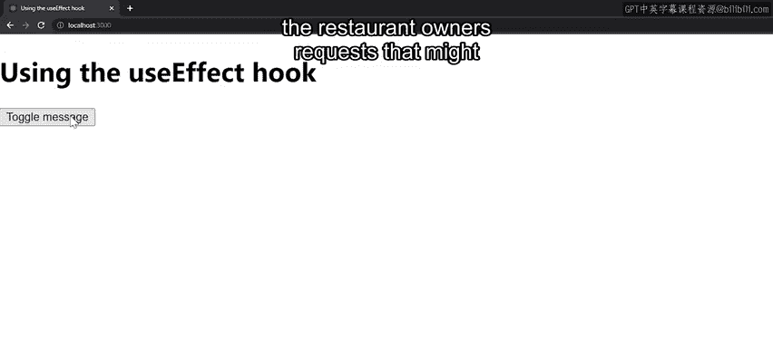
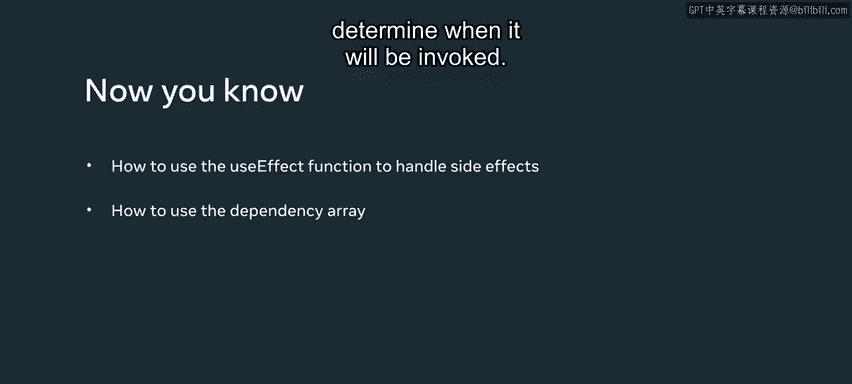

# React 开发：P60：使用 useEffect 钩子 🪝

在本节课中，我们将学习如何在 React 组件中使用 `useEffect` 钩子来处理副作用，例如更新浏览器标签页的标题。我们将通过构建“小柠檬”餐厅应用的一个功能来演示，并重点讲解如何使用依赖数组来控制 `useEffect` 的执行时机。

---

为了演示如何在组件内使用 `useEffect` 钩子，我们将继续开发“小柠檬”应用。

餐厅老板希望添加一种特定的用户交互方式：点击一个按钮时，显示欢迎信息；点击另一个按钮时，隐藏该信息。此外，老板还希望这个变化能反映在运行该应用的浏览器标签页上。

浏览器标签页的更新就是一个副作用的例子。在本视频中，我将演示如何使用 `useEffect` 钩子在 React 中执行副作用，以及如何使用依赖数组来控制 `useEffect` 函数的运行时机。




我将使用之前通过 Create React App 构建的一个应用来演示如何使用 `useEffect` 钩子。让我们从 `return` 语句开始分析。

我有一个包裹性的 `div`，其内部包含一个 `H1` 标题、一个按钮，以及一个使用逻辑与 (`&&`) 运算符进行条件渲染的 `H2` 的 JSX 表达式。

按钮有一个 `onClick` 事件处理属性，它会触发 `clickHandler` 函数。该函数是我在第7行开始声明的一个函数表达式。

在第5行，我通过调用 `useState` 钩子解构出了 `toggle` 变量，用于跟踪其状态，从而使 `return` 语句中的条件渲染成为可能。




现在，让我们在浏览器中检查当前运行的应用。

一切运行正常。当我点击按钮时，如果之前没有显示，按钮下方会出现“欢迎来到小柠檬”的句子，反之亦然。

尽管应用运行良好，但我的应用目前无法按照餐厅老板的要求更新浏览器标签页中的文本。

这是一个副作用的例子，因此添加此功能的正确方法是使用 `useEffect` 钩子。

所以，在 `return` 语句上方，我将按如下方式添加对 `useEffect` 函数的调用：

```javascript
React.useEffect
```




我需要向 `useEffect` 调用传递一个函数，因此我将添加一个不带参数的箭头函数。

在箭头函数体内，我将添加这个三元表达式，它检查 `toggle` 变量的值是 `true` 还是 `false`。如果是 `true`，则返回字符串“欢迎来到小柠檬”。否则，返回字符串“使用 useEffect 钩子”。

无论返回什么，都将赋值给 `document` 对象的 `title` 属性。这个属性会动态更新运行此 React 应用的浏览器标签页上显示的文本。

让我们在浏览器中检查更新后的应用。




我可以确认，每次点击按钮时，标签页的标题都会更新为两个指定字符串中的一个。

假设老板改变了主意，他希望文档标题在组件初始渲染时被设置一次，之后就不再更新。




这时就需要用到依赖数组。依赖数组决定了 `useEffect` 钩子何时被调用。

现在，我将用空依赖数组更新我的代码，这意味着我没有跟踪任何状态变量的状态。换句话说，无论我的应用中发生什么，我都不希望 `useEffect` 钩子被调用。

这意味着它只会被调用一次。之后，无论应用中发生什么，`useEffect` 钩子都不会再运行。

更新应用后，让我们保存更改，并在浏览器中检查这如何影响应用的行为。




`useEffect` 钩子只运行一次，输出“使用 useEffect 钩子”字样。之后，无论我点击多少次“切换信息”按钮，标签页标题都没有进一步更新。

依赖数组的作用是监视特定变量的变化，并基于此执行作为 `useEffect` 函数调用第一个参数传入的函数。




这意味着，如果我希望每当存储在 `toggle` 变量中的值更新时都运行 `useEffect` 钩子，就需要将 `toggle` 变量添加到依赖数组中。




完成此更改后，回到浏览器中，每次点击“切换信息”按钮时，`useEffect` 钩子都会运行。因为点击处理程序通过调用 `setToggle` 函数更新了 `toggle` 状态变量的值。

这反过来又触发了 `useEffect` 的调用，因为依赖数组被设置为监视 `toggle` 变量值的变化。

这样，我就有办法满足餐厅老板可能涉及 React 应用中副作用的任何请求。

现在，你应该对如何使用 `useEffect` 函数处理副作用，以及如何使用依赖数组来确定其调用时机有了更好的理解。




---


本节课中，我们一起学习了 `useEffect` 钩子的核心用法。我们了解到 `useEffect` 是 React 中处理副作用（如操作 DOM、设置订阅等）的主要工具。通过依赖数组，我们可以精确控制副作用执行的时机：空数组 `[]` 表示仅在组件挂载时执行一次；包含特定状态变量的数组 `[toggle]` 表示在该变量变化时执行；不提供数组则表示在每次渲染后都执行。掌握这些概念，你就能在 React 应用中灵活地管理各种副作用逻辑了。