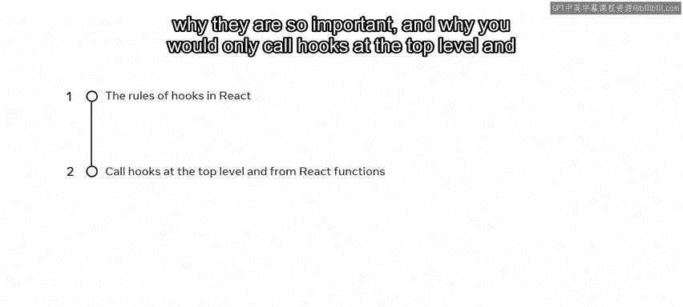
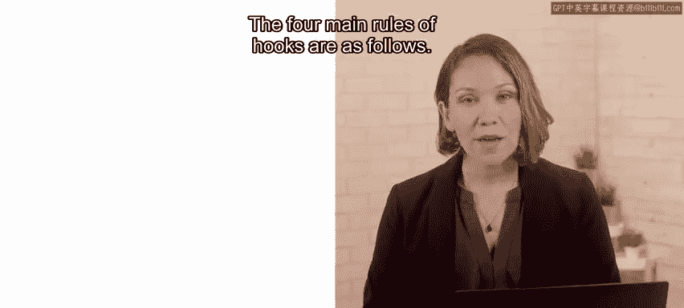
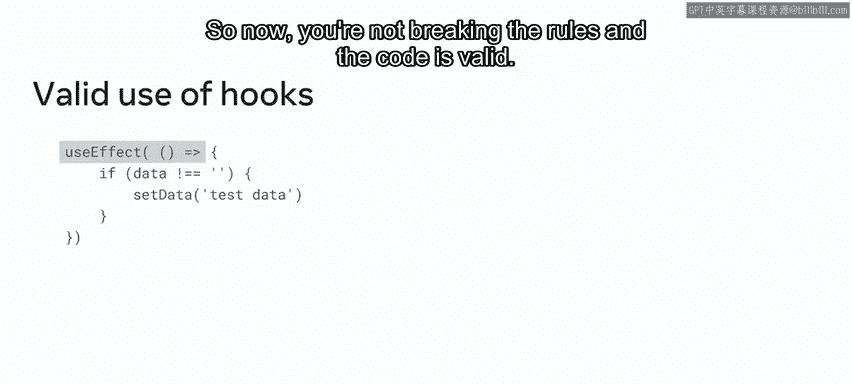

# React 钩子规则详解：P61：19_钩子的规则是什么

## 概述

在本节课中，我们将要学习 React 钩子的核心使用规则。理解并遵守这些规则对于正确、高效地使用钩子至关重要，它们能帮助你避免常见的错误，并确保你的 React 应用稳定运行。

现在，你应该对 React 中钩子的目的和功能有了相当好的理解。你可能已经开始在一些解决方案中使用钩子。如果是这样，你可能遇到过一些情况，钩子可能使你的代码无效。这是因为在使用钩子时，有一些基本规则需要你在 React 应用中注意并遵循。

## 钩子的四大核心规则

以下是钩子的四个主要规则。

**第一**，你应该只从 React 组件函数中调用钩子。





**第二**，你应该只在 React 组件函数的顶层调用钩子。

**第三**，你可以在一个组件内调用多个状态钩子或副作用钩子。

**第四**，始终确保这些多个钩子调用的顺序一致。

现在，让我们更详细地解读每一条规则。

---

### 规则一：仅从 React 函数中调用钩子

第一条规则意味着你不应该从普通的 JavaScript 函数中调用钩子。相反，你应该只从 React 组件函数内部、内置钩子调用（例如 `useEffect`）或自定义钩子内部调用它们。

以下是一个代码示例，描述了一个可以点击为宠物选取新名字的按钮。`nameLooper` 函数用于将宠物名字选项限制为 “Fluffy”、“Rexxi” 或 “Gizmo”。请注意，`useState` 钩子是在 `App` 函数的最外层作用域中调用的，它没有在 `nameLooper` 函数作用域内部等其他地方使用。

```javascript
function App() {
  const [petName, setPetName] = useState(‘Fluffy‘); // ✅ 正确：在组件顶层调用

  function nameLooper() {
    // 这里不能调用 useState
    // 但可以使用状态设置函数
    setPetName(‘Rexxi‘); // ✅ 正确：状态设置函数可以在任何需要的地方使用
  }

  return ( ... );
}
```

然而，你可能已经注意到，这条规则并不阻止你使用状态设置函数（这里命名为 `setPetName`）。状态设置调用可以在任何需要的地方使用。

---

### 规则二：仅在顶层调用钩子

第二条规则意味着你必须在 `return` 语句之前、在循环、条件或嵌套函数之外调用你的钩子。如果你在条件语句中使用钩子，你就违反了规则。

例如，在下面的代码中，`useEffect` 钩子被用在 `if` 条件语句内部，这使得这段代码中的钩子使用无效。

```javascript
// ❌ 错误示例：在条件语句内调用钩子
if (someCondition) {
  useEffect(() => {
    // 副作用逻辑
  });
}
```

---

### 规则三与四：顺序一致性与条件调用

第三条和第四条规则紧密相关。只要始终以相同的顺序调用，一个组件内可以有多个钩子调用。这意味着你不能将钩子调用放在条件语句中，因为这可能导致与上一次渲染相比，某个钩子的调用被跳过，从而破坏调用顺序。

让我们通过一个例子来理解违反规则的后果。在之前描述宠物名字的代码中，如果错误地在 `nameLooper` 函数内部使用了 `useState` 钩子，而不是使用状态设置函数 `setPetName`，就会违反规则。

```javascript
function nameLooper() {
  // ❌ 错误：在嵌套函数内调用钩子，破坏了调用顺序
  const [tempName, setTempName] = useState(‘’);
  // ... 其他逻辑
}
```

如果你编译并运行这个应用，初始时可能看到预期的输出，例如 “I‘d like to name my pet Fluffy” 和一个 “Pick a new name” 按钮。然而，一旦你点击按钮，就会收到一个“无效的钩子调用”错误。这违反了第四条规则，即破坏了渲染之间钩子调用的顺序，从而导致错误。

如果你想有条件地调用一个副作用，你仍然可以做到，但必须确保将条件放在钩子**内部**。

```javascript
// ✅ 正确示例：将条件逻辑放在 useEffect 钩子内部
useEffect(() => {
  if (someCondition) {
    // 条件性的副作用逻辑
  }
}, [someCondition]); // 依赖项中包含条件变量
```



在上面的正确示例中，`useEffect` 钩子被正常调用，随后在钩子内部执行 `if` 条件判断。这样就没有违反规则，代码是有效的。

---

## 总结

本节课中，我们一起学习了在 React 中使用钩子的主要规则及其重要性。我们了解到，必须只在 React 组件函数的顶层调用钩子，并且要确保多次调用的顺序一致。

让我们回顾一下钩子的四大核心规则：
1.  只从 React 组件函数中调用钩子。
2.  只在 React 组件函数的顶层调用钩子。
3.  允许在组件内调用多个状态或副作用钩子。
4.  始终确保这些多个钩子调用的顺序一致。

只要遵循这些简单的规则，你就可以成功地在你的 React 解决方案中享受使用钩子带来的便利。