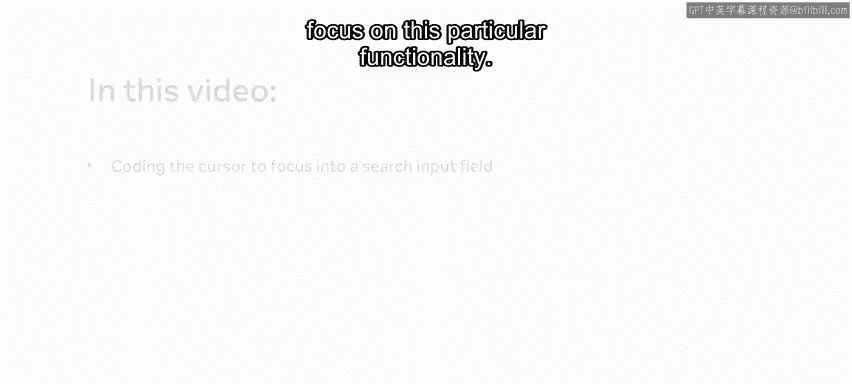
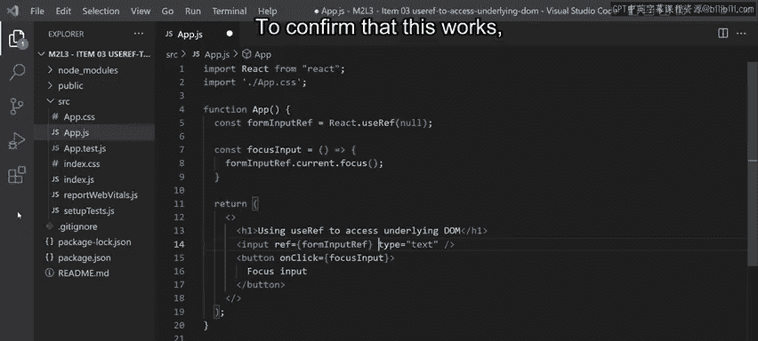
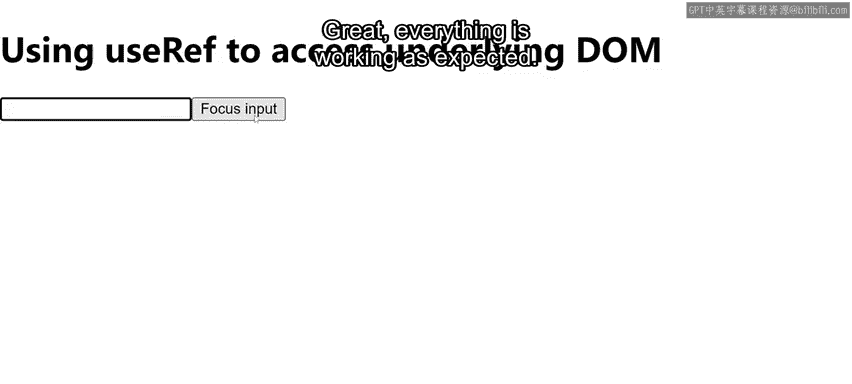
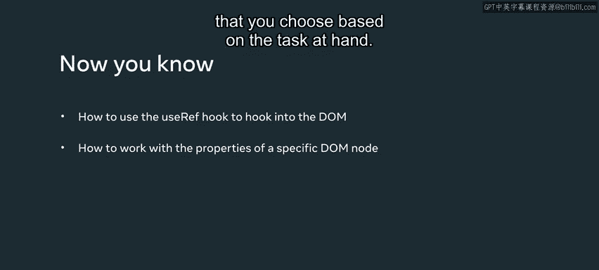

# Meta《前端开发（React／UI、UX／毕业项目／code review）｜Meta Front-End Developer》中英字幕 - P66：24_useRef 访问底层 DOM.zh_en - GPT中英字幕课程资源 - BV1uJ4m1e7HT

Imagine the owner of little lemon would like a search inventory functionality that would focus the cursor into the search input field In this video。

 I will demonstrate how to code this specific requirement in a separate app so that you can focus on this particular functionality。

 So here I have another example app built using creates react app or CR Note that for the purpose of this demonstration。

 I have made some tweaks so that I can more easily showcase the Usere hook。

 So my starting app is just a return statement with a fragment and inside of it。

 an H1 that reads using Useref to access the underlying Dom。

As I'd like to demonstrate how the use Ref hook is used to access the dom。

 I will use it to focus the cursor into an input field， so let me start by adding the input field。

 I will also add a button。Now that I've added an onclick event handling attribute。

 I need to define the focus input function to handle the button clicks for the sake of simplicity。

 my click handler only accesses the form input ref object and then it accesses the focus method on the current property which exists on the form input ref object。

 But what is this object and where does it come from。

 This object is the return value of invoking the use ref hook。

 So on this update to my function I'm invoking the Re user ref function and I'm saving a ref object that is the value return from that function andvocation to a variable named form input ref。

 I'm then setting the JSx expression of form input ref as the value of the ref attribute on the input element。

React will create the input elements Dom node and render it on the screen。

 This dom node is assigned as the value of the current property of the ref object。

 This makes it possible to access the input Dom node and all its properties and values using the syntax form input ref dot current Since I want to access the focus function on the input elements Dom node。

 I'm using the syntax form input ref do current dot focus。

 This allows me to move the focus to the input field so that it is ready to be typed into without the user having to click tab or tab into it。

This is now triggered on a button click to confirm that this works。 I will save all my changes。

 Go to my app being served in the browser， Click outside of the input box and click the focus input button。

 Great， everything is working as expected。 You have just learned about using the userf hook to hook into the Dom and work with the properties of a specific Dom note that you choose based on the task at hand。

