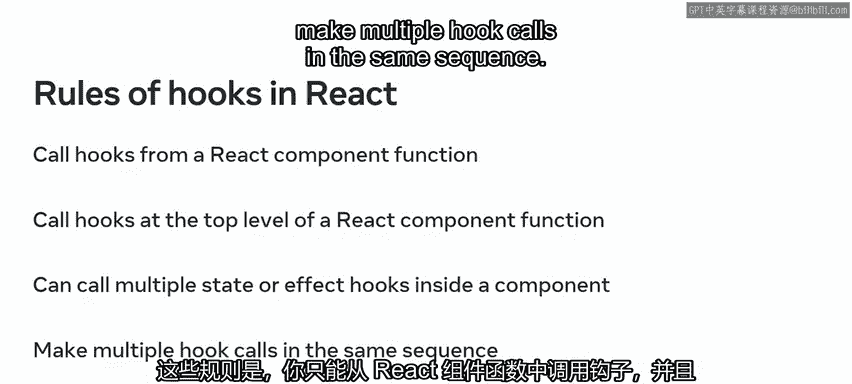
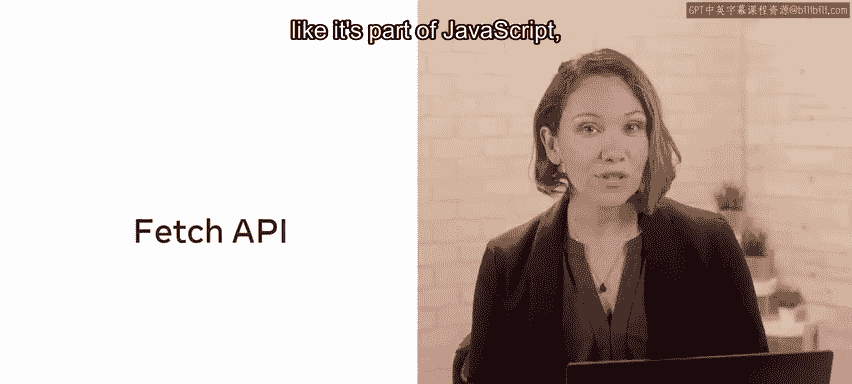
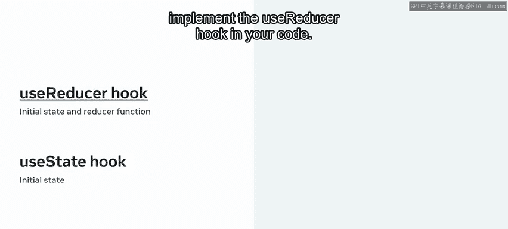
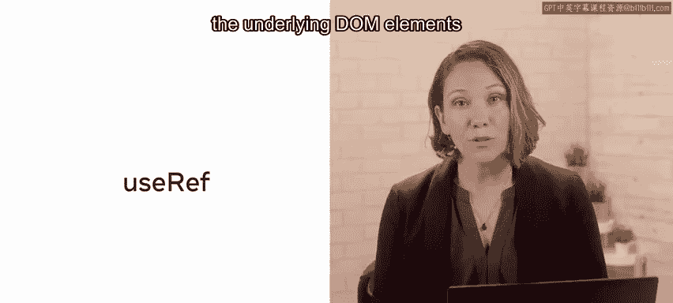

# Meta《前端开发（React／UI、UX／毕业项目／code review）｜Meta Front-End Developer》中英字幕 - P67：25_React 钩子和自定义钩子模块总结.zh_en - GPT中英字幕课程资源 - BV1uJ4m1e7HT

Well done。 You've reached the end of this module on react hooks and custom hooks Throughout this module。

 you've explored hooks in react in depth and covered many important concepts and practical applications that will benefit you as you progress through the course。

It's now time to recap the key lessons you've learned and skills you've gained。

Your first lesson focused on the use state hook， which is used to work with state in a react component。

 You explored how to perform a ready destruct using the use state hook and update state when using use state through the state updating function and even how to change state in response to user generated events like button clicks。

 You then worked through a detailed demonstration， learning how to use the use state hook within a component。

 including how to declare， read and update state。Next。

 you learned about side effects in relation to another important hook。 The use effect hook。

 You discovered that side effects make a function impure with impure functions performing side effects such as invoking console log。

 fetch or the browser's geolocation functionality。 In addition to learning about the use effect hook theoretically。

 you learned how to use the use effect hook to perform side effects within functional components and to control when the use effect function is run using the dependency array through a practical demonstration。

 recall that the dependency array determines when the use effect hook will be invoked。

Following the completion of lesson one of this module。

 you should now be better positioned to work with state and react and to handle side effects in your components。

The second lesson of this module focused on the rules of hooks and fetch and JSON data from the web。

First， you were introduced to the rules of hooks and react and unpacked them。

These rules are that you should only call hooks from a react component function and at the top level of a react component function are allowed to call multiple state hooks or effect hooks inside a component and should make multiple hook calls in the same sequence。

Next， in relation to the fetch function， you learned about the delegation of duties in Javascript referred to as a synchronous jascript。

 You also learned about the fetch function itself， which is a function that looks like it' part of jascript。

 but is actually a way to call a browser API from jascript。

 This LED up to the lesson on fetching data using the state and effect hooks。

 You worked through a demonstration where a call to the fetch API was used to get data from the web using react。

Now that you completed this lesson， you should have greater insight into what happens if a developer doesn't follow the rules of hooks and reactact and be able to describe how data is fetched in both JavaScript and Re。

In the third lesson of this module， you learned about the Use reducer hook and that it differs from the use state hook because it gets a reducer function in addition to the initial state。

 you learned that the use reducer hook could be used in cases where the use state hook would be inefficient。

 such as when you have complex state logic and how to implement the user reducer hook in your code。

You were also introduced to the concept of reps and how they can be used to go beyond the virtual dom and access the underlying dom elements。

 as well as other applications， and have the opportunity to explore coding your own custom hooks。

By completing this lesson， you should be able to use the Use Redr hook to track state as well as roll out your own hooks in your react apps。

You're making excellent progress now that you have a solid grasp of working with hooks。

 it's time to take a deep dive into JSX， which I look forward to guiding you through in the next module。

