# React 前端开发：P68：JSX 组件与元素 🧩

在本节课中，我们将要学习 React 如何利用 JSX 来描述用户界面，理解组件与元素之间的区别，并探索 React 声明式编程模型背后的核心概念。

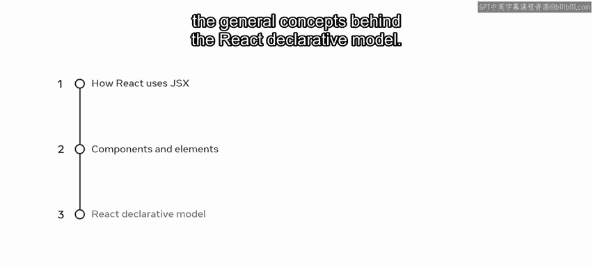

---

## 业务背景与需求

Little Lemon 餐厅的老板们长期以来对他们的原始网站感到满意。但随着业务增长，他们现在希望添加更多功能、交互性和数据分析。他们发现原始网站在进行此类增强时存在诸多限制。在寻求建议后，他们得出结论：应该使用 JSX 和 React 来开发一个应用。他们希望更深入地理解 JSX 和 React，以便为商业计划构建合理的依据。

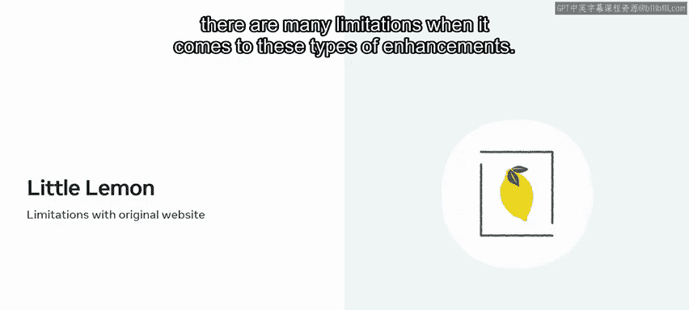

## 什么是 JSX？

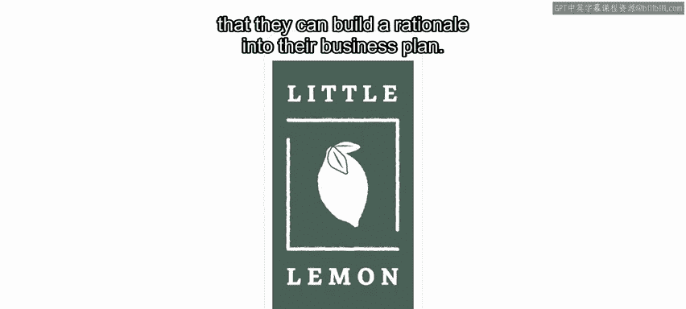

上一节我们介绍了项目的背景，本节中我们来看看 JSX 是什么。

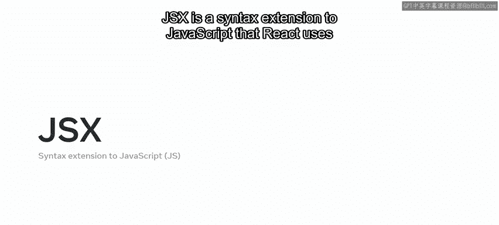

JSX 是 JavaScript 的一种语法扩展，React 使用它来描述用户界面应该是什么样子。然而，尽管 JSX 看起来像 HTML，但它本质上是一个更强大的抽象，它将标记语言和业务逻辑结合到一个称为 **组件** 的实体中。

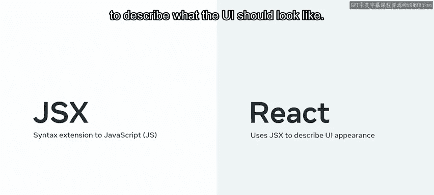

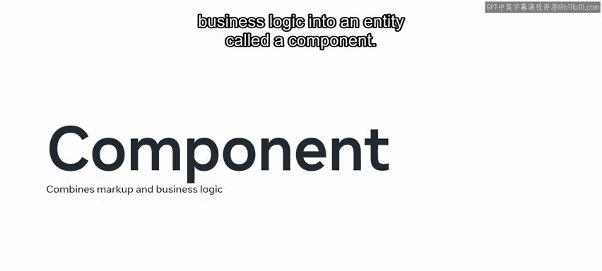

## 从 JSX 到页面：理解元素

在编写 JSX 后，React 如何为你的页面创建所需的资源？要理解所有涉及的步骤，你需要了解 React 中 **元素** 的概念。

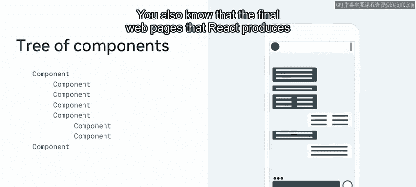

到目前为止，你已经对组件有了很好的理解，知道整个用户界面是由一个组件树表示的。你也知道 React 生成的最终网页不过是纯粹的 HTML、CSS 和 JavaScript。

当 React 分析你所有组件的渲染方法时，它会从根组件开始，获取整个 JSX 树，并创建一个中间表示。这个表示本质上是另一个树形结构，但其中的每个节点不再是 JSX，而是一个描述组件实例或 DOM 节点及其所需属性的普通对象。这个普通对象就是 React 定义的 **元素**。

元素只是一种将最终的 HTML 输出表示为普通对象的方式。它主要由两个属性构成：`type` 和 `props`。

*   **`type`**：定义节点的类型，例如一个 `button`。
*   **`props`**：在一个对象中包含了组件接收到的所有属性。

请注意元素如何通过 `children` 属性实现嵌套，就像按钮示例中那样。当 React 从根元素开始创建整个元素树时，根元素将所有子元素指定为 `children` 属性，每个子元素也做同样的事情，直到到达树的末端。

这个新结构的重要之处在于，子元素和父元素都只是描述，而不是实际的实例。换句话说，当你创建它们时，它们并不指向屏幕上的任何东西。毕竟，它们只是对象。

但这些对象易于遍历，并且当然比实际的 DOM 元素更简单。

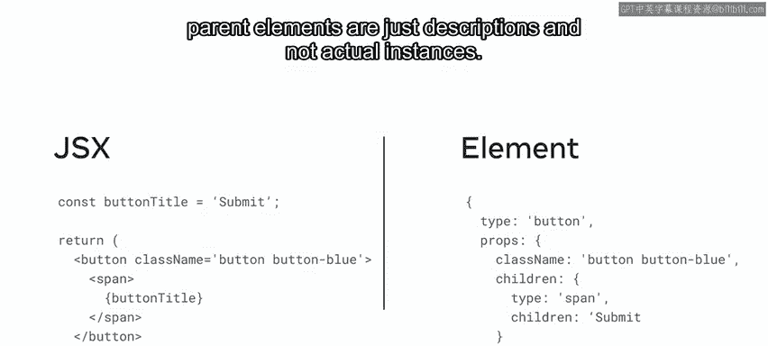

## 组件作为元素类型

到目前为止，我们介绍了使用简单 DOM 节点（如按钮）进行树转换的例子。在元素树中，这被指定为 `type` 属性。但元素的 `type` 也可以是一个函数，对应一个 React 组件。

想象你创建了一个名为 `SubmitButton` 的组件来封装传统的 HTML 按钮。在这种情况下，元素的 `type` 属性将指向该组件的名称。这就是 React 的基本思想：在元素树中，用户定义的组件和 DOM 节点可以相互嵌套和混合。

例如，如果你正在为 Little Lemon 餐厅应用创建一个注销流程，你可以用 JSX 编写一个 `Logout` 组件来实现。在这个 `Logout` 组件中，JSX 将被转换为以下的元素树。

这允许你将组件和 DOM 元素作为 `type` 属性进行混合和匹配，而无需担心 `SubmitButton` 是渲染成一个 `button`、一个 `div` 还是其他东西。这保持了组件之间的解耦，通过组合来表达它们的关系。

当 React 看到一个 `type` 为函数（如 `SubmitButton`）的元素时，它会知道去询问该组件，在给定的 `props` 下它渲染成什么元素。因此，React 会再次询问 `SubmitButton` 它渲染成什么，并将其转换为一个元素。

React 会不断重复这个过程，直到它知道页面上每个组件底层对应的 DOM 标签元素。

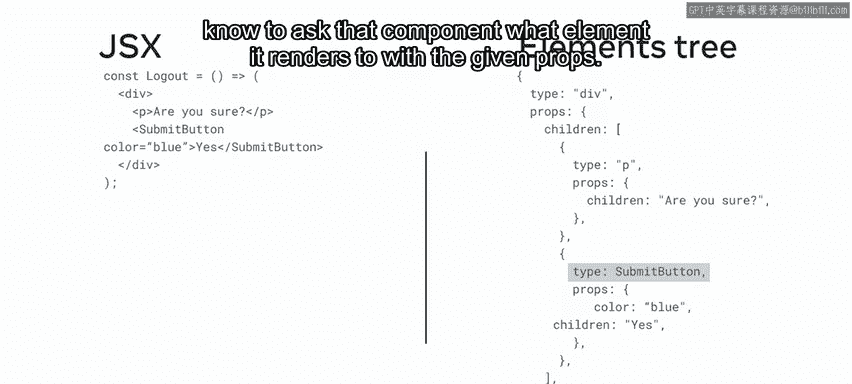

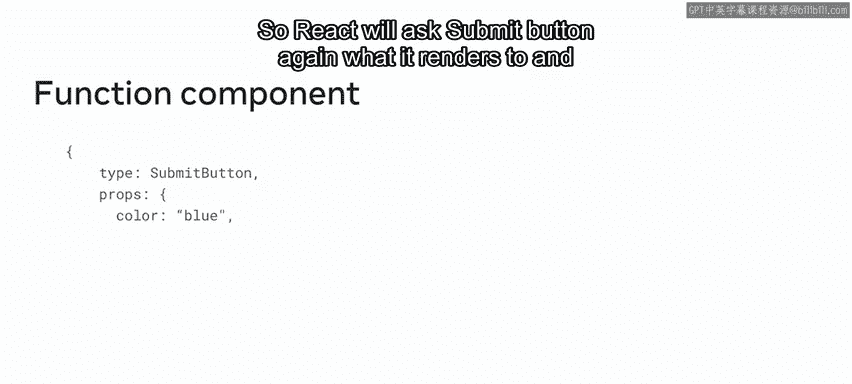

## 虚拟 DOM 与更新过程

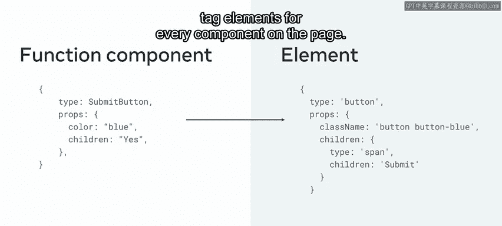

一旦 React 完成了从元素树中识别所有用户定义组件的过程，它就会将它们转换为 DOM 元素。结果就是通常所说的 **虚拟 DOM**，它是真实 DOM 的一个 JavaScript 替代表示。

那么，当你的用户界面发生新变化时，涉及哪些步骤呢？

以下是更新过程的关键步骤：

1.  **生成新树**：React 会获取你所有的 JSX，并生成一个新的 UI 表示，即一个元素树。
2.  **对比差异**：它会将这个新树与内存中保存的先前表示进行比较。
3.  **计算差异**：计算两棵树之间的差异。回想一下，由于树中的每个节点都是一个 JavaScript 对象，这个差异计算操作非常快。
4.  **应用更新**：基于这个差异，React 会对底层的 DOM 节点应用最少数量的更改来处理更新。

就是这样。你可能已经开始体会到 React 声明式编程模型的优美之处了。

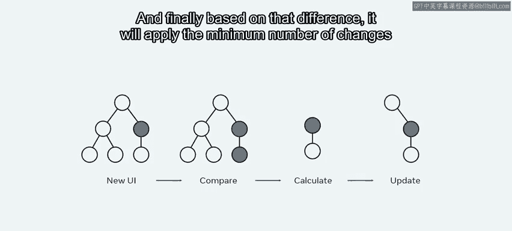

---

## 总结

本节课中我们一起学习了 React 如何使用 JSX 来描述用户界面，理解了组件（可复用的 UI 构建块）与元素（描述 UI 的普通对象）之间的区别，并探索了 React 声明式模型背后的核心概念。我们还看到了 React 如何将你的 JSX 转换成一个内部的元素树（这些元素只是 JavaScript 对象），正是这种轻量级的表示方式，使得 React 能够以可预测的方式更新你的 UI，同时为高性能应用提供足够快的速度。