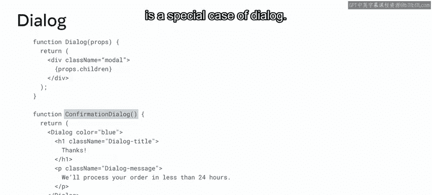
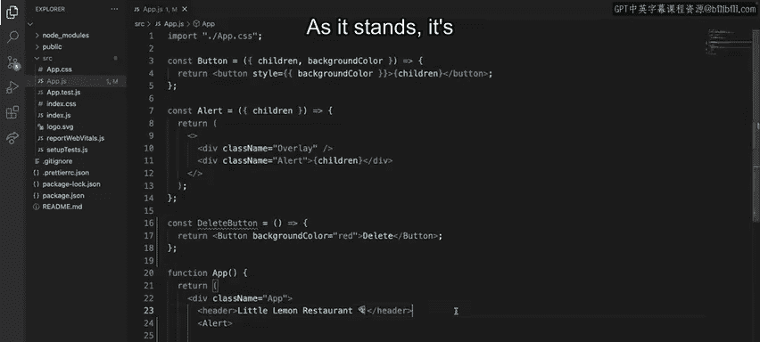
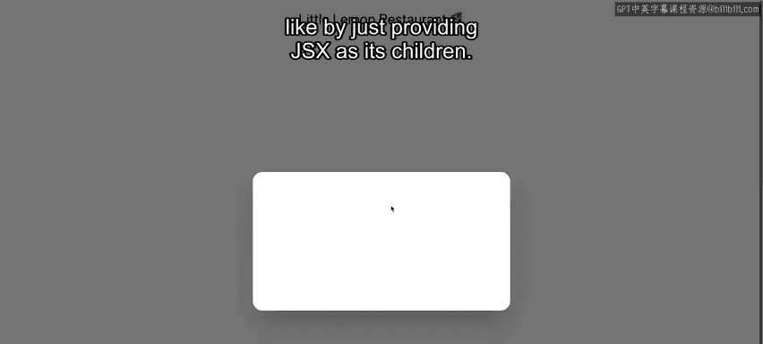
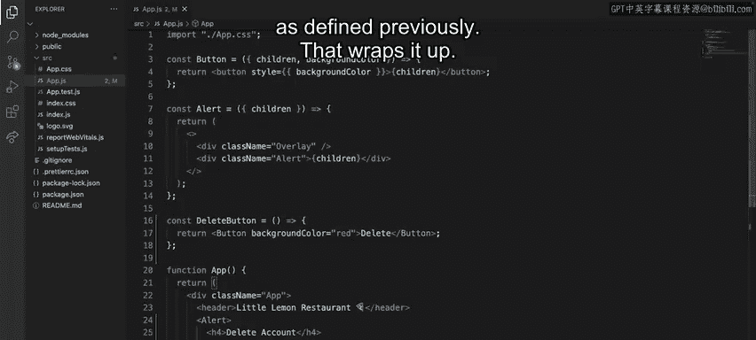

# React组件设计：P70：带有子组件的组件组合 🧩

在本节课中，我们将要学习React中一个强大但常被忽视的概念：**组件组合**。我们将重点探讨如何使用特殊的 `children` 属性来构建更灵活、更可复用的组件。

## 概述

当设计React组件时，开发者常常会忽略一个最重要的属性：`children` 属性。这个所有组件都具备的特殊属性，是React强大组合模型的基础。

假设Little Lemon餐厅希望用户能在其应用上拥有账户。这意味着需要在应用中构建创建、管理和删除账户的流程。这类流程可以通过使用 `children` 属性的组件组合来简单高效地构建。

## 组件组合的两大特性

组件组合主要依赖于两大特性：**包含** 和 **特化**。让我们来详细分解这两个特性。

### 包含

包含特性指的是，某些组件在编写时并不知道其子内容是什么。这对于像侧边栏或对话框这类组件尤其常见，它们在你的UI中划定一个特定区域来容纳其他元素。你也可以将它们视为**通用盒子**。

> 注：对话框是一种模态窗口，在用户处理并与之交互之前，UI的其余部分会被禁用。

对于这些“盒子”组件，推荐的方法是使用 `children` 属性，直接将子元素作为其内容传递。

让我们通过一个对话框的例子来探索这一点。

以下是一个 `Dialog` 组件的示例，它充当“盒子”，负责样式化容器，使其看起来像一个模态窗口：

```jsx
function Dialog({ children }) {
  return (
    <div className="dialog-overlay">
      <div className="dialog-box">
        {children}
      </div>
    </div>
  );
}
```

通过使用 `children` 属性，它变成了一个通用组件，我们可以向其提供任何有效的JSX作为子内容。

为了说明这一点，我们定义了一个 `ConfirmationDialog` 组件，它使用 `Dialog` 组件，并将一个标题和一段描述渲染为其子内容：

```jsx
function ConfirmationDialog() {
  return (
    <Dialog>
      <h2>确认操作</h2>
      <p>你确定要执行此操作吗？</p>
    </Dialog>
  );
}
```

这个例子也展示了组件组合的第二个特性：**特化**。

### 特化



特化定义了组件是其他组件的**特殊情况**。在上面的例子中，`ConfirmationDialog` 就是 `Dialog` 的一个特例。

## 实践：构建账户删除对话框

现在你已经熟悉了组件组合的基础知识，让我们动手编写一个应用来演示所学内容。这个应用是使用 `create-react-app` 创建的。

想象一下，Little Lemon希望为用户提供一种简单的方式来删除他们的账户（如果他们愿意的话）。我们的目标是构建一个通用的对话框组件，其中包含一个标题、一段描述和一个警告按钮，以确保用户了解操作的后果——所有这些都使用组件组合。

我已经创建了两个通用组件：一个 `Button` 和一个 `Alert`。`Button` 使用 `children` 属性来指定其文本，而 `Alert` 是一个通用盒子，它在背景渲染一个遮罩层，并在屏幕中央渲染一个白色模态框。`children` 属性决定了该模态框的内容。

以下是构建步骤：

第一步是使用组件组合的**特化**特性创建一个警告按钮。为此，我将定义一个名为 `DeleteButton` 的新组件，在其中渲染 `Button` 组件，并将其属性配置为红色和文本“删除”。

```jsx
function DeleteButton() {
  return <Button color="red">删除</Button>;
}
```

接下来，我将渲染 `Alert` 组件。



```jsx
function App() {
  return (
    <Alert>
      {/* 内容将在这里定义 */}
    </Alert>
  );
}
```

目前，它只是一个通用的白色盒子或容器。这说明了组件组合的第二个特性：**包含**。

我可以按照我想要的任何方式自定义盒子的内容，只需提供JSX作为其子元素。为了满足Little Lemon的要求，我将创建一个标题为“删除账户”的标题，以及一个告知用户相关操作的段落。

```jsx
function App() {
  return (
    <Alert>
      <h2>删除账户</h2>
      <p>此操作将永久删除您的账户。您确定要继续吗？</p>
    </Alert>
  );
}
```



我想明确指出，如果他们删除账户，将错过主厨的美味食谱，所以我将在描述中反映这一点。

最后一步是渲染之前定义的 `DeleteButton`。



```jsx
function App() {
  return (
    <Alert>
      <h2>删除账户</h2>
      <p>此操作将永久删除您的账户，您将无法再访问主厨的美味食谱。您确定要继续吗？</p>
      <DeleteButton />
    </Alert>
  );
}
```

这样就完成了。

## 总结

本节课中，我们一起学习了React中称为**组件组合**的技术及其重要性。你也学会了如何运用组合的两大关键特性——**包含**和**特化**，并通过一些实际例子探索了如何利用特殊的 `children` 属性来创建更健壮、更可复用的组件。