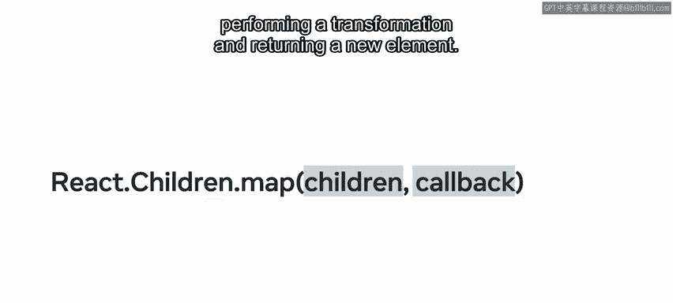
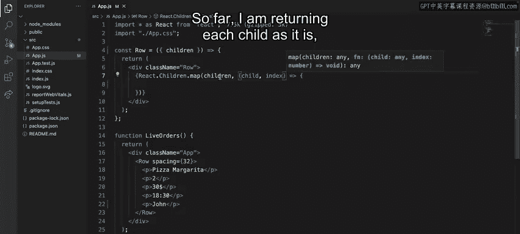
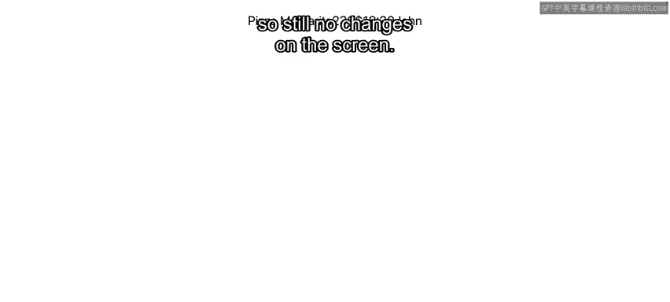
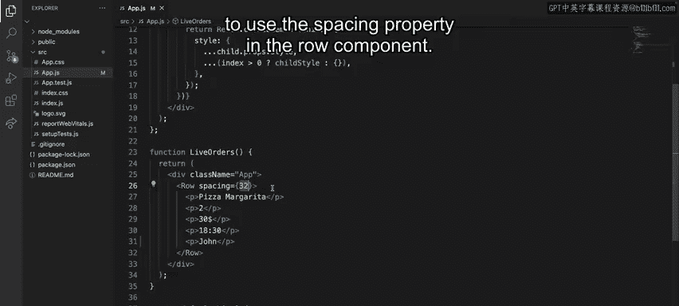
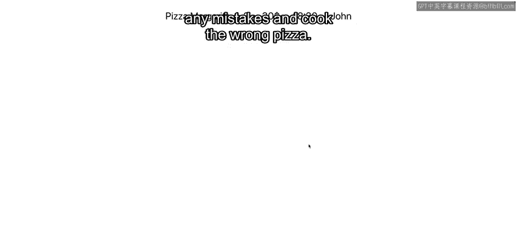

# React 前端开发：P71：在 JSX 中动态操作子组件 🧩

在本节课中，我们将要学习 React 中两个强大的顶层 API：`React.cloneElement` 和 `React.Children.map`。它们允许你动态地操作和转换组件的子元素，从而创建出更灵活、更智能的组件设计模式。

---

## 理解 React 子元素与组合模型

React 的 `children` 是所有组件隐式拥有的特殊属性之一。结合 React 的组合模型，它开启了一种新的组件设计范式。到目前为止，你可能已经学会了如何利用这个特殊属性，并且是以“只读”模式使用它，即你的组件按原样消费它。

但是，如果我们能更进一步，以任何方式、形状或形式来转换你的子元素呢？为了说明这一点，假设 Little Lemon 餐厅希望有一种方式，能在顾客下单时可视化实时订单的摘要。对于厨房工作的厨师来说，将每个顾客订单显示在单独的一行中，包含菜品名称、每道菜的数量、总价、提交时间和顾客全名，会非常有用。

通过使用一组新的 React API 来提升你的组件设计技能，你将能够为 Little Lemon 提供一个智能且高效的解决方案。让我们从探索其中两个强大的 React API 开始：`React.cloneElement` 和 `React.Children`。

---

## 探索 `React.cloneElement` API

`React.cloneElement` 是 React 顶层 API 的一部分，用于操作和转换元素。顶层 API 指的是你从 `react` 包中导入这些函数的方式。你可以在文件顶部将 `react` 作为全局对象导入，并将其作为该对象上的方法来访问，或者也可以使用命名导入。

请记住，元素只是 React 内部用来描述你希望在屏幕上显示内容的普通 JavaScript 对象。`React.cloneElement` 可以有效地克隆并返回所提供元素的一个新副本。

其函数签名如下：
```javascript
React.cloneElement(element, [props], [...children])
```
*   第一个参数是你想要克隆的 React 元素。
*   第二个参数是将要添加并与传递给组件的原始属性合并的新属性。

在 React 中，属性（props）是不可变的对象。因此，你必须先创建元素的副本，然后在副本上执行转换。这正是 `React.cloneElement` 允许你实现的功能。

这个 API 非常有用，它允许父组件执行以下操作：
*   修改子组件的属性。
*   向子组件添加属性。
*   扩展子组件的功能。

例如，你可以动态地向之前示例中的提交按钮元素添加另一个属性。

---

## 探索 `React.Children` 工具集



另一个用于操作子元素的重要顶层 API 是 `React.Children`，它提供了用于处理 `props.children` 数据结构的实用工具。

其中最重要的方法是 `map` 函数。`React.Children.map` 与数组的 `map` 函数非常相似，它对其 `children` 属性中包含的每个子元素调用一个函数，执行转换并返回一个新元素。

其函数签名如下：
```javascript
React.Children.map(children, function[(thisArg)])
```

---

## 实战演练：为 Little Lemon 餐厅创建订单行



如果这些概念听起来还有点令人困惑，不用担心。让我们通过一些代码来更好地理解。Little Lemon 餐厅正忙于接收实时订单。为了可视化这些订单的摘要，我的任务是将其中的每一个显示在一行中，并且在每条关键信息之间保持固定的水平间距。

在这个应用程序中，有一个客户提交的订单，要求一份玛格丽特披萨。每个订单包含菜品名称、数量、总价、提交时间和客户全名。我创建了一个 `Row` 组件来处理每个项目之间的分隔。目前，它只是按原样返回子元素，因此屏幕上的所有项目都挤在一起，没有分隔。

让我们开始使用 `React.cloneElement` 和 `React.Children.map` 来实现解决方案，以解决分隔问题。



首先，我将使用 `React.Children.map` 函数来遍历每个子元素。
```javascript
const Row = ({ children, spacing }) => {
  const childStyle = {
    marginLeft: `${spacing}px`,
  };

  return (
    <div className="Row">
      {React.Children.map(children, (child, index) => {
        return React.cloneElement(child, {
          style: {
            ...child.props.style,
            ...(index > 0 ? childStyle : {}),
          },
        });
      })}
    </div>
  );
};
```
到目前为止，我按原样返回每个子元素，所以屏幕上仍然没有变化。为了实现均匀的水平间距，我将添加一些自定义样式，为每个子元素（第一个除外）设置左边距。为了指定间距大小，我将创建一个名为 `spacing` 的新属性，它代表像素数，并使用字符串插值来正确设置以像素为单位的边距样式。

现在样式已经定义好了，我需要将其作为 `style` 属性附加到每个元素上。因此，在 `map` 函数的回调中，我将使用 `React.cloneElement` 返回元素的一个新副本。第二个参数允许你指定新的属性。在这种情况下，我想添加一个新的 `style` 属性，它将与之前的样式合并。如果元素不是第一个子元素，那么我也会合并包含 `marginLeft` 声明的 `childStyle` 对象。

最后一步是在 `Row` 组件中使用 `spacing` 属性。让我们将其设置为 32 像素。
```javascript
<Row spacing={32}>
  <span>Pizza Margarita</span>
  <span>2</span>
  <span>$30</span>
  <span>18:30</span>
  <span>John Smith</span>
</Row>
```
完成了！现在，每个实时订单都清晰地展示了所有信息，这样厨师就不会犯任何错误，也不会做错披萨。



---



## 总结

在本节课中，我们一起学习了两个新的 React API：`React.cloneElement` 和 `React.Children.map`。它们为你提供了一个强大的工具集，让你能够轻松地动态操作子元素，从而极大地增强了组件的灵活性和可复用性。通过实际案例，我们看到了如何利用这些 API 解决现实中的布局问题，例如为 Little Lemon 餐厅的订单创建清晰的可视化行。