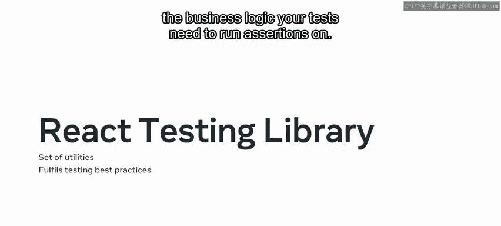
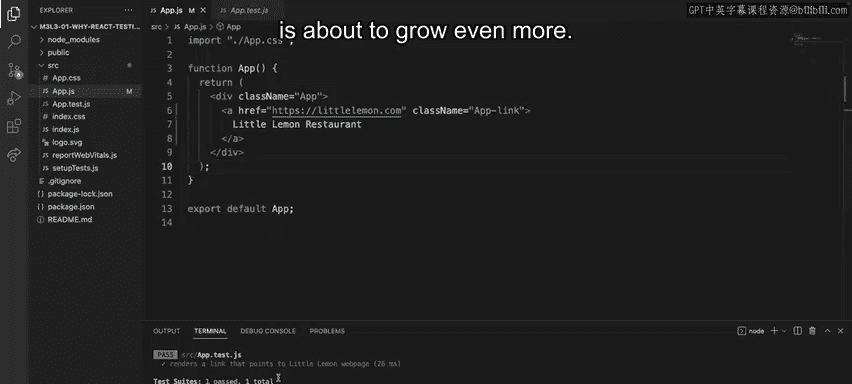

# Meta前端开发课程：P76：为什么使用React测试库 🧪

在本节课中，我们将学习如何为React组件编写自动化测试。我们将探讨测试的重要性、最佳实践，并介绍Jest和React测试库这两个核心工具。通过一个实际例子，你将了解如何从零开始构建一个测试。

---

## 为什么需要自动化测试？

作为Little Lemon餐厅应用的开发者，你如何保证你创建的应用能按预期工作？你可以选择依靠自己系统化的能力，手动与应用的所有不同部分进行交互，以确保应用功能完整。然而，手动测试每一个新增的改动，可能会变得繁琐、容易出错且耗时，尤其是在应用复杂性增加时。

这正是自动化测试的用武之地。

---

## 测试的重要性与最佳实践

就像工厂对其生产的产品进行测试以确保其符合预期一样，开发人员也需要对自己的代码进行同样的测试。一套设计良好的自动化测试套件，能让你在交付给客户之前有效地发现缺陷或错误。因此，测试对于保证所开发软件的质量至关重要。

此外，通过在错误进入线上应用之前发现它们，测试可以减少用户投诉，并最终为组织节省时间和金钱。

既然你已经了解了测试的重要性，那么在编写测试时需要牢记哪些最佳实践呢？

以下是需要遵循的核心原则：

*   **避免包含组件实现细节**：React只是一个工具，你的最终用户根本不会意识到React的存在。因此，你的测试不应处理已渲染的React组件实例，而应处理实际的DOM节点。
*   **测试应模拟软件的使用方式**：你的测试越接近软件的实际使用方式，它们给你的信心就越足。
*   **测试应具备长期可维护性**：只要功能不变，组件实现的任何更改都不应破坏你的测试，从而拖慢你和团队的进度。

---

## 测试工具：Jest与React测试库

现在，让我们来探索React官方推荐用于构建测试的两个工具：Jest和React测试库。

**Jest**是一个JavaScript测试运行器，它让你可以访问一个名为`jsdom`的模拟DOM。虽然`jsdom`只是对浏览器工作方式的近似模拟，但对于测试React组件来说通常已经足够。Jest提供了良好的迭代速度，并结合了诸如**模拟模块**等强大功能，让你能更好地控制代码的执行方式。

> 回忆一下，**模拟**指的是制作一个仿制品，它使你能够用更简单、能模拟相同行为的函数来替换代码中的复杂函数。模拟功能可用于确保你的单元测试是独立的。

**React测试库**是一组实用工具，让你能够在不依赖组件实现细节的情况下测试React组件。它的设计初衷就是为了满足前面强调的所有最佳实践，让你能够开箱即用地获得一个配置良好的测试环境，并专注于测试需要运行断言（assertions）的业务逻辑。



---

## 实践：编写你的第一个测试

理论部分已经介绍完毕，接下来让我们使用Jest和React测试库从头开始实现一个测试。

当你使用`create-react-app`启动一个新项目时，默认已经预装了Jest和React测试库。这两个工具都已预先配置好，并且在你的根文件夹中有一个名为`App.test.js`的示例测试文件。

假设Little Lemon与一家热门餐厅聚合平台达成协议，将其网页作为一个新URL列入其列表。在`App.js`文件中，`App`组件在页面上渲染了一个指向Little Lemon网页的链接。

让我们逐步分析我创建的、用于自动验证该链接是否始终存在的测试。

首先，需要从`@testing-library/react`中导入`render`和`screen`。

```javascript
import { render, screen } from '@testing-library/react';
```

*   `render`函数用于渲染你想要测试并对其执行断言的组件。
*   由于查询整个`document.body`非常常见，React测试库还导出了一个`screen`对象。这是对`document.body`的引用，并且所有查询方法都已预先绑定到它上面，这意味着在执行搜索时，它会自动在整个文档中查找。

现在，为了包装测试场景，Jest提供了全局的`test`函数。它接收两个参数：第一个是文本描述，第二个是一个函数，用于组合你的测试需要执行的所有步骤。这个函数不需要导入，因为Jest会自动将其注入到所有测试文件中。

以下是测试步骤：

1.  在模拟的DOM环境中渲染`App`组件。
2.  使用`screen`对象对`document.body`进行查询。这里，我使用`getByText`工具函数，询问文档的`body`标签是否能找到一个内部文本为“Little Lemon Restaurant”的元素，并将查找结果存储在`linkElement`对象中。如果搜索成功，`getByText`将返回找到的元素；否则，返回`null`。
3.  最后，为了完成测试，我执行一个断言，询问上述查询得到的`linkElement`是否存在于文档中，即它当前是否在屏幕上可见。为此，使用了全局的`expect`函数，这是Jest全局提供的另一个实用工具，无需显式导入。

`expect`函数接收查询结果，并附加一个特定的匹配器。在这个例子中，匹配器指的是在整个文档中可见的元素。

```javascript
test('renders learn react link', () => {
  // 1. 渲染组件
  render(<App />);
  // 2. 查询元素
  const linkElement = screen.getByText(/Little Lemon Restaurant/i);
  // 3. 执行断言
  expect(linkElement).toBeInTheDocument();
});
```

如果我运行这个测试，它会失败。让我们检查输出日志以了解问题所在。日志指出，它无法找到文本为“Little Lemon Restaurant”的元素。

有趣，让我们再次检查`App.js`组件。啊哈，我犯了一个错误，把“Lemon”打成了“Orange”，而这个错误被测试捕捉到了。这正是测试失败时你希望看到的情况。

同时，你可能已经注意到编写测试断言是多么直接。你在代码中看到的一切，都能很好地转化为真实用户与你的应用交互的方式，并产生你期望的行为。

现在问题已经修复，让我们再次运行测试。太好了，测试通过，Little Lemon的线上曝光度即将进一步增长。

---



## 总结

本节课中，我们一起学习了测试的重要性以及测试的最佳实践。你现在已经掌握了如何使用**Jest**和**React测试库**来测试你的React组件。请保持关注，因为很快你将发现编写更复杂的测试是多么容易。