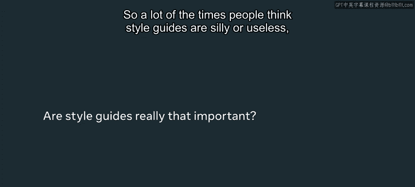
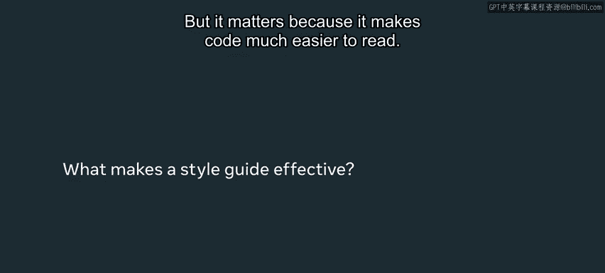
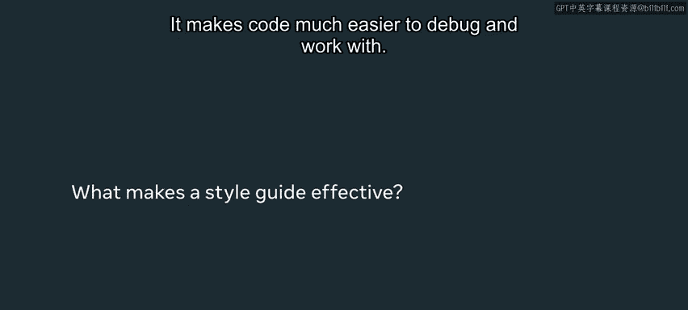
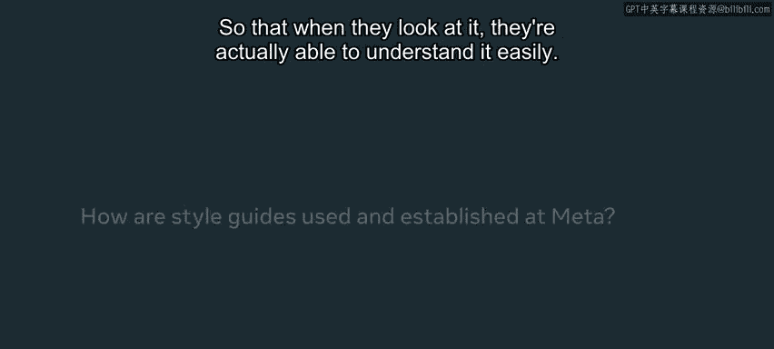
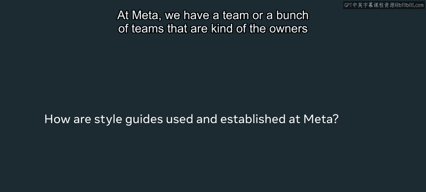

# 前端开发（React/UI、UX/毕业项目/代码审查）：P78：样式指南 📚

在本节课中，我们将要学习**样式指南**的重要性及其在软件开发中的核心作用。我们将探讨为何遵循一致的代码风格对于代码的可读性、可维护性以及团队协作至关重要。

---

我曾经非常不喜欢样式指南，认为它们不重要。但现在，如果看到不符合风格的代码，我会立刻注意到，并且感到非常沮丧。因此，我现在非常重视它们。

我的名字是Martra，是Meta公司西雅图办公室的一名软件工程师。

很多时候，人们认为样式指南很傻或没用，可能并不真正重视它们。我在审查许多新开发者的代码时经常看到这一点，我的很多评论实际上是关于代码风格的。这可能看起来我很烦人，或者我在挑剔一些不重要的事情，因为遵循风格并不会从功能上改变代码的运行方式，它只是改变了代码的外观。所以人们会想：这有什么关系呢？代码的功能还是一样的。

**但这很重要，因为它使代码更容易阅读，也更容易调试和使用。** 这是一个大问题，因为很多时候我们写代码不仅仅是为了自己，也是为了别人。因此，提前投入时间，正确地设计代码风格是非常值得的。

我们遵循样式指南的一个目标是确保代码是**自文档化**的。这非常有帮助，因为开发者无需花费时间撰写详细的注释来解释一切。如果你查看代码，通过变量命名的方式或函数结构的方式，你就能理解它，代码自身就说明了问题。这非常重要，因为它减轻了开发者编写文档的负担，也减轻了其他开发者阅读文档的负担。同时，当新成员查看代码时，也更容易发现问题。很多时候，我们编写了代码，但后续并非由我们持续改进或维护，而是由其他人接手。因此，以清晰、风格良好的方式编写代码，是对后来者的一种服务，当他们查看代码时，能够轻松理解。

在Meta，我们有一个团队（或几个团队）负责制定样式指南，以确保公司在不同的代码库中遵循相似或一致的指南。因为样式指南是那种可能涉及不同观点、品味和实现同一目标的不同方式的事情。即使有多种正确的方法，我们也希望保持一致。我们希望选择一种方式，并在整个代码库中保持一致，这样开发者在查看代码库的不同部分时就不会感到困惑。

Meta的每个人都在使用或遵循由负责团队创建和管理的样式指南。我是一名工程师/开发者，和公司里所有编写代码的人一样，每天都在遵循和使用这些样式指南。

学习编码和样式指南，你可能会想：我为什么需要这个？实际上这并不复杂。你需要它，因为它就像一项投资。遵循这些样式指南、坚持它们并学习好的样式指南，将对应用程序及其稳定性、可用性、可读性以及未来为改进它所做的任何事情（无论是添加新功能还是修复错误）产生重大影响。因此，它可能看起来是开发和编写软件中不重要的部分，但如果你是为长期编写代码，它实际上会产生巨大的影响。

---

本节课中我们一起学习了**样式指南**的核心价值。我们了解到，良好的代码风格并非无关紧要的装饰，而是提升代码**可读性**、**可维护性**和**团队协作效率**的关键实践。通过遵循一致的样式指南，我们可以编写出**自文档化**的代码，这不仅减轻了开发者的负担，也为项目的长期健康发展奠定了基础。记住，编写整洁的代码是对未来接手项目的同事的一份重要礼物。