# Meta《前端开发（React／UI、UX／毕业项目／code review）｜Meta Front-End Developer》中英字幕 - P79：37_JSX 和测试模块总结.zh_en - GPT中英字幕课程资源 - BV1uJ4m1e7HT

Well done。 You have reached the end of this module on react J S X advanced patterns and testing。

 Let's take a few minutes to review what you have learned so far。

 You began the module with an in depth lesson on J S X。

 You were presented with a distinction between components and elements。

 You learned the components or functions that take data or props as an input and return a tree of elements as output。

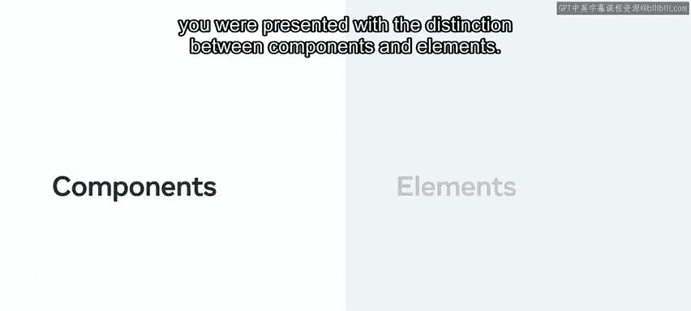

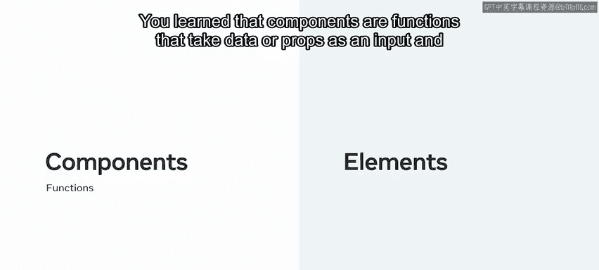

You also learn that elements are just plain JavaScript objects that offer a lightweight representation of the Dom and let react。

 update your user interface in a fast and predictable way。

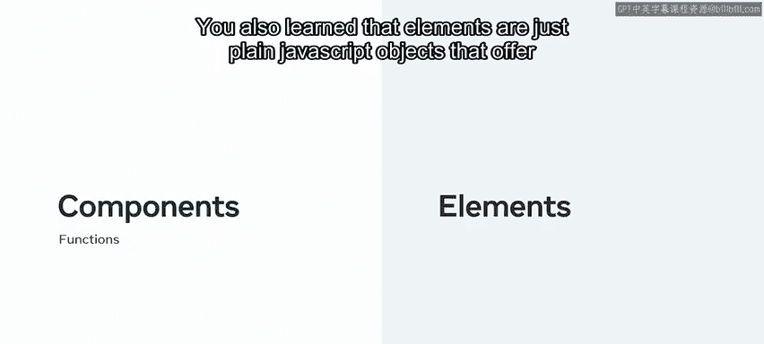

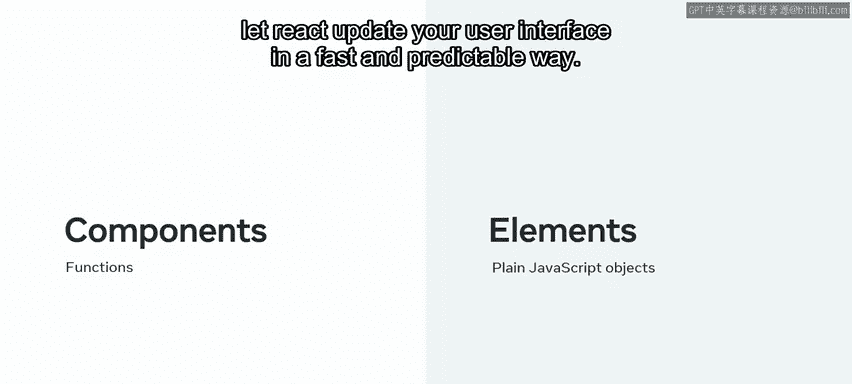

Next， you discovered the importance of component composition and the use of the children prop you were introduced to containment and specialization。

 the two main properties that component composition has。

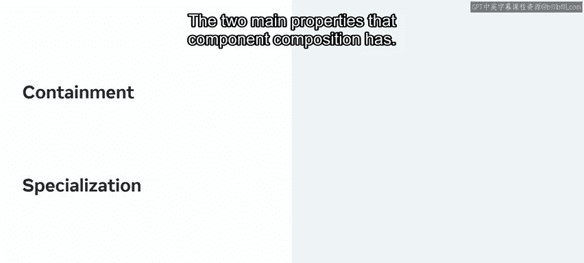

You learn that containment is a technique that is applicable to components that don't know their children ahead of time。

 like a dialogue or a sidebar， and that it uses the special children prop to pass elements directly as their content。

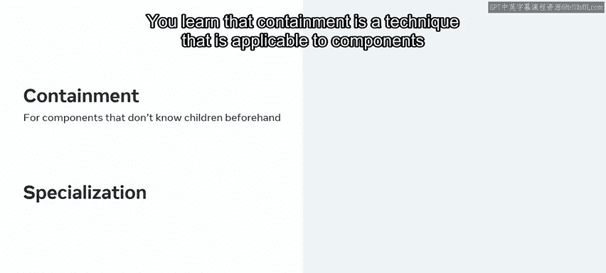

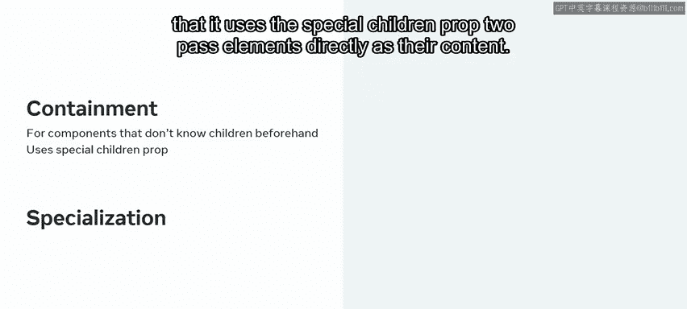

You were also introduced to specialization， a technique that allows you to define components of special cases of other components。

 like creating a confirmation dialogue based on a dialogue。

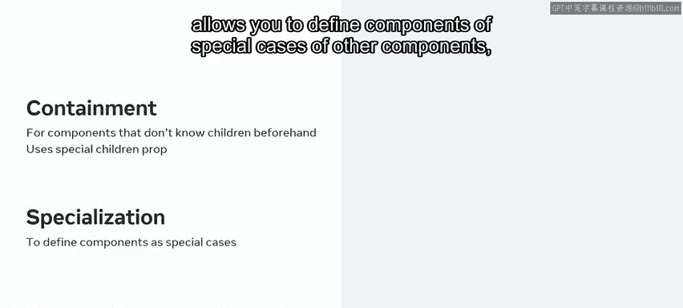

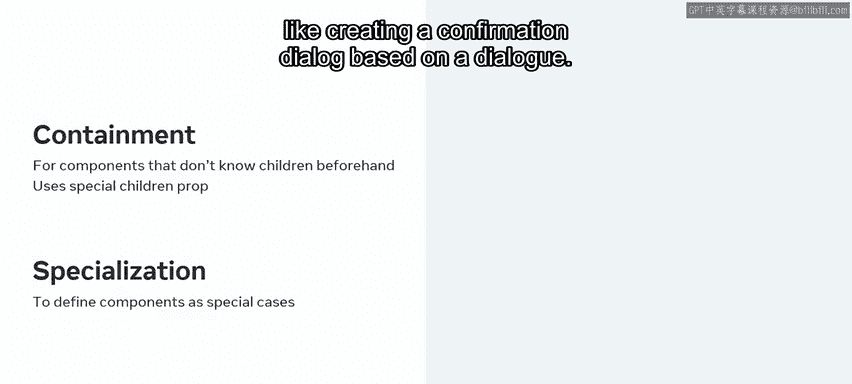

Then you moved on to a lesson about manipulating children dynamically in JSX Here。

 you were introduced to a couple of new react APIs。 Re dot clone element and Re dot children。

 You learned that react dot clone element clones and returns a new element。

 allowing you to manipulate and transform elements directly in your JSX。

You also learned that reactor。children。m is useful for children manipulation and that when used in conjunction with react。

clona element， enables a powerful composition model for creating flexible components。

You worked through a practical example of those two APIpis where a row component was implemented to separate its children evenly。

 Finally， you were introduced to the spread operator in react。

 You learned that the spread operator enables two main operations and objects， copying and merging。

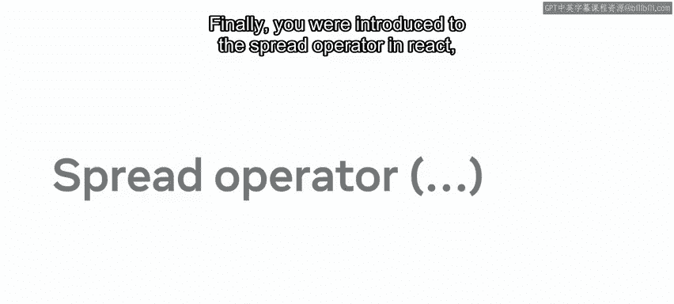

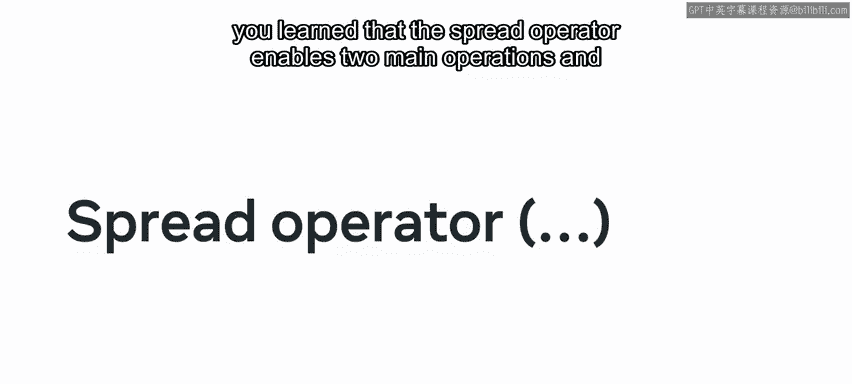

You then saw how reactact uses that operator to spread all the props instead of having to type them manually one by one。

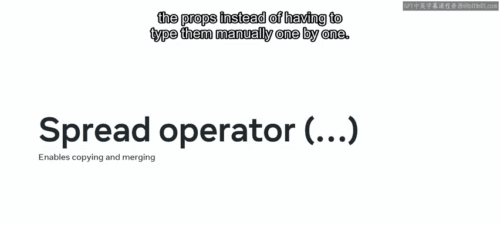

Finally， you were presented some practical examples that illustrated how the spread operator allows the creation of flexible components。

 You then moved on to a lesson on advanced patterns to reusing common behavior。

 The lesson started with an overview of cross cutting concerns in react。😊。

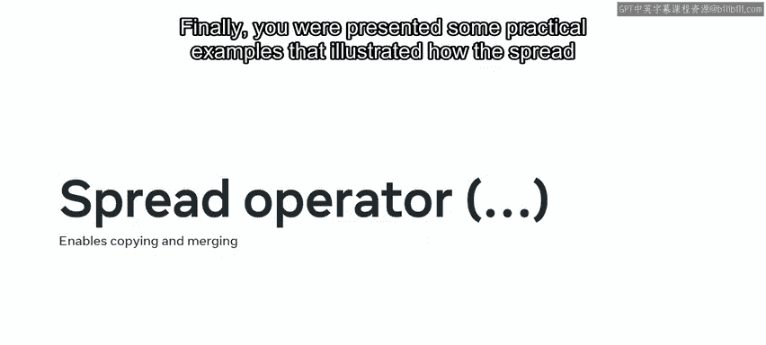

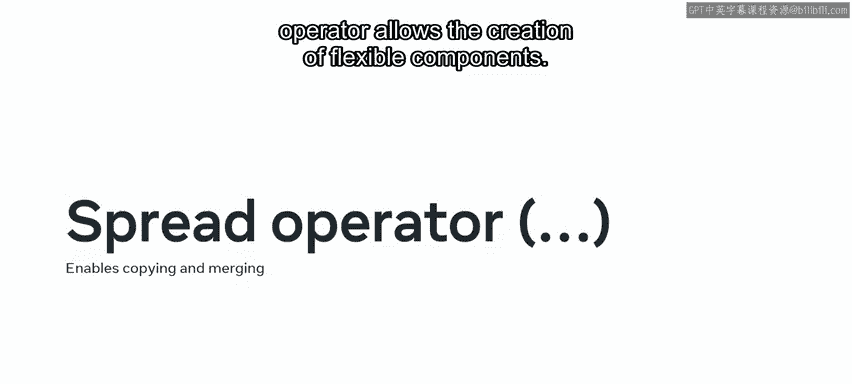

You learned that cross cutting concerns refers to generic functionality that is not related to the application business logic and that is needed in many places like handling errors。

 authentication or fetching data。 You understood why components。

 despite being the primary unit of code reuse and react。 don't fit this type of logic。After that。

 you were presented with two techniques for cross cutting concerns。

 The first technique you were introduced to was the higher order component technique。

 which you learned enables a powerful abstraction for creating cross cutting concerns。

 You were also presented with an example of how data fetching can be abstracted using this technique。

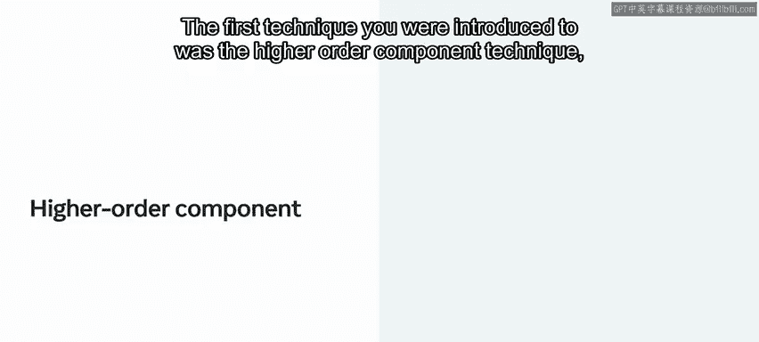

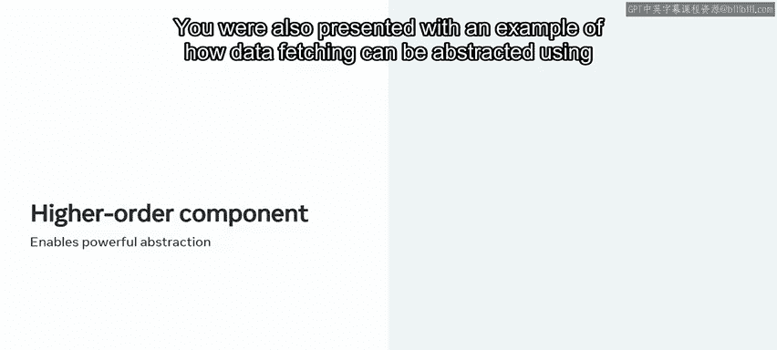

As part of a practical lesson on higher order components。

 you learned that a higher order component is just a function that takes a component and returns a new one。

 You were presented with a required code structure to create a higher order component and examined an application of a higher order component that handled the position of the mouse pointer on the screen。

 Then you learned about the second technique for cross cutting concerns called render props。

 which is a special prop you add to your components with a particular attribute of being a function that returns a react element。

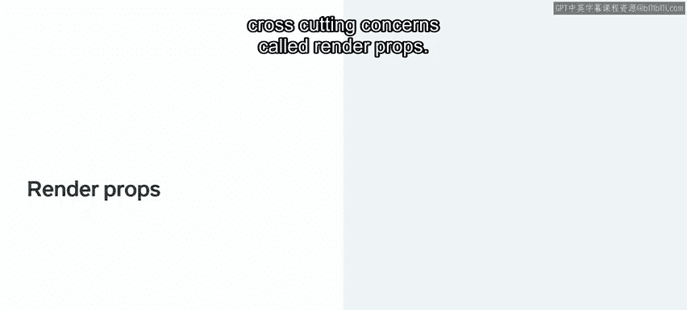

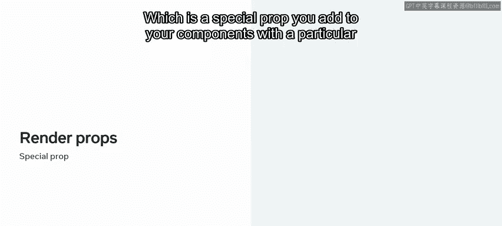

You discovered that， as opposed to higher order components。

 the new props are injected dynamically as the parameters of the function and worked through a practical example where the render props technique was used to abstract the functionality of fetching data from a server。

 The module ended with a lesson on component testing using react testing library。

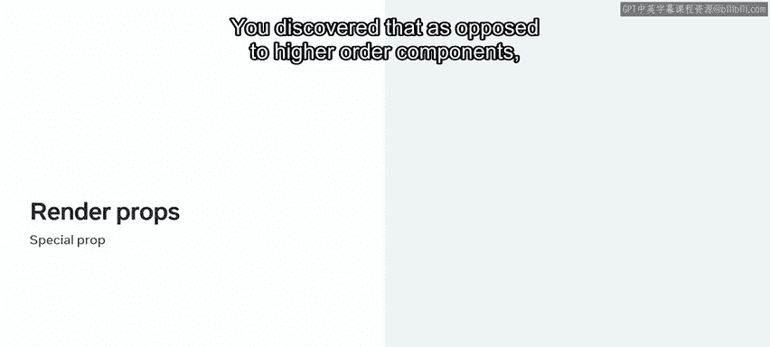

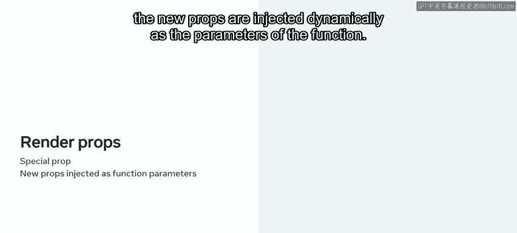

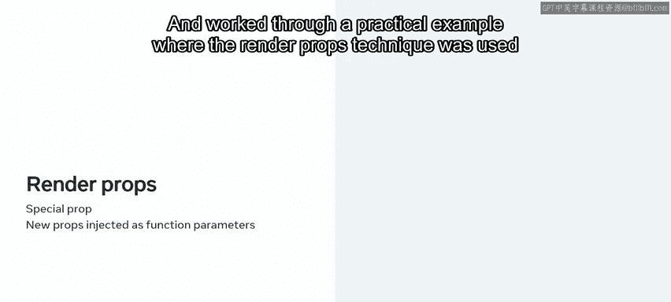

The lesson began with a comprehensive explanation as to why Re Test library is the recommended tool for your tests。

😊，You learned that to guarantee that your application's work as intended。

 a suite of automated tests is crucial。

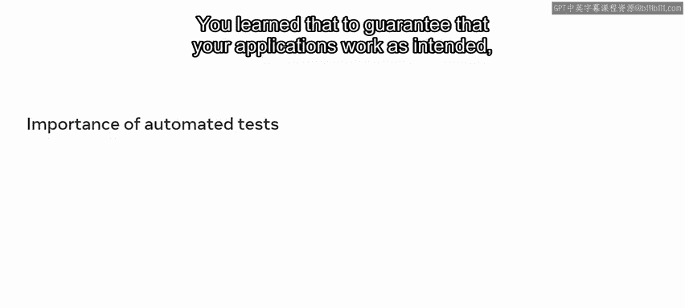

You are presented with best practices when it comes to testing。

 seeing how the Re testing library has been designed with all of them in mind。

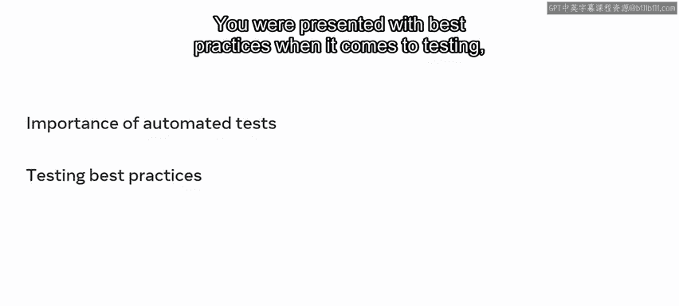

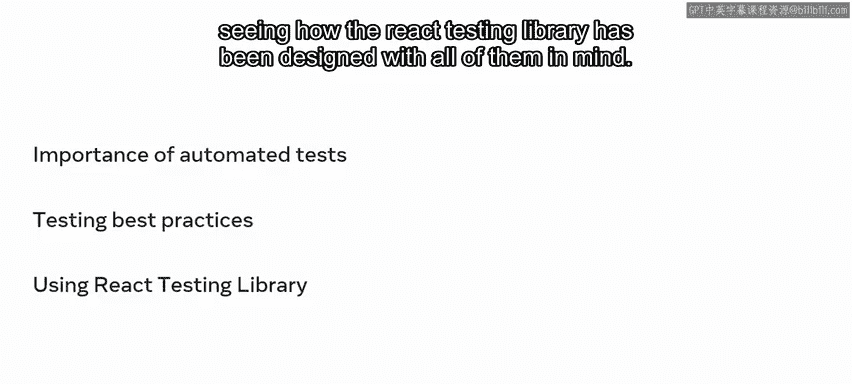

Finally， you were introduced to a basic example of a test with Jest， the recommended test runner。

 and React Test library to illustrate the basic scaffolding of a test。

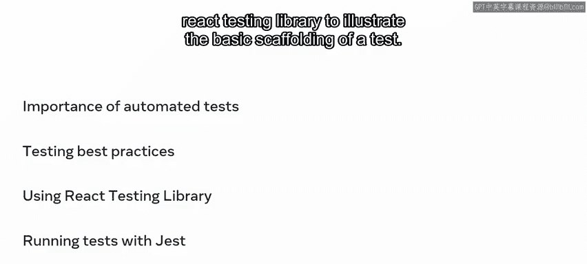

The lesson on component testing concluded with a practical application of tests in a real world example With this。

 you learned how well designed tests can catch errors in your code。

 providing you with the necessary context to fix them。

You also discovered a more complex application that can be easily tested with a few lines of code。

Then you were presented with several As from react testing library。

 like screen to query on the global document and different query types。

 like querying by text or querying by role。 Lastly。

 you learned about different matters for your expectations and assertions。

 like to have been called for mock functions and to have attribute for attribute in your elements。

 Fastic work。 Congrats for getting to this point in the course。

 It's time to use everything you have learned so far and build some amazing applications。😊。

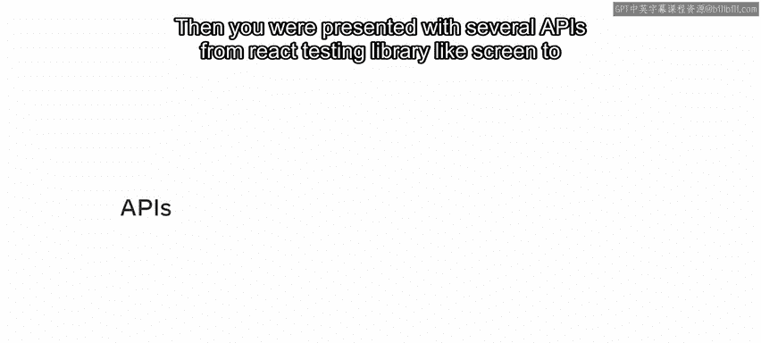

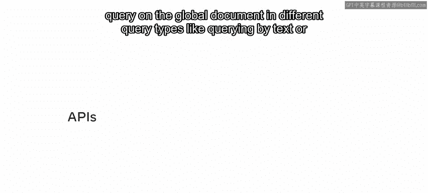

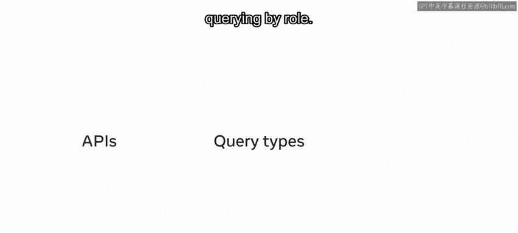

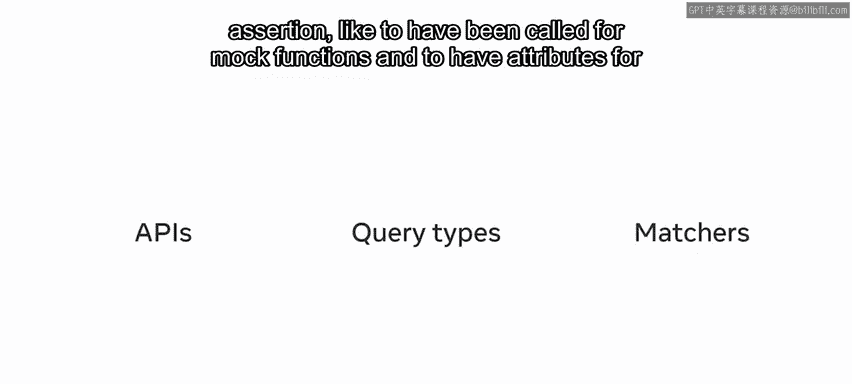

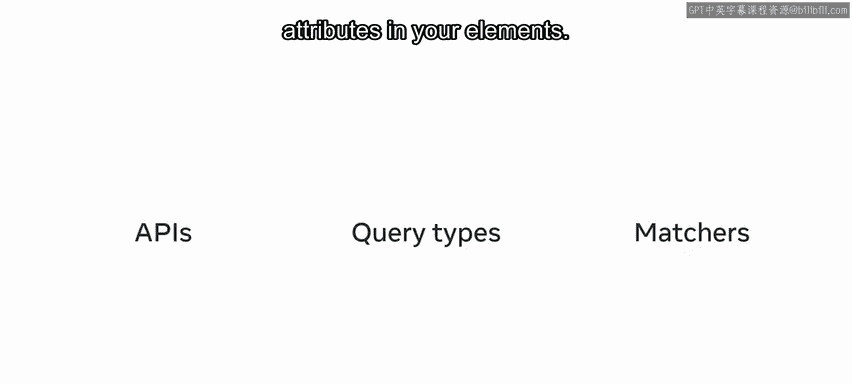