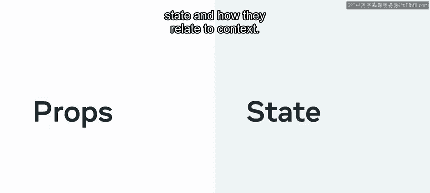
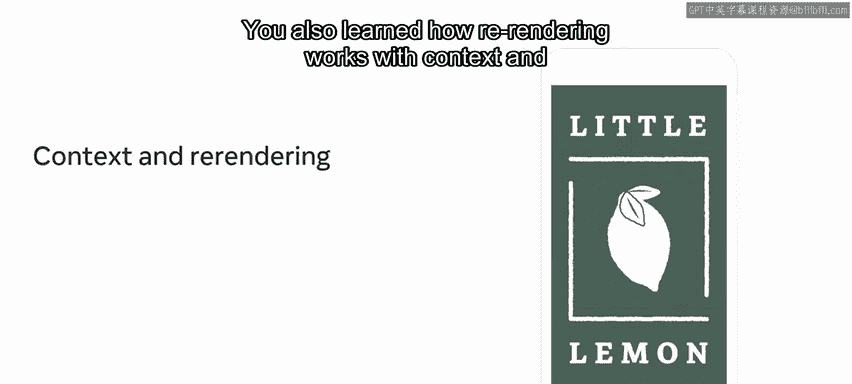
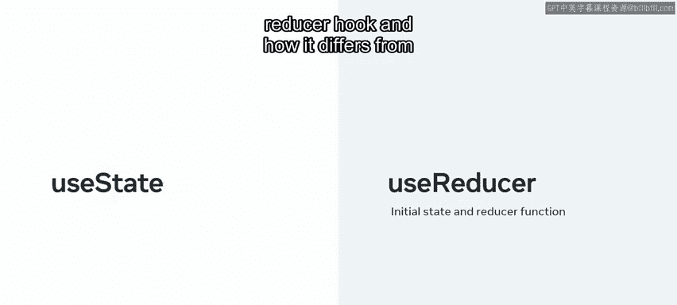
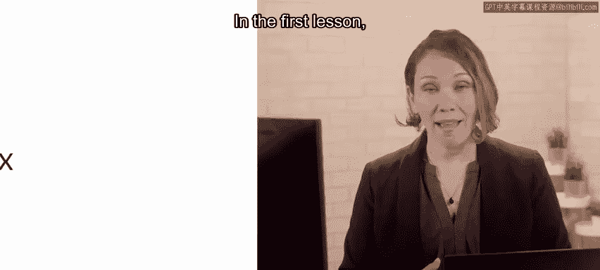
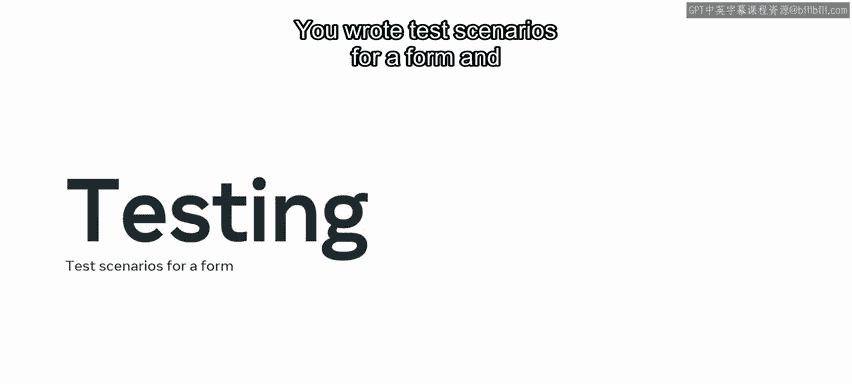

# Meta《前端开发（React／UI、UX／毕业项目／code review）｜Meta Front-End Developer》中英字幕 - P80：38_高级 React 课程回顾.zh_en - GPT中英字幕课程资源 - BV1uJ4m1e7HT

In this course， you learned about advanced Re。Let's take a few moments to recap the key topics that you learned about。

In the opening module， you received an overview of components during the first lesson you received an introduction to the course you discovered how to set up a project in VS code。

 and you learned how to make the most of the content in this course to ensure that you succeed in your goals。

You then moved on to the next lesson in which you learn how to render lists and react。In this lesson。

 you learned how to transform and render list components， create a basic list component。

 and you learned about keys within list components in react。 In the next lesson。

 you explored forms in react。 First， you learned about the differences between controlleded and uncontrolled components。

Next， you discovered how to create a controlled form component in react and then had a chance to test your skills by creating your own registration form。

In the last lesson， you learned about react context。

 you explored props and state and how they relate to context。

 You also learned how re renderndering works with context。

 and you applied your knowledge to create a light dark theme switcher。 Next。

 you began the second module， which covered all the common hooks and react and how to build custom hooks。

 In the first lesson of this module。 you got started with hooks。

 You learned how to implement the use state hook to work with complex data and applied this knowledge to manage state within a component。

 You also learned about side effects and the use effect hook。 In the next lesson。

 you moved on to the rules of hooks and fetching data with hooks。

 You discovered the essential rules of hooks and how to use them effectively in your solutions。

You also gained an in depthth explanation on how to fetch data using hooks and tested your skills in fetching data in a practical exercise In the final lesson of the module。

 you enhanced your knowledge and skills with advanced hooks。

 you learned about the benefits of the use reducer hook and how it differs from use state and how to access the underlying Dom with use ref。

 You then built your own custom hook， Use previous。

In the third module you explored JSX in more detail and how to test your solutions in the first lesson you took a deep dive into JSX you gained a more detailed overview of JSX components and elements。

Next， you've explored component composition with children with its two key features。

 containment and specialization and how to dynamically manipulate children in JSX you had the opportunity to apply your new skills when building a radio group component and were introduced to spread attributes in JSX In the next lesson you focused on reusing behavior。

You learned about cross cutting concerns in react and explored higher order components and how they're used to great effect。

 You also learned about a specific HOC called render props and used render props to implement scroller position tracking in a solution。

In the final lesson of this module， you were introduced to integration tests with react Test library。

 you discovered Jest and the reactact Test library。

 you wrote test scenarios for a form and were introduced to continuous integration。

You've reached the end of this course recap， it's now time to try out what you've learned in integrated graded assessment。

 good luck。