# 前端开发（React/UI、UX）：39：投资组合解决方案演练 🧑‍💻

在本节课中，我们将一起演练一个个人作品集网页的实现方案。我们将分析其整体结构、使用的技术栈，并深入探讨关键组件的实现细节，特别是表单的处理逻辑。


## 概述

本方案使用 React 框架构建，并借助 Chakra UI 组件库来简化样式开发。应用包含页头、全屏展示区、项目展示区、联系表单和页脚等部分。我们将重点关注布局结构、组件设计以及使用 Formik 和 Yup 库实现的表单验证与提交逻辑。

---

## 整体布局与应用结构

首先，让我们概览整个应用程序的布局。应用由一个包含社交媒体链接和页面导航的页头、三个全屏区域以及一个页脚构成。

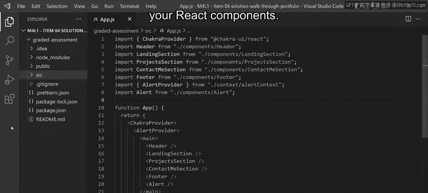

三个全屏区域分别是：
1.  展示个人简介和头像的“着陆区”。
2.  展示过往项目的“项目区”。
3.  包含联系表单的“联系我”区。

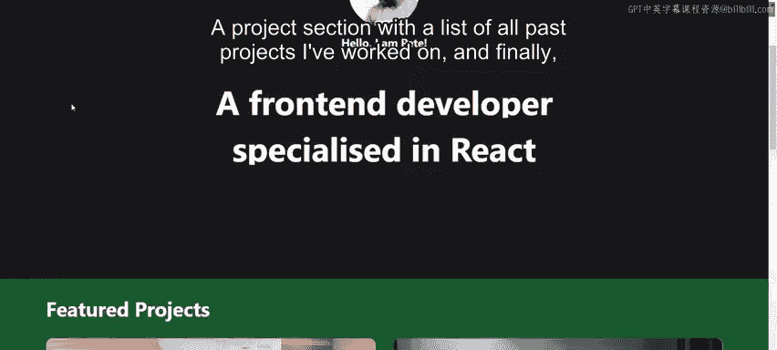

应用的整体布局在入口文件 `App.js` 组件中定义。除了顶部的两个 Provider，`<main>` 标签内的内容对应上述的各个区块，包括页头、着陆区、项目区、联系表单区、页脚以及一个全局提示组件。

这个全局提示组件（Alert）扮演着对话框的角色，可以通过 React Context 在应用的任何地方触发。

---

## 页头组件详解

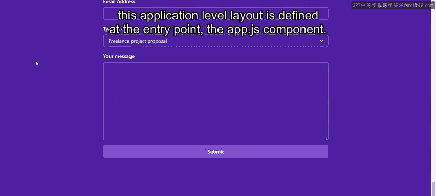

上一节我们介绍了应用的整体结构，本节中我们来看看页头组件的实现。它的渲染部分很好地展示了 Chakra UI 库的一个优势。

首先，Chakra 提供了通用的布局组件，例如用于水平排列的 `HStack` 和用于垂直排列的 `VStack`。这些组件使用特殊的 `children` 属性来放置内容，并可以通过 `padding`、`margin` 或 `spacing` 等属性进行样式控制。

其次，Chakra 使用 Props 来设置所有 CSS 样式，以及一些额外的属性，如 `spacing` 可以均匀地分隔一组子元素。

以下是渲染社交媒体图标列表的代码片段，使用了 `map` 函数，并以每个图标的唯一 URL 作为 `key`：

```jsx
<HStack spacing={4}>
  {socials.map(({ icon, url }) => (
    <a key={url} href={url} target="_blank" rel="noopener noreferrer">
      <FontAwesomeIcon icon={icon} size="2x" />
    </a>
  ))}
</HStack>
```

在这个组件的渲染逻辑中，你还会发现两个核心的 React Hook：`useRef` 和 `useEffect`。它们共同协作，实现了页头的平滑动画效果。

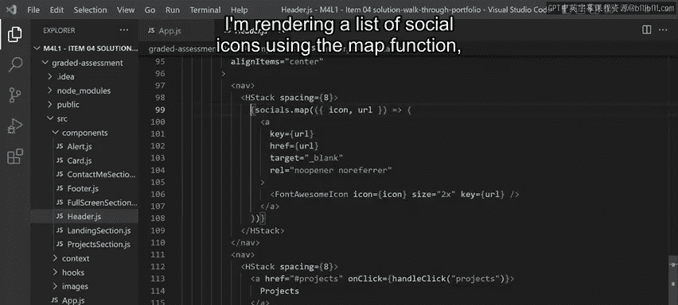

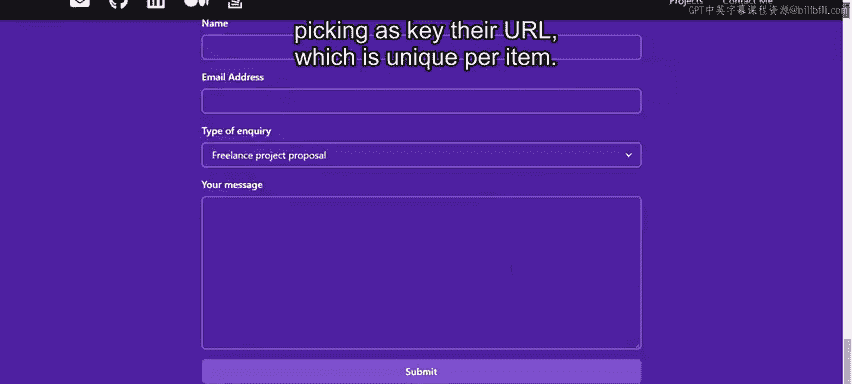

---

## 着陆区与全屏组件

现在，让我们检查下一个组件：着陆区。这个组件本身没有特别复杂之处，它是一个展示型组件，占据整个屏幕高度，并在中央放置图片和文本。

然而，这里使用了一个我创建的可复用组件 `FullScreenSection`，它应用了你已学过的技术。这个组件同时利用了 `children` 属性和扩展运算符（spread operator）。

它的目标很简单：创建一个宽度为 1280 像素的全屏容器，并根据背景是深色还是浅色来设置特定的背景色和文字颜色。

扩展运算符允许你将其他布局属性传递给内部的 `VStack` 组件，以便进行进一步的定制。

```jsx
function FullScreenSection({ children, backgroundColor, isDarkBackground, ...boxProps }) {
  return (
    <Box backgroundColor={backgroundColor} color={isDarkBackground ? "white" : "black"} {...boxProps}>
      <VStack maxWidth="1280px" minHeight="100vh">
        {children}
      </VStack>
    </Box>
  );
}
```

---

## 项目展示区

接下来是项目展示区。这是另一个展示型组件，它以网格布局渲染所有精选项目。

---

## 联系表单组件：实现与验证

最后，我们来到本项目的核心——联系表单组件。这可能是所有组件中最有趣的一个，因为它实现了一个带有验证功能的受控表单，并处理了一些内部状态。

为了简化表单的业务逻辑，我决定使用 React 社区中另一个知名的库：**Formik**。Formik 是最流行的 React 开源表单库，其声明式的特性非常突出，让你能花更少的时间连接状态和变更处理器，而将更多时间专注于业务逻辑。

观察应用，我添加了四个输入字段：
1.  用于输入名字的文本输入框。
2.  用于输入邮箱的文本输入框。
3.  用于选择咨询类型的下拉选择框。
4.  一个通用的文本区域。

要定义表单的配置，你需要使用 `useFormik` 这个 Hook。

这个 Hook 接收一个直观且易于理解的配置对象：
*   `initialValues`：定义表单的初始状态。
*   `onSubmit`：用户点击提交按钮后将执行的函数。
*   `validationSchema`：指定客户端表单验证规则。

Formik 与 **Yup** 库配合得非常好。Yup 允许你通过一系列操作符链以声明式的方式定义验证规则。

```jsx
import { useFormik } from 'formik';
import * as Yup from 'yup';

const formik = useFormik({
  initialValues: { firstName: '', email: '', type: '', comment: '' },
  onSubmit: (values) => { /* 提交逻辑 */ },
  validationSchema: Yup.object({
    firstName: Yup.string().required('Required'),
    email: Yup.string().email('Invalid email address').required('Required'),
    // ... 其他字段规则
  }),
});
```

这个 Hook 返回一个 `formik` 对象。你需要用它来将你的输入字段与 Formik 的内部状态连接起来。

现在，让我们探讨渲染部分的业务逻辑。我将每个输入字段分组到一个从 Chakra 导入的 `FormControl` 组件中。

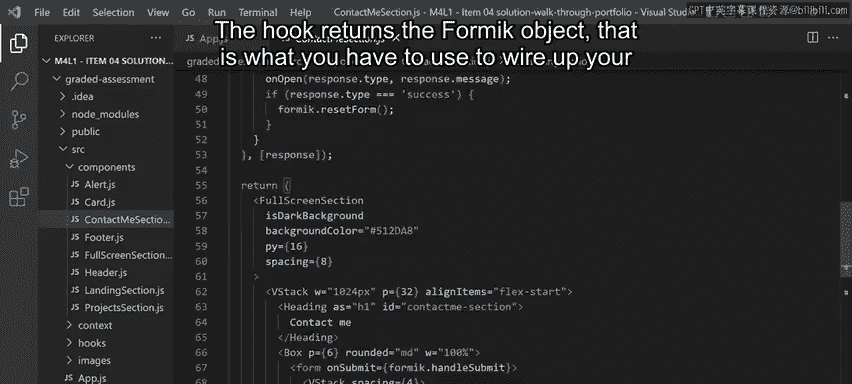

例如，名字字段有一个标签、输入框本身以及一个用于显示该特定输入字段错误信息的组件。

`FormControl` 的 `isInvalid` 属性决定了错误信息是否显示。对于名字字段，如果根据验证规则存在错误，并且该字段已被“触碰过”（即用户至少聚焦过该输入框一次），则会显示错误。

在输入框组件中，我需要通过调用 `formik.getFieldProps('firstName')` 来连接状态和变更处理器，其中参数值 `'firstName'` 必须与 `initialValues` 中使用的属性名匹配，然后展开其返回的结果（这是一个包含所有需要从 Formik 连接的属性的对象）。

```jsx
<FormControl isInvalid={formik.errors.firstName && formik.touched.firstName}>
  <FormLabel htmlFor="firstName">First Name</FormLabel>
  <Input id="firstName" {...formik.getFieldProps('firstName')} />
  <FormErrorMessage>{formik.errors.firstName}</FormErrorMessage>
</FormControl>
```

如果我聚焦名字输入框然后离开（失去焦点），底部会弹出提示“Required”的错误信息。这很简洁，不是吗？

其余输入字段遵循类似的模式，在此不再赘述。

---

## 表单提交与反馈

最后，我们来看表单提交。还记得 `useFormik` Hook 配置中的 `onSubmit` 属性吗？那就是表单提交时将被调用的函数。

在该函数中，会向一个端点执行 API 调用以提交表单及其值。随后，一个 `useEffect` Hook 会监听响应值的变化。一旦服务器响应，它将打开一个提示对话框，显示确认或错误信息。

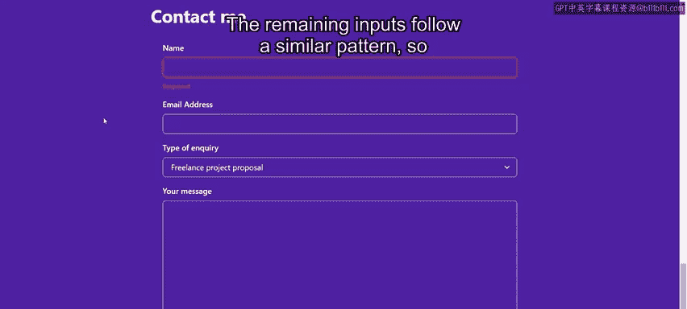

这个 API 调用只是为了练习目的而模拟的，其编程方式有 50% 的成功几率。

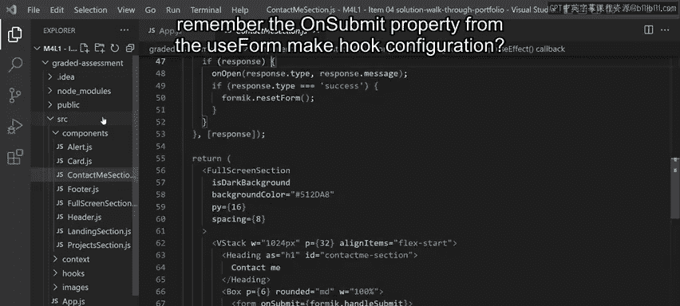

如果响应成功，将使用 `formik` 对象中的 `resetForm` 函数来重置和清空表单。

让我们看看表单的实际运行效果：填写表单值，点击提交。

等待后，提示框出现。我们可以再试一次以展示相反的状态。

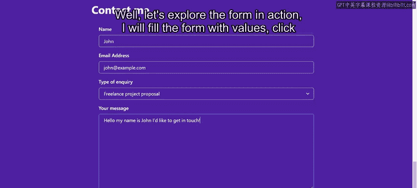

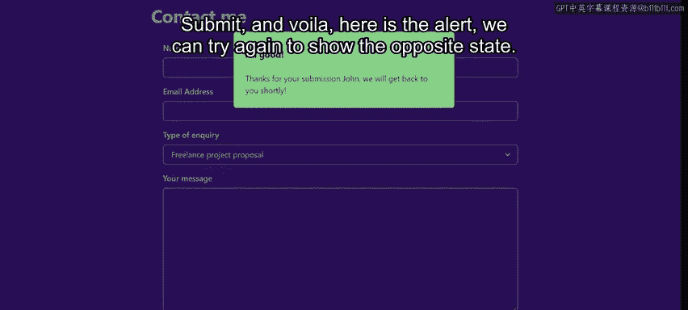

---

## 总结

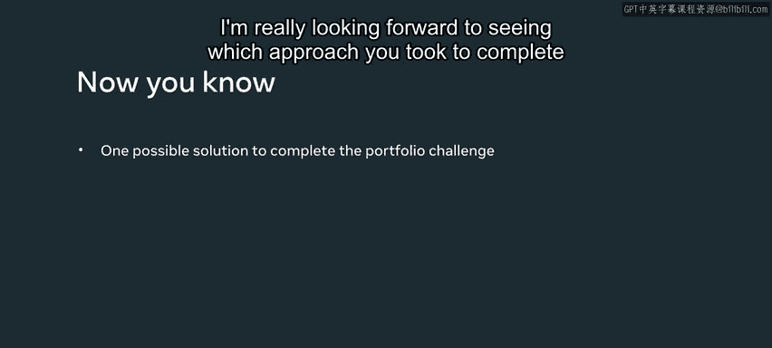

本节课中，我们一起学习了一个 React 作品集网页的完整实现方案。我们分析了使用 Chakra UI 构建的页面布局，深入探讨了页头动画、可复用全屏组件等细节，并重点剖析了如何利用 Formik 和 Yup 库高效地实现带有验证和状态管理的复杂表单。这为你完成自己的作品集挑战提供了一个可行的参考思路。