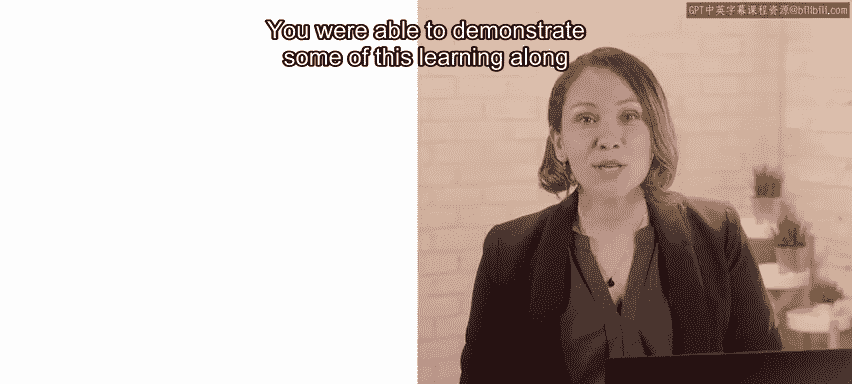
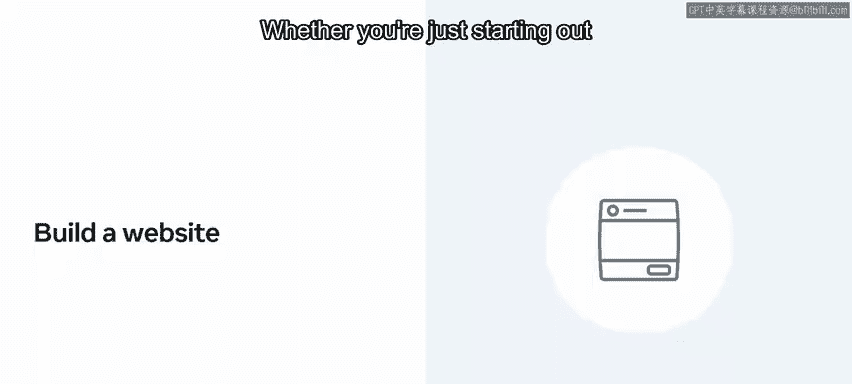

# Meta《前端开发（React／UI、UX／毕业项目／code review）｜Meta Front-End Developer》中英字幕 - P82：40_恭喜你完成了高级 React 课程.zh_en - GPT中英字幕课程资源 - BV1uJ4m1e7HT

You've reached the end of this advanced react course。

 You've worked hard to get here and developed a lot of new skills along the way。

 You're making great progress on your front end developer journey。

 and you should now understand how to use more advanced react features。

 test your react applications and use JSX more proficiently。

 You were able to demonstrate some of this learning。

 along with your practical react skill set in the lab project。😊。

Following your completion of this course in advanced Re。

 you should now be able to render list and form components efficiently in react。

 De how context provides a way to share global values between components with a defined API and potential applications。

 Use all common hooks and react and put them to use within your application。

And build your own custom hooks。The key skills measured in the graded assessment revealed your ability to understand JSX in depth。

Use advanced patterns to encapsulate common behavior via higher order components and render props。

Write tests for your application and build a portfolio using react。 So what are the next steps。

 This advanced react course has enhanced your knowledge and skills in several key areas。

 You probably realize that there is still more for you to learn。

 So if you found this course helpful and want to discover more。

 Then why not register for the next course。 You'll continue to develop your skill set during each of the front end development courses。

 In the final lab。 you'll apply everything you've learned to build your own fully functional website using react。

Whether you're just starting out as a technical professional， a student， or a business user。

 the course and projects prove your knowledge of the value and capabilities of front end development。

The lab consolidates your abilities with a practical application of your skills。

 but the lab also has an important benefit。It means that you'll have a fully operational website built using React that you can reference within your portfolio。

 This serves to demonstrate your skills to potential employers。

 and not only does it show employers that you are self driven and innovative。

 but it also speaks volumes about you as an individual， as well as your newly obtained knowledge。😊。

And once you've completed all the courses， you'll receive a certificate in front end development。

These certificates provide globally recognized and industry endorsed evidence of your technical skills。

Thank you。 It's been a pleasure to embark on this journey of discovery with you best of luck in the future。

😊。