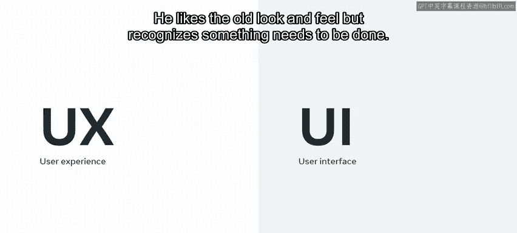
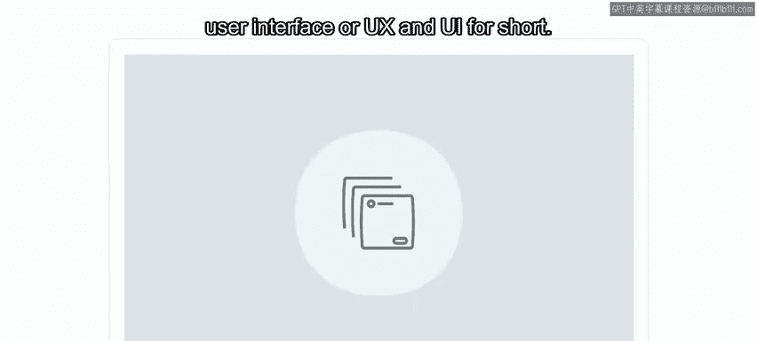
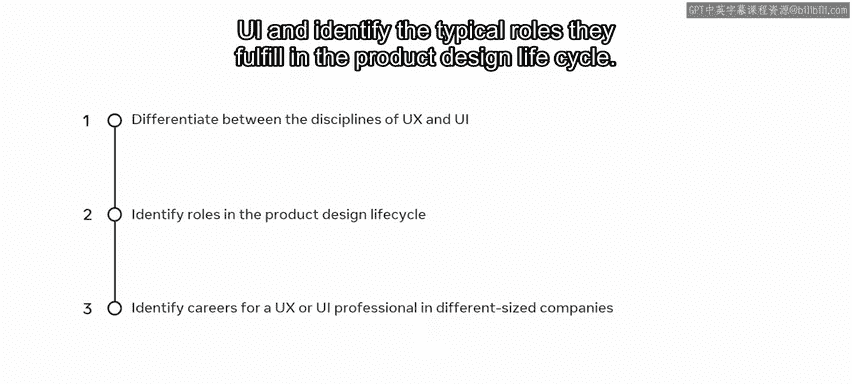
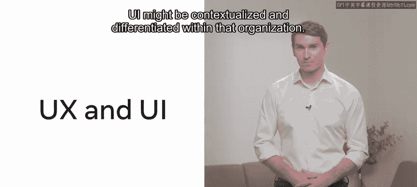
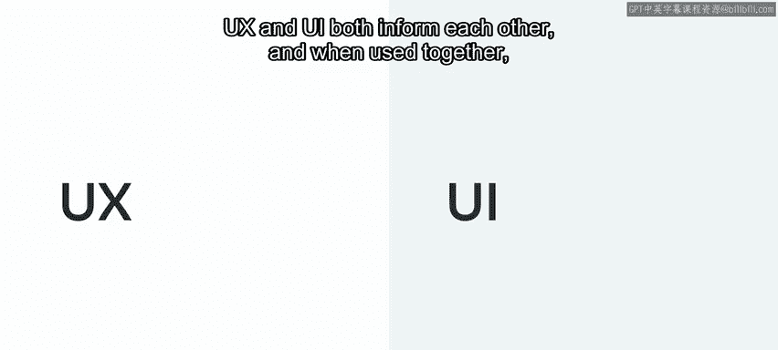
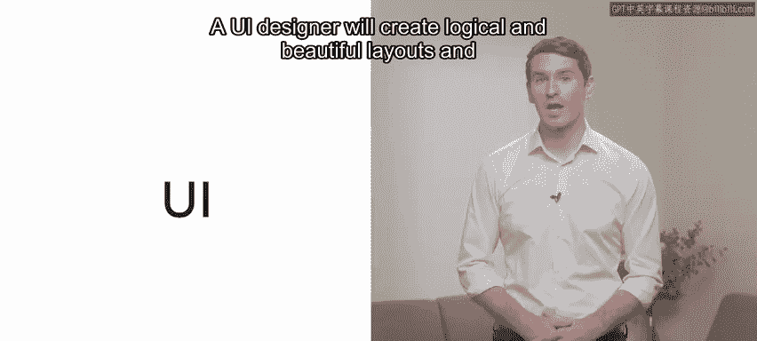
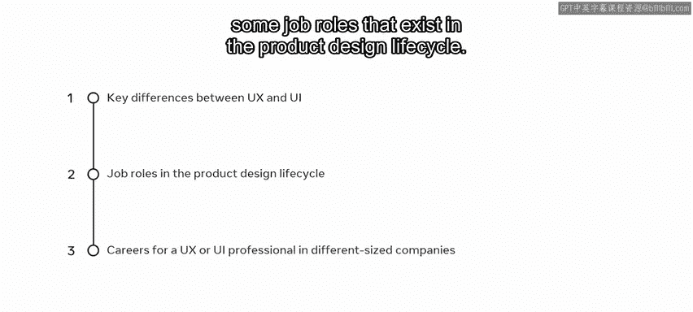

# 前端开发：P85：用户体验与用户界面简介 🎨

## 概述
在本节课中，我们将学习用户体验（UX）和用户界面（UI）的基本概念，了解它们之间的区别，并探讨在产品设计生命周期中各自扮演的角色。我们还将了解在不同规模的公司中，UX和UI设计师的职业发展路径。

---

## 小柠檬餐厅的挑战
小柠檬餐厅的网站目前面临一些问题。餐厅的联合创始人之一阿德里安注意到，他们的网站没有获得太多订单或预订。他喜欢网站旧有的外观和感觉，但也认识到必须做出一些改变。

阿德里安知道你对用户体验和用户界面设计感兴趣，因此询问你是否愿意重新设计小柠檬餐厅的网站。这为你提供了一个绝佳的学习和实践技能的机会。你接受了阿德里安的邀请，并迫不及待地想要学习更多关于UX和UI的知识，以帮助阿德里安，并探索该领域的职业发展。

---

## 区分UX与UI
上一节我们介绍了小柠檬餐厅面临的挑战，本节中我们来看看如何区分UX和UI这两个学科，并识别它们在产品设计生命周期中通常承担的角色。

### 什么是用户体验（UX）？
首先，UX不仅仅关乎小柠檬餐厅网站或应用程序的用户界面。UX关乎顾客或用户与小柠檬餐厅整个业务的体验，包括员工、服务、食物、装饰、菜单设计、洗手间，当然也包括网站和应用程序。然而，在本课程中，我们将重点放在应用于小柠檬网站设计和重新设计的UX流程上。

UX的核心是提出问题并寻找答案。以下是UX设计师关注的一些典型问题：
*   **用户需求是什么？**
*   **是什么阻碍了用户实现他们的目标？**
*   **网站的使用直观性如何？**
*   **用户能否轻松订购食物？**
*   **顾客能否快速高效地在不同板块间切换，例如选择菜品和定制订单？**

UX的最终目标是在产品中为这些问题提供解决方案。

### 什么是用户界面（UI）？
现在，我们来看看用户所看到的部分——UI。在这个情境下，小柠檬餐厅网站是用户的主要接触点。UI提供了用户首先看到并与之交互的信息。这包括**字体、颜色、按钮、形状、图标和图像**等元素。

成功的UI设计在于以某种方式分组和组合这些元素，这种方式既能帮助用户快速高效地实现目标，同时看起来美观并符合餐厅的品牌形象。其核心公式可以概括为：
**美观的界面 + 高效的交互 = 成功的UI**

---

## UX与UI的协作关系
UX和UI彼此相互影响。当它们结合使用时，可以共同创造出美观且令人愉悦的产品。例如：
*   **UX设计师** 会通过研究识别用户需求，并通过原型迭代提出解决方案。
*   **UI设计师** 则会根据系统化的设计库，创建出逻辑清晰、美观的布局和交互流程。

它们的关系可以用一个简单的协作流程来描述：
`用户研究 (UX) -> 信息架构与原型 (UX) -> 视觉与交互设计 (UI) -> 开发实现`

---

## 不同公司的职业角色
值得注意的是，UX和UI领域内的角色可能和学科本身一样细致入微。在不同的公司，这些角色的含义会有所不同。

以下是不同规模公司中可能存在的角色差异：
*   **在小型公司**，一名设计师可能需要同时承担UX和UI的角色，包括研究用户需求、设计解决方案甚至进行编码。
*   **在大型公司**，学科内部可能会有更专业化的角色。例如：
    *   **UX研究员** 可能只专注于用户研究。
    *   **UX文案** 可能专注于产品文案的内容、措辞和语调。
    *   **UI设计师** 可能完全专注于设计系统（一个交互元素和组件的仓库）的维护和管理。
    *   **无障碍设计专家** 则专注于确保为可能有障碍的用户提供最佳的体验。

可以肯定的是，了解这些学科各自涉及的内容并恰当地应用它们，能够催生出设计精美且易于使用的产品。

---

## 课程实践与应用
在本课程中，你将跟随小柠檬餐厅网站订餐功能的重设计过程，观察UX和UI原则是如何被应用的。然后，在最终的课程项目中，你将有机会在“餐桌预订”功能部分亲自应用这些原则。

---

## 总结
本节课中，我们一起学习了UX和UI之间的关键区别，以及产品设计生命周期中存在的一些工作岗位。我们还了解了UX或UI设计师在不同规模公司中的职业发展情况。掌握这些基础知识，将为你后续深入学习和实践打下坚实的基础。