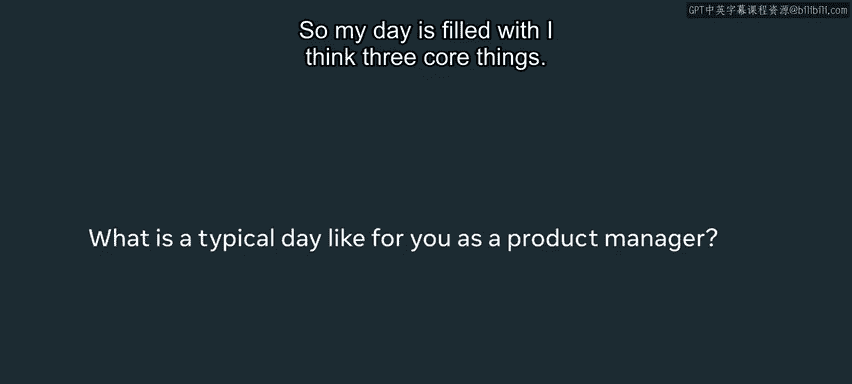
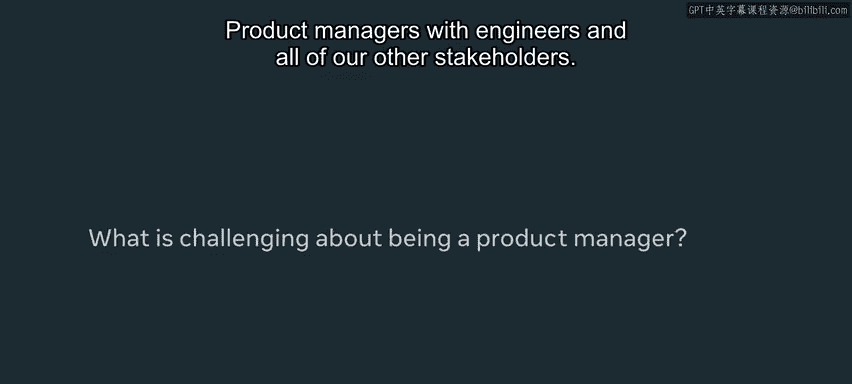
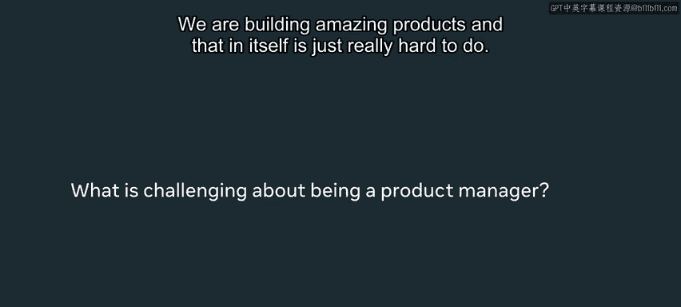
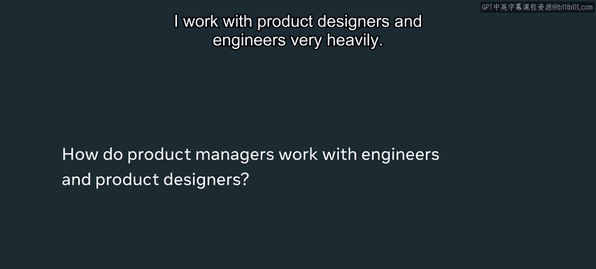
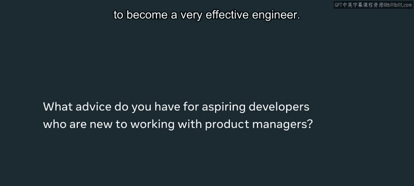
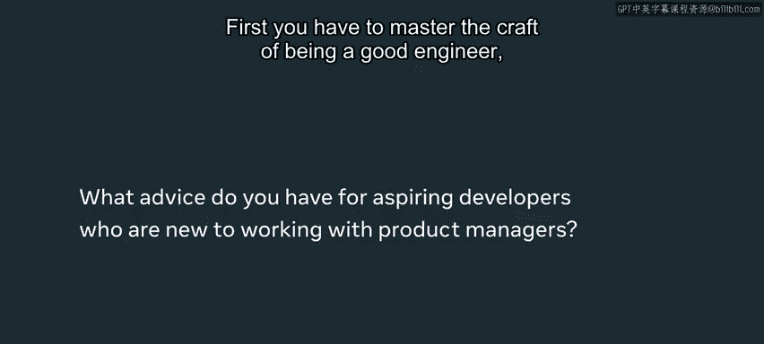

# Meta《前端开发（React／UI、UX／毕业项目／code review）｜Meta Front-End Developer》中英字幕 - P86：3_Meta 产品经理的一天.zh_en - GPT中英字幕课程资源 - BV1uJ4m1e7HT

Pic managers don't tell designers or engineers to do this。

We focus on bringing everyone together on a strategy that we believe in。

 so we are very collaborative and we really value what developers think。

 what engineers think because we are a team and we are trying to build this together。🎼，う。Hi。

 my name is Jason， I am a product manager at Meta。 I work in the Facebook web app and web platformform team。

So my day is filled with， I think three core things The first one is reading。

 understanding what is happening with the product with the market。

 with leadership and with other teams， I have to sort of have a really good idea of what is happening in order to lead to section number two which is thinking that happens in writing often and it's really crystallizing like product strategy。

 figuring out what the communication is trying to figure out what the plan is for the entire team or setting goals。

The third part is collaboration， which usually happens meeting other people。

 I will send information via a written document， but a lot of times it is getting in a room with an engineer working through a problem together。

 And it's like figuring out， hey， this is a product strategy， What does it take to build this。

 What does it actually take to make this happen in H1 or this year and how do we bring it to life。

 What should the trade off。 So those three things or would usually take up。

 take up my time as a product manager。😊，If you think about technical skills。

 product managers actually have less technical skills than a lot of the people we work with。

 The main one that I use is analysis。 I actually rely on the data scientists to pull and do a lot of the hard numbers。

 But I have to digest and understand what it means。 Collaboration is a core skill set。

 because what we are doing is working with engineers to make the product come to life。

 So a lot of the soft skills include written communication and verbal communication。

 It's really can we。Bring our ideas and thinking and help other people understand and come along for the ride。

Product managers with engineers and all of our other stakeholders。

 we are building amazing products and that in itself is just really hard to do。

 So first we have to actually know what's a winning product and have a clear strategy making that happen that is challenging and in the absolute best way and that's what makes this job really fulfilling。

I work with product designers and engineers very heavily。

 they are two of my top stakeholders with product designers。

 I am really bringing the product strategy and creating a visual representation of what that looks like so if I had to give an example let's say I have this concept and strategy that we really need navigation to be more persistent and so people can access some of their stuff。

I will write that as a strategy the product designers will then visualize that into an actual menu What are the pixels。

 how big is it， what are the actual colors should we show notification or not and they've taken the product strategy and turn this into a visual item We then together work with an engineer to build that menu you know the menu the designers have put and say it's like 80 or 100 pixels or whatever heck it is will actually could put that into code so the three of us will work very closely together to realize this product which occupies like a very important role in the broader strategy。

So some things that an engineer could focus on to become a very effective engineer。 First。

 you have to master the craft of being a good engineer。

 which is excellent coding and excellent execution。

In addition to that， collaboration is very important， the product designer。

 the product manager and engineer， we all are working together to build an amazing product Comication goes a really long way when you're working in a team。

Communication would really help us make sure we're moving together and as a result。

 helps make sure we build a phenomenal product。Building things is incredibly fulfilling。

There's nothing like that feeling when you launch something and people love it and you know that you built this and that's what you'll be able to do when you finish this course。

