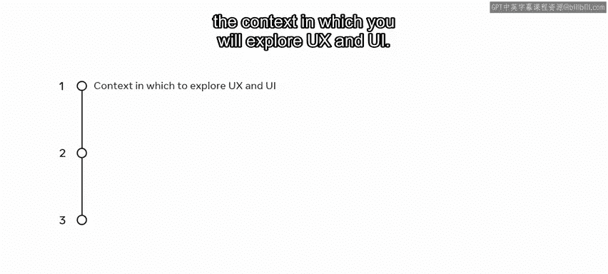
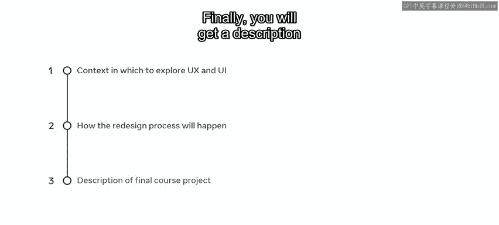
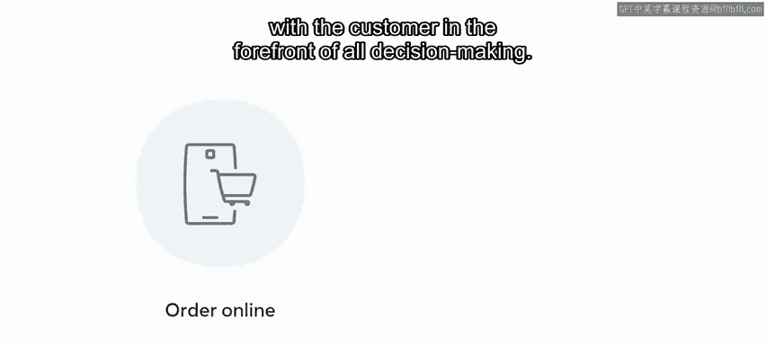
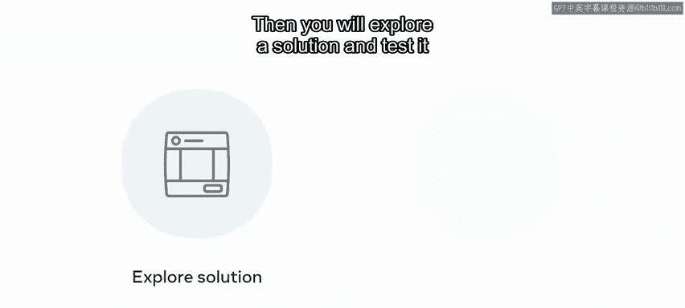
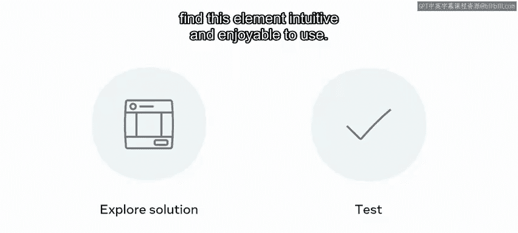
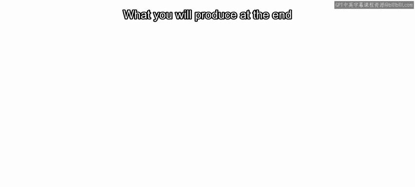
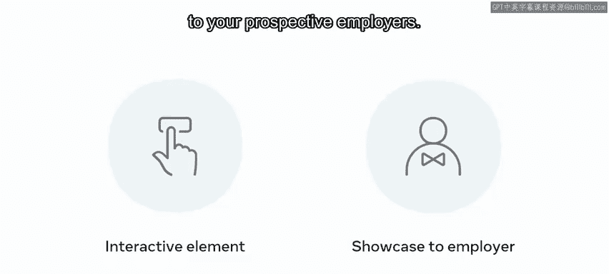
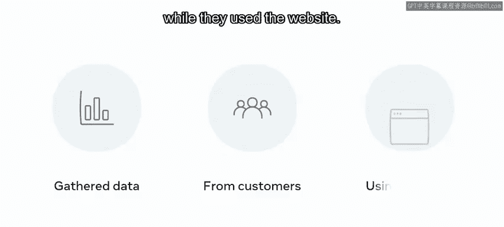
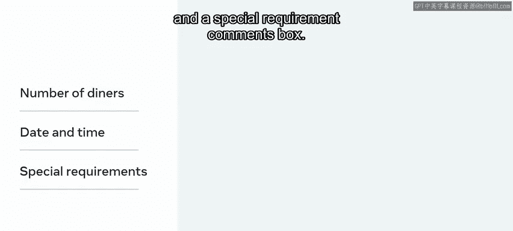
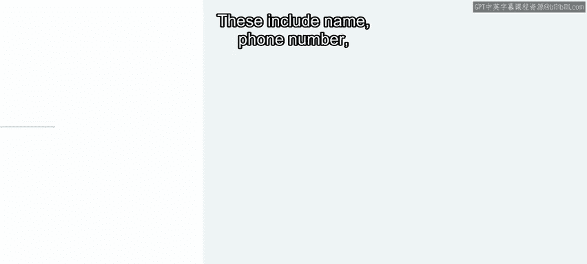

# 前端开发（React/UI、UX/毕业项目/代码评审）：P87：4_最终项目概览 🎯

在本节课中，我们将要学习Meta前端开发课程中最终项目的整体背景与目标。我们将了解项目背景、需要解决的问题、你将遵循的设计流程，以及最终需要交付的成果。

---

## 项目背景介绍

Adrian是Little Lemon餐厅的联合创始人之一，负责管理所有与产品相关的事务。他要求你遵循UX/UI流程，对Little Lemon网站进行重新设计。

在整个课程中，你将学习支撑UX和UI的理论知识，并将新学到的技能应用于重新设计他们网站的部分功能。在本视频中，你将了解探索UX和UI的具体情境，并概述重新设计过程将如何进行。

最后，你将获得对最终课程项目所能完成内容的描述。

---

## 项目核心问题

在你将要工作的情境中，顾客在使用Little Lemon网站订餐外卖和预订餐桌时遇到了问题。在整个课程中，你将学习用于识别和更好地理解这些问题的UX和UI原则及最佳实践。

你将遵循以顾客为所有决策核心的在线订餐元素重新设计流程，然后探索解决方案并进行测试，以确保顾客觉得这个元素直观且使用愉快。

---

## 你的实践任务

在学习了UX/UI流程所涉及的内容后，将轮到你练习所学的技能，并为餐桌预订元素创建一个解决方案。你将收到一份作业，概述课程结束时需要产出的内容。

你在课程结束时产出的将是一个交互式元素，你可以向未来的雇主展示。你将基于从顾客使用网站时收集的数据开始你的工作。

---

## 最终项目：餐桌预订交互元素设计

在整个课程中，你将学习UX和UI原则及最佳实践，并将其应用于你的项目——设计“餐桌预订”交互元素。

预订餐桌元素将广泛包含顾客可以选择的功能，例如：

*   **用餐人数**
*   **日期和时间**
*   **特殊要求备注框**

在选择这些选项后，顾客将添加他们的详细信息。这些信息包括：

*   **姓名**
*   **电话号码**
*   **电子邮件地址**
*   **信用卡详情**

当他们完成这些阶段并确认预订后，他们将在屏幕上并通过电子邮件收到确认信息。这是你的创作，因此在设计过程中，你可以加入任何你认为必要的附加功能。

---

## 课程目标总结

在完成课程时，你将运用所学的方法和流程，为移动版Little Lemon网站的用户设计餐桌预订流程。

本节课中，我们一起学习了最终项目的整体框架。我们明确了项目背景是重新设计Little Lemon网站以解决用户订餐和预订餐桌的痛点。我们了解到，你将先学习并实践UX/UI流程来重新设计在线订餐功能，然后独立运用这些技能完成餐桌预订交互元素的设计，最终产出一个可用于作品集的可展示成果。