# 前端开发（React/UI、UX/毕业项目/代码审查）：P90：用户体验流程概览

## 概述

在本节课中，我们将要学习用户体验设计的基本流程。我们将了解一个成功的UX项目通常包含哪些关键阶段，以及如何将这些阶段应用到“小柠檬”餐厅网站的重设计项目中。理解这个流程将帮助你系统地创建出以用户为中心、能提升销售并留住顾客的网站。

## UX流程简介

上一节我们介绍了学习UX流程的重要性，本节中我们来看看这个流程具体包含哪些阶段。UX是一门非常注重流程的学科。在进行UX设计或重新设计时，可以遵循多种不同的模型。虽然没有放之四海而皆准的方法，但遵循一些关键步骤有助于确保成功实施丰富的用户体验设计。

让我们来了解UX流程，以及在本课程中如何将其应用于“小柠檬”网站的重设计。不必担心现在不理解某些术语，我们后续会详细讲解。

UX流程包含五个阶段：**共情**、**定义**、**构思**、**原型**和**测试**。

需要牢记的是，UX是一个**迭代过程**。这意味着你可能需要回到之前的阶段进行调整和完善。

`迭代过程：设计 → 测试 → 反馈 → 优化设计 → 再次测试...`

## 第一阶段：共情

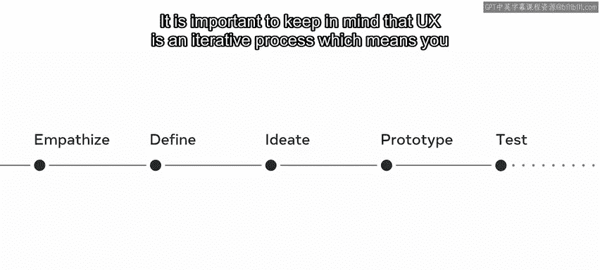

在定义了流程框架后，我们首先进入第一阶段：共情。这个阶段的目标是深入理解你的用户。

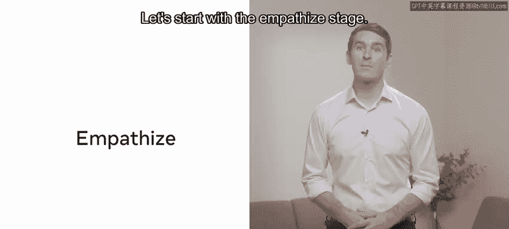

你获得了许可，可以采访并观察阿德里安的顾客，了解他们在餐厅网站上尝试完成任务（例如订购外卖）时的各个阶段。你需要倾听他们的困扰。

此阶段的关键在于从研究结果中理解用户的需求。基于这些信息，你可以创建一个**用户画像**，并在整个设计过程中参考它。

`用户画像 = 基于真实用户数据构建的虚构角色，代表一类用户群体`

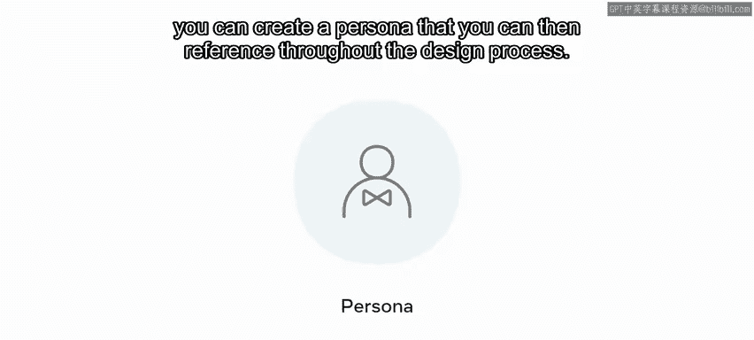

你还会创建**共情地图**、**场景**和**旅程地图**，以更深入地与这个用户画像产生共情。这也能让你的想法立足于实际，避免做出假设。

## 第二阶段：定义

理解了用户之后，下一步就是明确问题所在。第二阶段是定义阶段。

你需要整理并提炼从用户那里收集到的所有信息，识别出他们面临的关键问题和需求。你还需要根据重要性对这些困扰或痛点进行优先级排序。

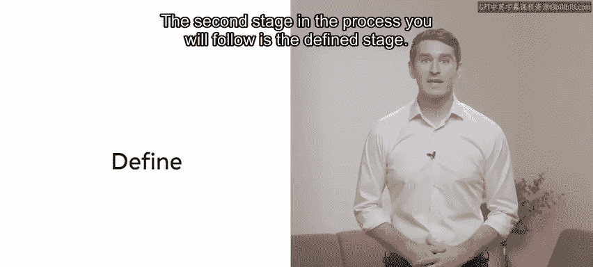

`痛点优先级 = 评估每个问题对用户体验的影响程度和发生频率`

现在，你知道了你的用户是谁、他们的困扰是什么以及你需要解决什么问题。你将创建一个**用户需求陈述**，清晰地概述用户的需求。

## 第三阶段：构思

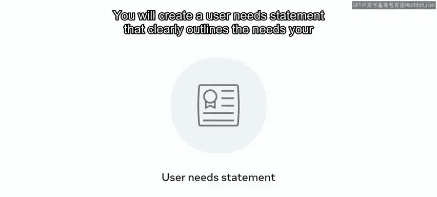

一旦明确了问题和解决对象，就可以开始构思解决方案了。构思阶段是关于产生想法的阶段。

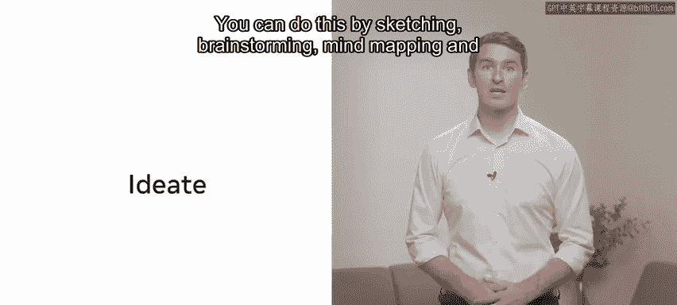

你可以通过**草图绘制**、**头脑风暴**、**思维导图**甚至手写笔记来进行构思。

`构思方法：草图、头脑风暴、思维导图`

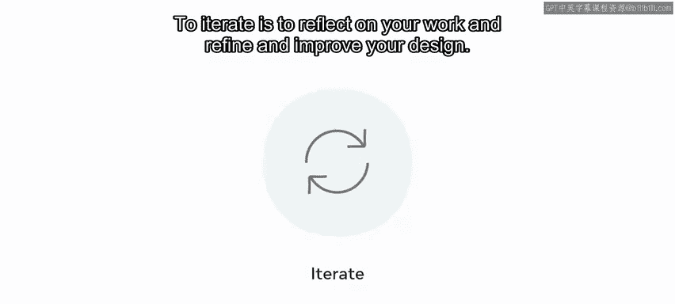

此阶段的关键是保持开放的心态，不要过早地锁定某一个具体的想法。在整个设计过程中，构思可能会被反复迭代。

`迭代 = 反思你的工作，并优化改进你的设计`

你将把你的想法草图化，形成能够解决“小柠檬”顾客需求的方案，然后将它们发展成**线框图**。

`线框图 = 用户界面的二维表现形式，关注内容的布局与层级、提供的功能以及用户的预期操作`

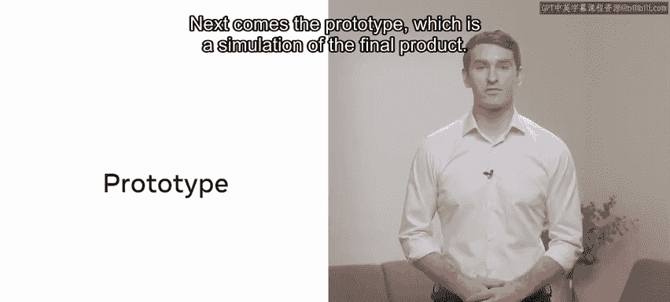

## 第四阶段：原型

有了初步的设计框架，接下来需要将其具体化。接下来是原型阶段，即最终产品的模拟。

你已经通过迭代和完善将想法变成了一个全新的解决方案，但不能假设它对所有人都有效并直接发布。你应该先用一个原型来模拟它的行为。

`原型 = 最终产品的交互式模拟`

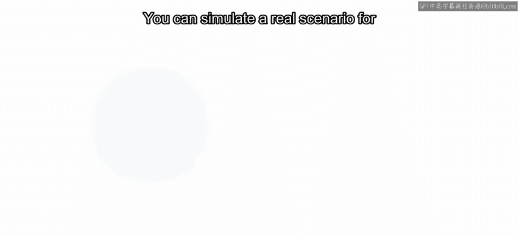

拿出你的线框图，将其丰满起来：添加一些颜色、放入按钮和文本，并使其具有交互性。你可以为你的顾客模拟一个真实的场景，帮助他们实现所需的目标。

由于UX是一个基于用户和客户反馈的迭代过程，你可能也需要在这个阶段进行迭代，因此你的想法会不断被精炼，逐渐接近最终的设计方案。

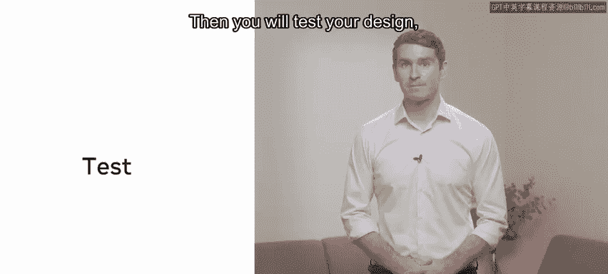

## 第五阶段：测试

设计完成后，必须验证其有效性。测试阶段是你向用户展示解决方案并获取反馈的阶段。

你需要创建一个**测试脚本**，其中包含一些清晰的指示，专注于完成一项或多项任务。你的测试参与者（本例中是顾客）会与你的原型进行交互，同时尝试完成手头的任务。

`测试脚本：1. 向参与者介绍任务。 2. 观察其操作过程。 3. 收集口头与行为反馈。`

任何困扰都可以在这个阶段被沟通和突显出来，你可以在进入流程的下一个阶段之前返回并解决它们。

## 最终阶段：构建

最后一个阶段是构建阶段。你已经倾听了用户的声音，与他们产生了共情，并通过迭代设计技术力求解决他们的需求。你观察了他们使用你的产品，并对其进行了调整，使其更简单、更直观。

现在，是时候开始构建了。确保遵循这些步骤可以帮助你构建出满足用户需求并提供优秀用户体验的产品。

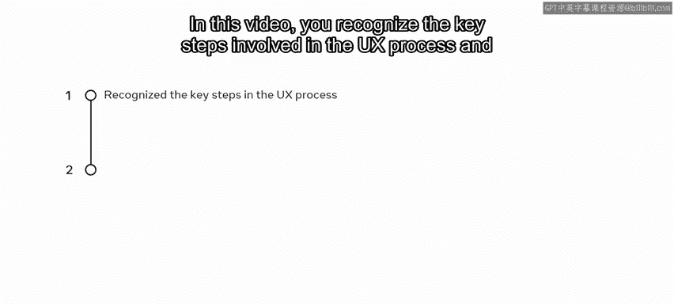

## 总结

本节课中，我们一起学习了UX流程的关键步骤，并明确了如何应用它们。你认识了共情、定义、构思、原型和测试这五个核心阶段，以及迭代在整个过程中的重要性。你可以利用这些工具，使“小柠檬”网站的重设计更加用户友好。