# 前端开发：P91：什么是用户界面 👨‍💻

在本节课中，我们将要学习用户界面（UI）的核心概念、其历史演变以及它在日常生活中的重要性。我们将了解UI如何作为用户与科技产品沟通的桥梁，并探讨优秀UI设计的关键作用。

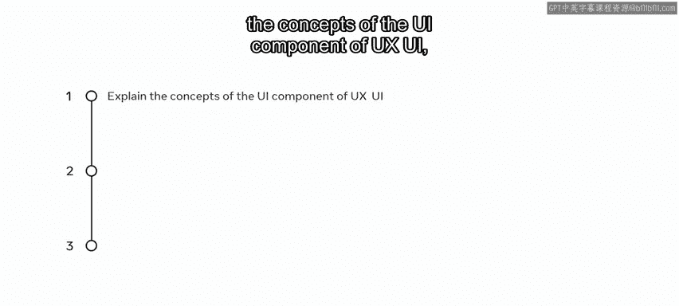

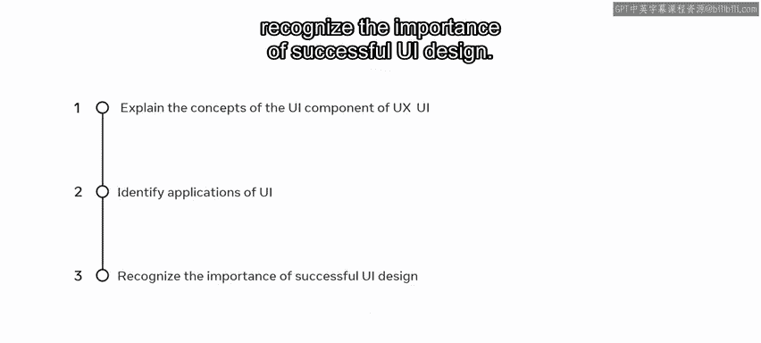

你已经学习了可以应用于小柠檬网站的用户体验（UX）原则，以改进其点餐和预订功能。但你也知道需要改进用户界面。因此，你将深入了解UI设计。

## 什么是界面？ 🤔

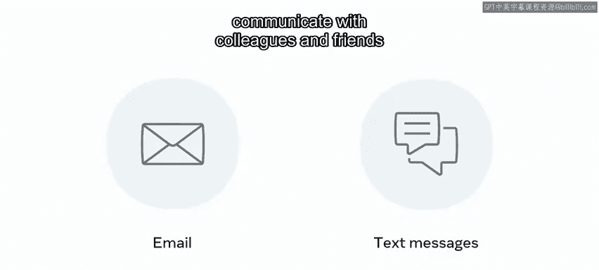

与某物“交互”意味着与其互动或沟通。你可以与其他人交互，也可以与计算机和应用程序交互。人们每天通过电子邮件和短信与同事和朋友沟通，或者与技术交互，例如通过更改设置与打印机交互。

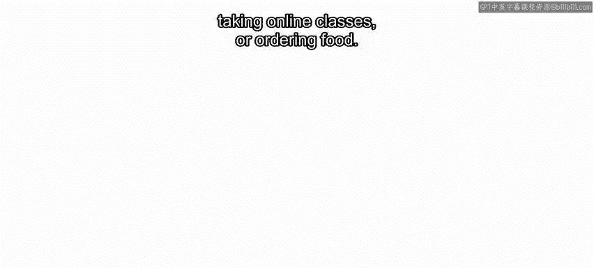

在与咖啡师交互的同时，他们也在与制作咖啡的机器交互。思考一下你如何使用设备来完成各种任务，例如获取地点路线、参加在线课程或订购食物。

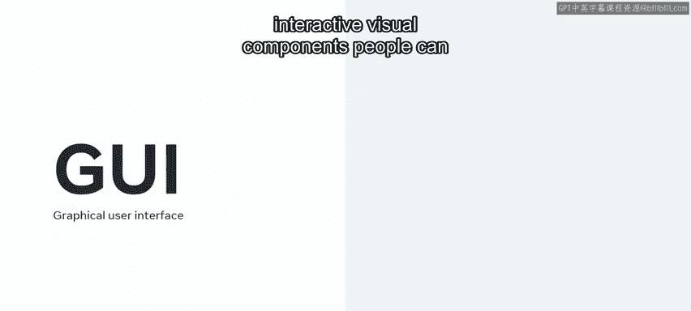

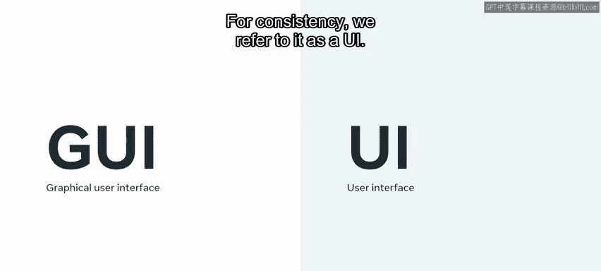

## 图形用户界面（GUI） 🖥️

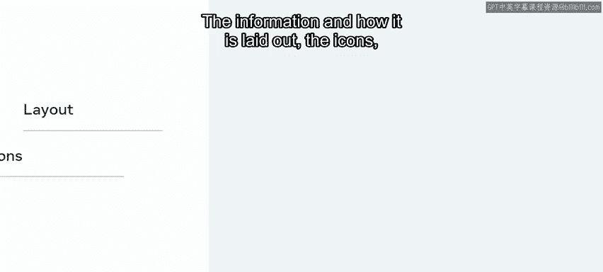

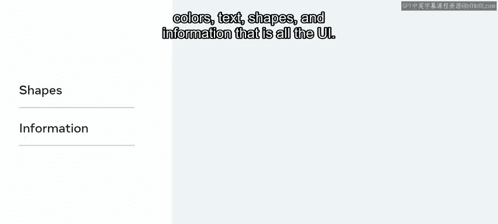

图形用户界面（GUI）在屏幕上呈现交互式视觉组件，人们可以通过这些组件与技术进行沟通。为保持一致性，我们将其简称为UI。

界面上的信息及其布局方式、图标、颜色、文本、形状和所有信息，共同构成了UI。当你点击或轻触某个东西时发生的反应，也属于UI的一部分。

## 界面的本质：沟通与任务 🗣️

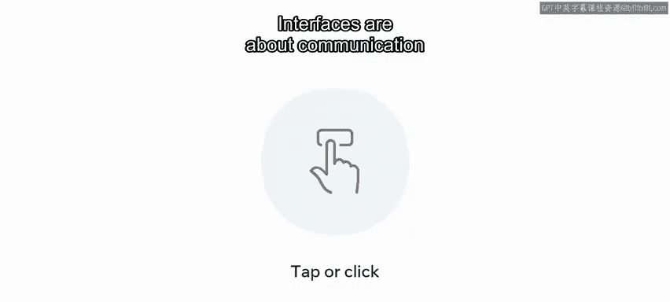

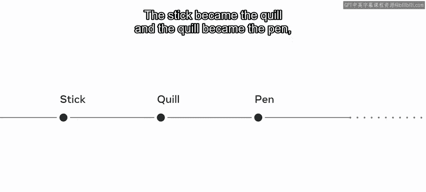

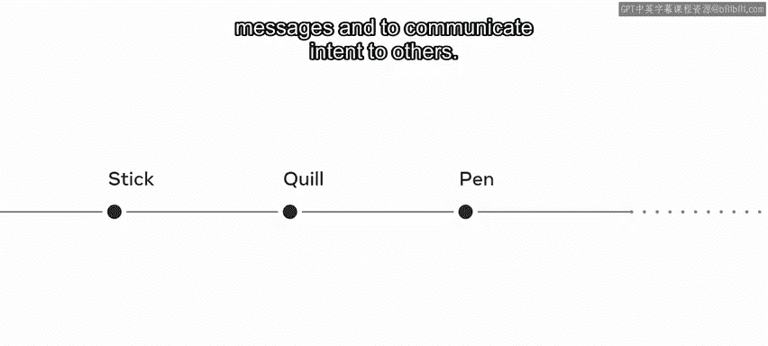

界面关乎沟通。自远古以来，人类就使用工具作为彼此沟通的手段。洞穴壁画表明，人们使用木棍来描绘故事和事件。木棍演变成了羽毛笔，羽毛笔又演变成了钢笔，至今仍被用于传递信息和沟通意图。

现代键盘源自打字机。人类通过用手指敲击打字机的按键来组合单词，与之交互。今天，当你在最喜欢的社交网络上发布状态更新时，你也在做同样的事情。

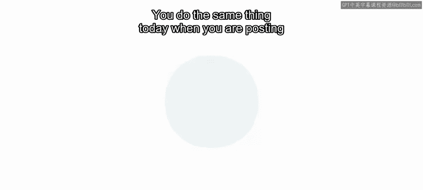

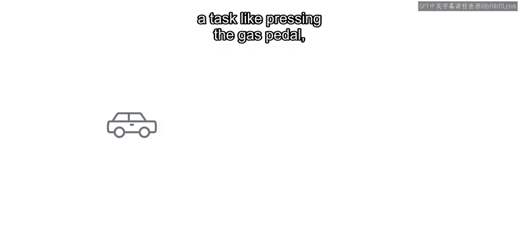

界面也关乎任务。以汽车为例，仪表盘是用户界面的完美范例。如果驾驶员执行踩油门的任务，汽车会做出响应，仪表盘上的速度表会反应，同时汽车也会加速。

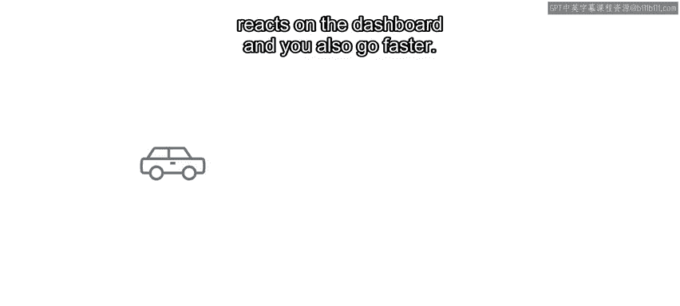

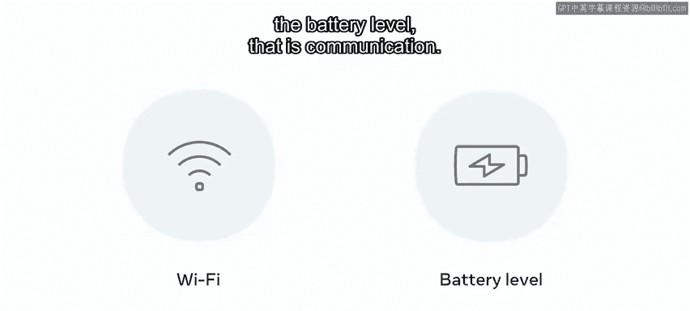

当你与手机交互以检查Wi-Fi信号和电池电量时，这也是一种沟通。

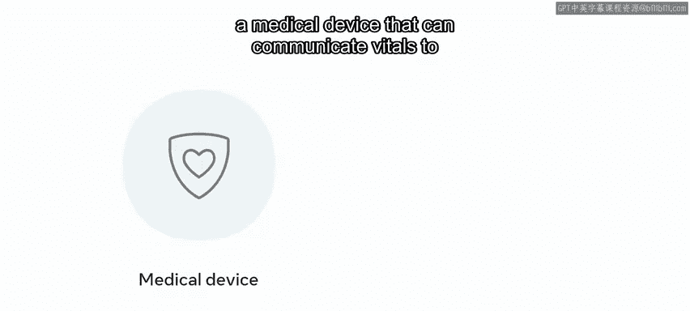

## 优秀UI设计的重要性 ⭐

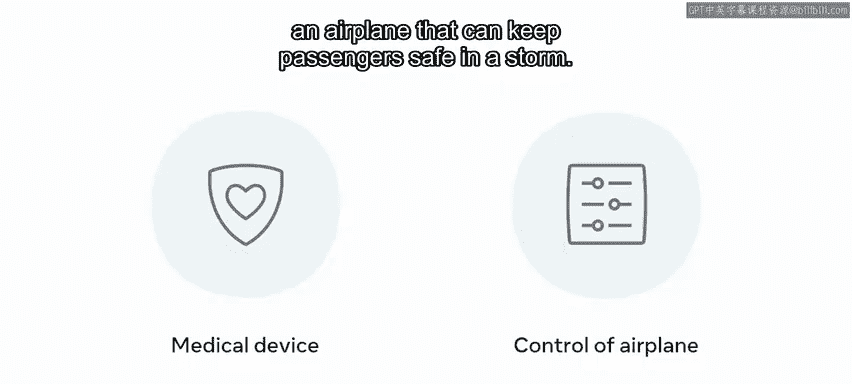

一个设计精良的用户界面的重要性再怎么强调也不为过。试想一下，一个能将生命体征传达给医生的医疗设备界面，或是在风暴中能保障乘客安全的飞机操控界面。它们设计的直观性有助于拯救生命。

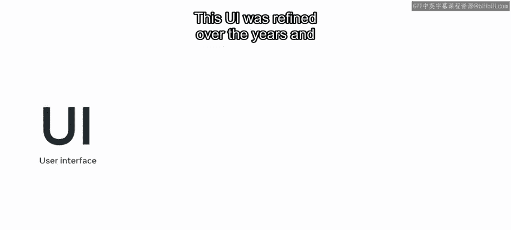

施乐帕克研究中心推出了第一台带有图形用户界面的个人电脑。这个UI经过多年完善，施乐之星于1981年作为个人电脑推出。许多设计隐喻，如桌面、窗口、菜单和图标的引入和广泛应用，至今仍在沿用。

这些设计隐喻通过将用户熟悉的心智模型与当时这个新的、陌生的数字空间联系起来，帮助用户完成任务。

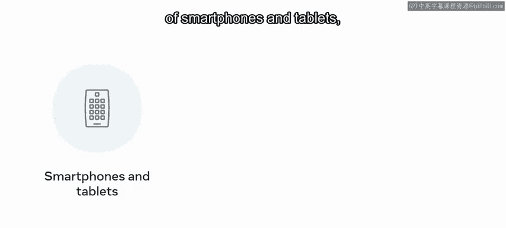

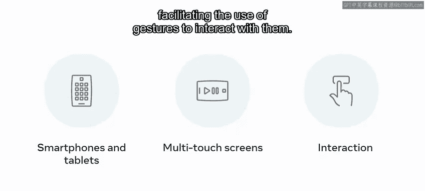

另一个里程碑是智能手机和平板电脑的引入，它们利用多点触控屏幕，促进了使用手势与之交互。开发者和设计师能够创新并创建在这些设备上运行的应用程序。特别是这个阶段，带来了UI的现状：它无处不在。从你使用的应用程序到现代电动汽车的仪表盘，随处可见。

在本课程中，你将专注于应用于网站设计的UI，然而，这些方法和概念同样适用于应用程序等一系列输出产品。

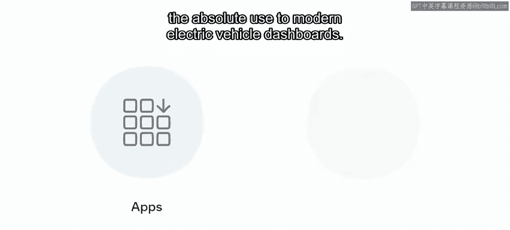

## 总结 📝

本节课中，我们一起学习了用户界面设计、它的历史与演变，以及它在日常生活中扮演的重要角色。牢记这些历史和概念，可以帮助你为小柠檬网站创建更好的UI设计。