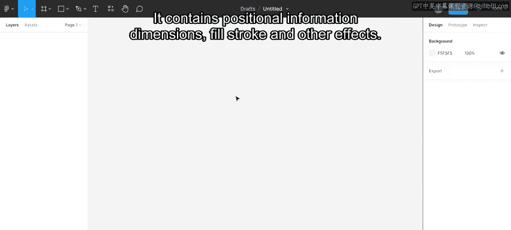
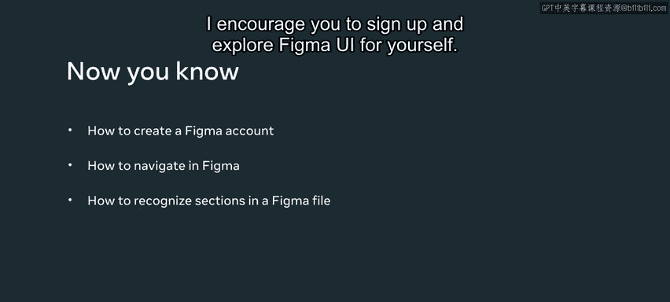

# Meta《前端开发（React／UI、UX／毕业项目／code review）｜Meta Front-End Developer》中英字幕 - P92：9_Figma 入门.zh_en - GPT中英字幕课程资源 - BV1uJ4m1e7HT

By now， you should have learned the principles of UX and U I design。

 You were on the right track to create a redesign for the ordering and reservation elements of the little Lemon website。

To get started on the redesign， you need to learn a standard industry design tool to create layouts and test them with users。

So now is a good time to start learning Figma。In this video。

 you will explore how to navigate and use the Figma interface and recognize its sections。

Figma is a free online UX U Y design prototyping tool。

 It is collaborative and assists designers and developers in building digital products。

 It allows them to edit， comment and review designs and code together。 It is web based。

 so it works on all platforms like Mac， PCs running Windows， Linux and Chromebook。😊，In this course。

 you will cover the main stages of designing a website in FigGma from wire frames and mockups to an interactive prototype。

You will explore the basic tools and get familiar with more advanced features like auto layout components and prototyping。

To access FGma， go to www。fiigma。com and sign up for a free account。In FIGma。

 you can build teams and create shared workspaces where you can work simultaneously on files。

You can choose to start with a free starter or a paid professional plan。

If you are a student or educator， you can access all of Figma's professional features for free Just visit Figma。

com forward/ed forward/ apply to verify your education account。Now， let's explore Figma。

After I log in， I am presented with the options new design。New Fig Jam file， and import file。

I select new design file。The interface displays the editor。

 It seems pretty blank the first time I open it， but don't worry about it。

You will cover the sections in the Figma interface now。On top。

 there is a toolbar which contains a variety of tools and functions。In the center of the screen。

 there is the canvas where your design lives。Then there is the left sidebar with the li， assets。

 and pages in your file。And then on the right， there is a right side bar。

 which contains three panels。 But let's take it easy and cover each of the main sections in more detail now。

Let's start with the canvas。The canvas is the background for all of your designs。

It's where you'll create and evaluate your work。Now， the menu。

Figgo's menu can be accessed by clicking the FigGma icon on the top left of the screen。

Take a minute to explore the items in the menu。You can also search for a specific command by typing it in the Quick action option。

Now let's briefly check the toolbar。In the toolbar。

 you can quickly access the tools you're likely to use most often， like frames， shapes， pan and text。

The toolbar is contextual， meaning that what appears in it depends on which item you have selected。

Next is the option section。 It is located on the top center and displays extra options for whichever tool you have selected。

If nothing is selected， Figma shows the file name。When something is selected。

 contextual options will appear。 For example， if I have a shape selected。

 the options change to edit object， group components or mask。Now let's explore layersar。

I access layersers by clicking the layersyers tab in the left sidebar。

Every element that I add to my design appears in the liars panel on the left。

 where they are listed and organized into frames and groups。

Don't worry if you don't fully understand what liars， frameins and groups are。

 You will cover them in detail later in this course。Now let's cover the right sidebar。

It is a contextual section that can show either the design， prototype or inspect panels。

 In this course， you will mainly focus on the design and prototype panels。

 The inspect panel can be used for copying CsS values。 If I select an object on the frame。

 the panel shows the properties related to that specific object in the design panel。

The panels in the right sidebar are contextual， meaning the information and settings change depending on which object is selected。

 It contains positional information， dimensions， fill stroke and other effects。

Now that you know how to sign up for FGma， navigate the user interface and recognize its sections。

I encourage you to sign up and explore Figma's U I for yourself。

