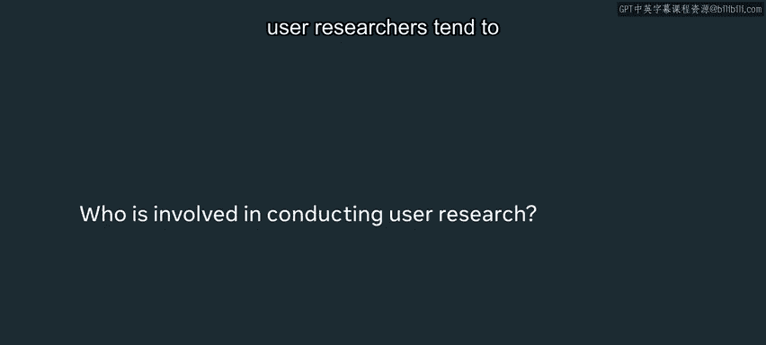
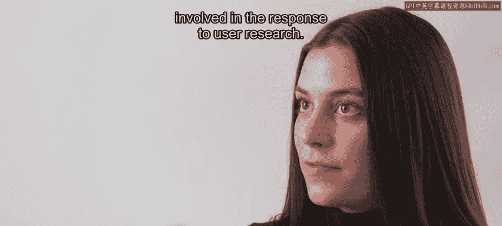
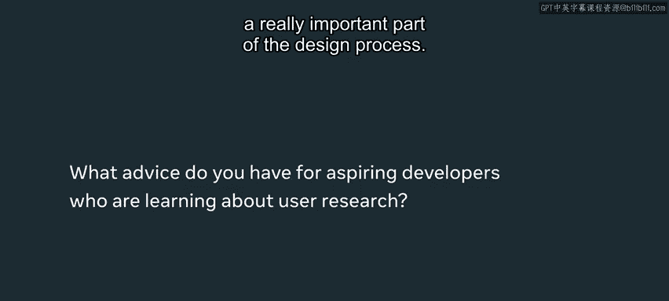
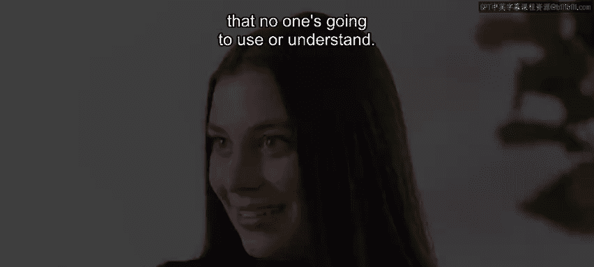

# Meta《前端开发（React／UI、UX／毕业项目／code review）｜Meta Front-End Developer》中英字幕 - P95：12_案例研究-Meta 的用户研究.zh_en - GPT中英字幕课程资源 - BV1uJ4m1e7HT

I would say user research can be one of the more frustrating parts of the process if it means that you kind of have to change an idea or a product that you've developed。

 but it's also one of the most rewarding pieces of the process because you're seeing how your product actually impacts real people and it puts meaning to your work as well。

🎼，🎼我。🎼The。🎼。My name is Katie and I'm a software engineer on the React apps team at Meta and me and my team work on building new features for Facebookbook。

com。User research is a way of collecting quantitative feedback about how a product is fulfilling user it needs and how understandable it is to an end user Use are the people who are going to be interacting with our products every day and we really need to make sure that we're fulfilling user needs and the best way to do that is by conducting user research。

We collect user research through AB testing， through surveys。

 through observing users actually using the product， and by creating personas as well。

 there's a lot of different techniques for user research and we actually have user researchers at Facebook who are conducting it nearly every day。

User research is integral to the quality of products at meta we conduct user research as we're starting to think around the idea of a product。

 as we're building a product and releasing an MVP and even after we've launched a product to make sure that it's still fulfilling user needs。

 we should collect user feedback early and often， just because we tend to pivot on the direction and the look and feel of our products based on user feedback。

So I would say designers and PMs and user researchers tend to be involved in the user research process。

 user researchers are the ones actually conducting the research。

 they're the ones asking questions to users conducting surveys。

 having the user actually use a product and writing down their feelings about it。

 designers and PMs are more involved in the response to user research。

 they're collecting this user feedback and they're seeing what they need to change about a certain product。

It's been really surprising to me how much user research can influence the direction of a product I remember me and my team built out a new group's feature and we had just worked on the MVP and we were giving it to a group of group admins to actually come and use the feature and we actually ended up changing a lot of things about this new feature after we collected user feedback even down to the name of the product it it made sense to us but it didn't really make sense to our end users so we really had to take a look at the direction of this product。

😊，I think one of the biggest challenges that I faced as an engineer hearing the results of user research is kind of seeing how it defies like your expectations as an engineer。

 it can be really difficult to change really big aspects of your product。

 especially features that you've already built out。

 so I think it's important to kind of conduct user research early and often just so you're not like dealing with the thrash of having to completely overhaul your products because it doesn't fit with the users like you thought it would。

It can also be super rewarding though because sometimes you show your product to users and you realize how much value an individual person gets out of your product and it really puts your work in perspective too so user research is a great way to hear how a feature that we build is actually impacting real people who are using it on a dayto-day basis It's really cool to hear personal andotes about how a feature has positively impacted a group or community and it really brings a human aspect to the work that I do every day。

I think user research is a really important part of the design process。

 You should really think about the questions that you're asking and try not to bias user research toward what you think a product should look like。

 It's good to get open honest answers from users because that will allow you to change and develop your product in a way that will actually fit user needs at the end of the day and that way you haven't built and launched a product that no one's going to use or understand。

