# Meta《前端开发（React／UI、UX／毕业项目／code review）｜Meta Front-End Developer》中英字幕 - P96：13_用户体验和用户界面简介模块总结.zh_en - GPT中英字幕课程资源 - BV1uJ4m1e7HT

Yeah。Congratulations you completed this module on introduction to UX and UI In this module。

 you explored the basics of UX and UI and started studying about user centered design It's now time to recap the key points and concepts you learned and the skills that you gained。

You began the module with a general introduction to the course After you completed the first lesson you were now able to differentiate between UX and UI and identify career options for the UX and UI disciplines。

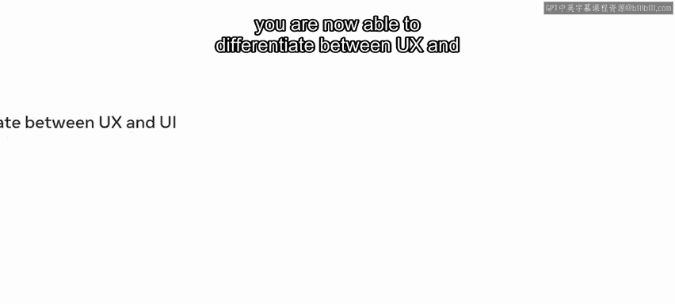

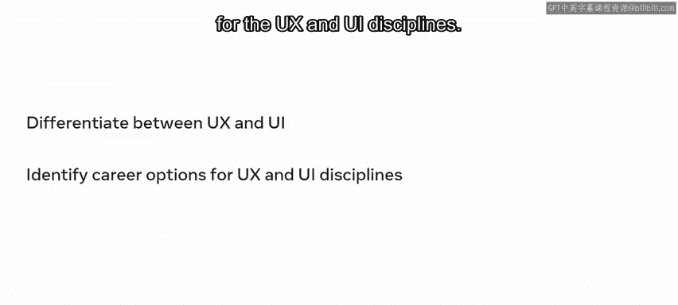

After you covered an introduction to UX and UI， you progressed to lesson two。

 where you focused on UX。In this lesson， you learn to define UX and identify the key stages in the UX process。

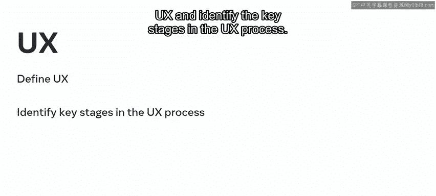

Now you are also able to discuss UX goals and identify the usability quality components。

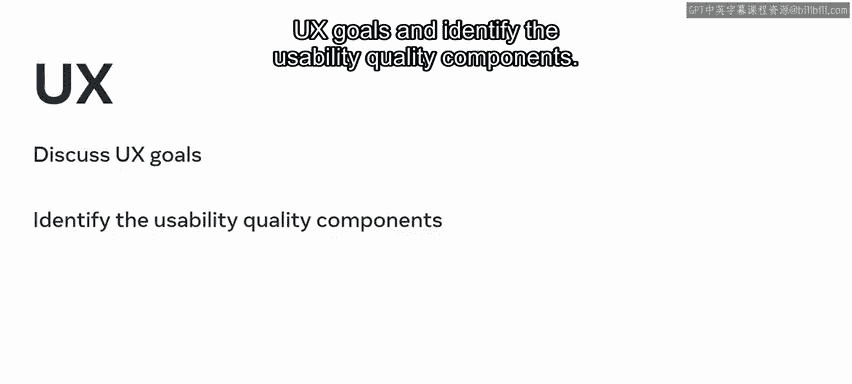

They are learnability， efficiency， memorability， error and satisfaction。Still in lesson two。

 you covered an overview of the UX process where you recognized each of the stages， empathize。

 define， ideate， iterate， and test。

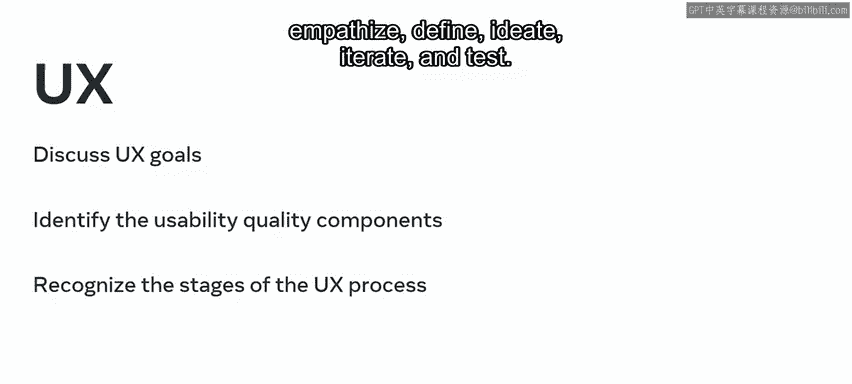

After studying UX， you are ready to learn more about UI。

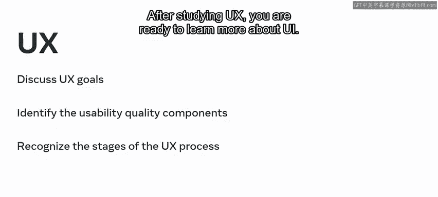

In lesson three， you learn to explain the concepts of UI and describe its history。

You also learn to identify applications of UI， recognize the importance of successful UI design and explain different types of design。

 including interaction design， human centered design， Uni design and design thinking In addition。

 you got an introduction to Figma， the design tool you explore in this course After an introduction to UX。

 UI and Figma， you covered user centered design In this lesson you used data from customer interviews and observations to better understand their issues while using the little Lemon website In this process。

 you explored a customer journey map and reviewed a persona in the empathy stage of the UX process。

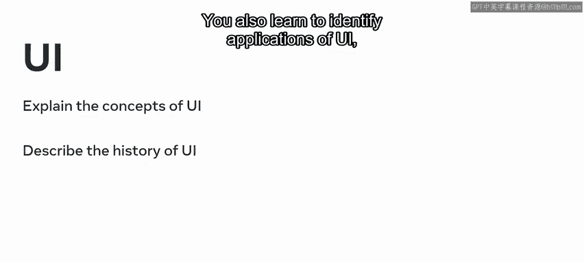

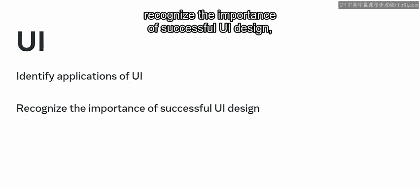

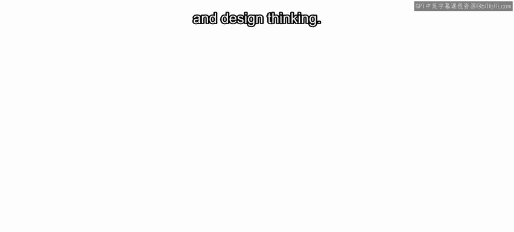

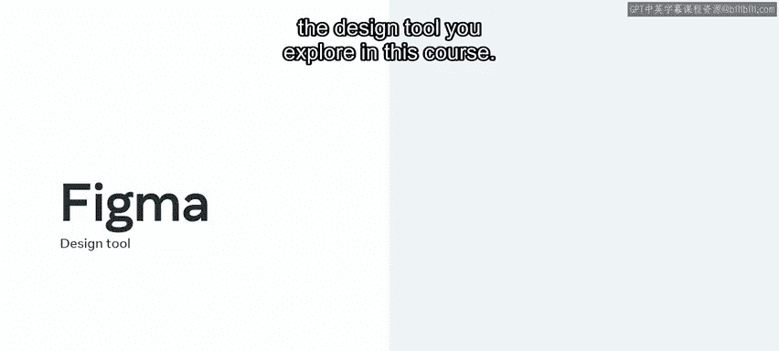

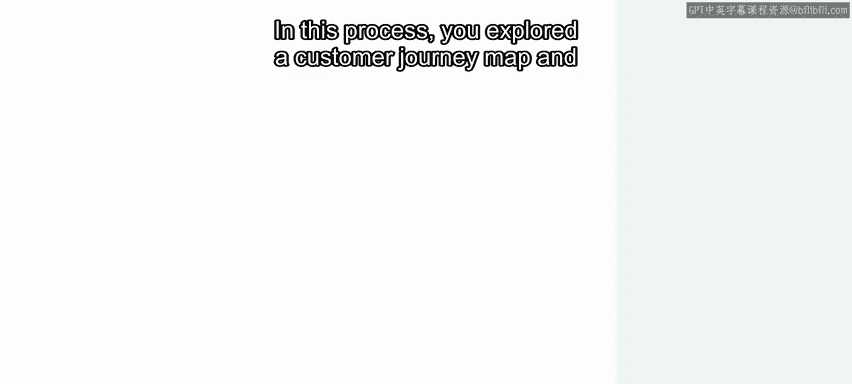

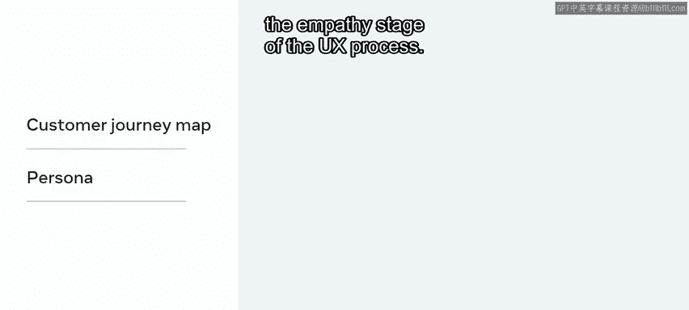

You now have an initial understanding of UX UI and usercented design You can explain the differences between UX and UI and recognize the importance of putting the customer in the forefront of your decisions as you work on your redesign That's a great start to your UX and UI journey Well done。

