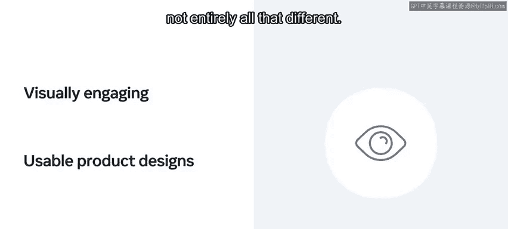
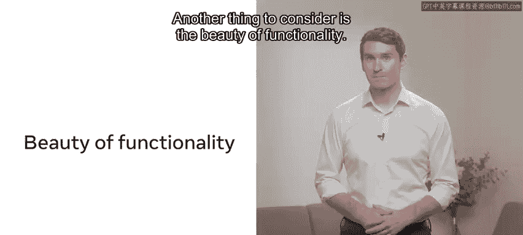
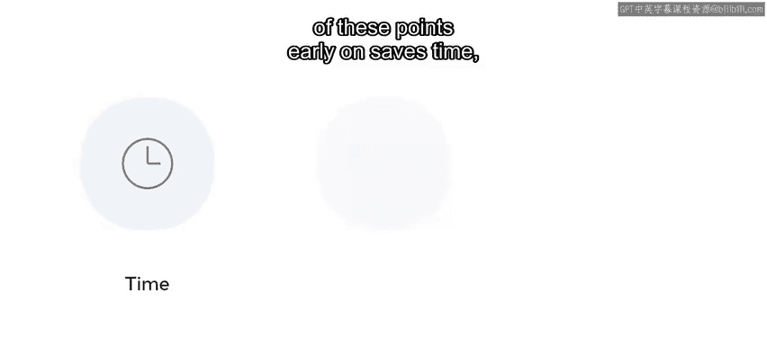
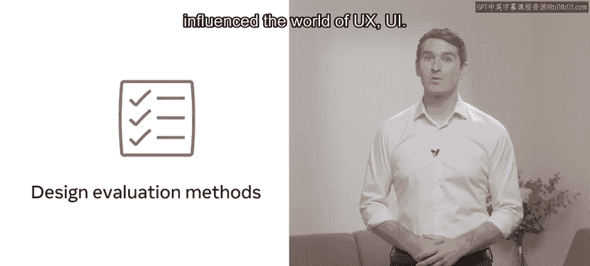
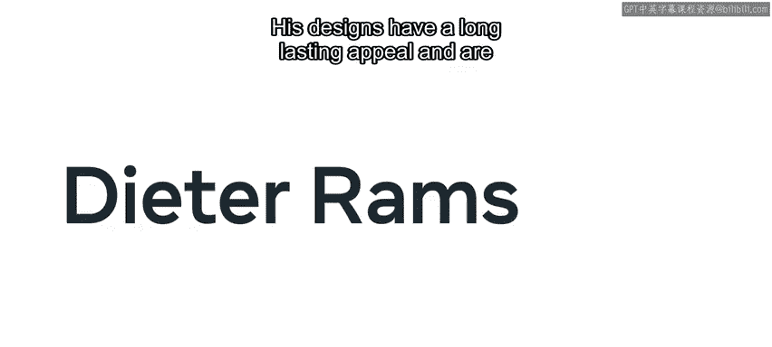
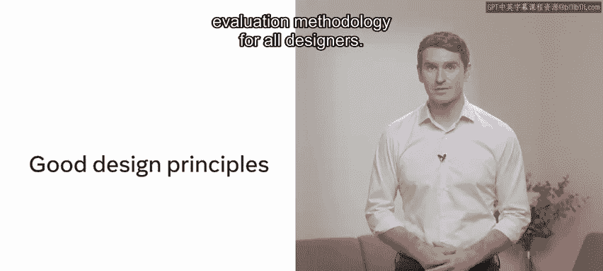
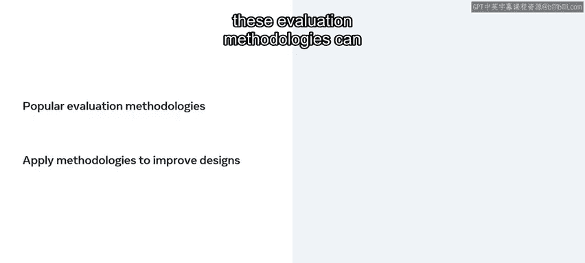

# 前端开发：P97：14_评估设计 📐

在本节课中，我们将学习如何评估设计。你将了解用户体验和用户界面设计中流行的评估方法论，并探索如何应用这些方法来改进你的设计。

## 概述

现在你已经了解了用户在小柠檬网站上遇到的问题。接下来，我们将探讨一些备受推崇的设计师提出的原则。你可以使用这些原则来评估当前的小柠檬网站，并在创建自己的设计时应用它们。

设计就像食物一样，具有主观性。对某人来说美丽的东西，可能并不符合其他人的品味。但就像食物一样，有一些规则我们可以遵循，以确保为客户提供愉快的体验。

## 功能之美 💡

上一节我们提到了设计的主观性，本节中我们来看看功能的重要性。

需要考虑的另一点是功能之美。

考虑一个注册表单。当然，它可能不是最漂亮的设计，但它可以运行得非常出色。并非所有美丽的东西都实用，反之亦然，并非所有运行良好的东西都看起来漂亮。功能应始终优先于美观。

现在，试着考虑一些既易于使用又看起来很棒的东西，这说起来容易做起来难，对吧？但有一些评估方法会有所帮助。

## 评估方法的价值 🧭

重要的是要知道，尽管你即将了解的指导原则非常宝贵，但你并不需要以非常详细的方式应用它们。相反，将这些广泛的建议用作指南，在坏习惯发生之前发现它们，并思考能满足这些指导原则的、更具可用性的替代方案。

更重要的是，尽早注意这些点可以节省时间、金钱，并有助于你从长远来看创建更具可用性的解决方案。

因此，让我们从讨论设计评估方法开始，看看这一切从何开始，以及谁的方法影响了UX/UI世界。

## 主要评估方法论 📋

以下是三种核心的设计评估方法论，它们为评估和改进设计提供了坚实的框架。

**迪特·拉姆斯的设计十诫**
迪特·拉姆斯是一位德国工业设计师和学者，在UX/UI领域非常有影响力。他的设计具有持久的吸引力，至今仍受到重视并影响着设计师。他撰写了“好设计的十项原则”，这为所有设计师提供了一个很好的评估方法。

**雅各布·尼尔森的十大可用性启发式原则**
另一个重要的方法是雅各布·尼尔森的“用户界面设计的十大可用性启发式原则”。所有这些都特别与人机交互相关，也称为HCI。这种方法与拉姆斯的原则有一些重叠。

**本·施奈德曼的八项黄金法则**
最后一种设计方法是美国计算机科学家本·施奈德曼的“界面设计八项黄金法则”，它被命名为“施奈德曼评估法”。同样，它与其他方法论有一些重叠。

## 应用与实践 🛠️

上一节我们介绍了三种主要的评估方法论，本节中我们来看看如何应用它们。

请务必探索提供的评估速查表作为阅读材料，以指导你判断哪些方面可能存在问题。

确保根据这些原则评估表单流程，并尝试优先处理最严重的问题。

你现在应该能够运用好设计的原则来评估各种设计了。

## 总结

在本节课中，我们一起学习了流行的评估方法论，以及如何应用这些评估方法来改进你的设计。

请记住，如果你在构思阶段就注意这些方面，即在设计之前，你可以为自己节省大量时间。

做得好。