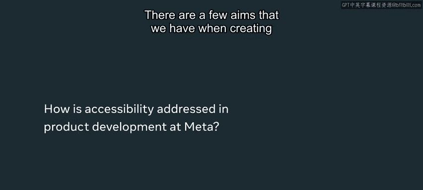
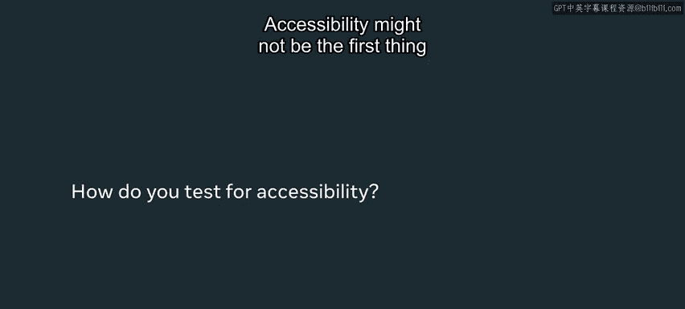
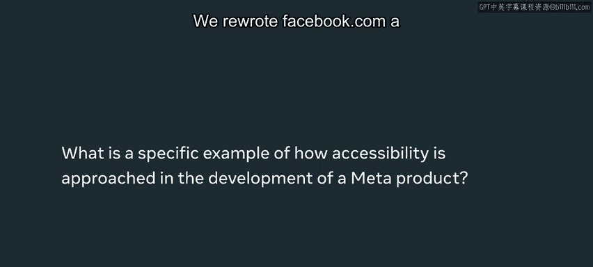
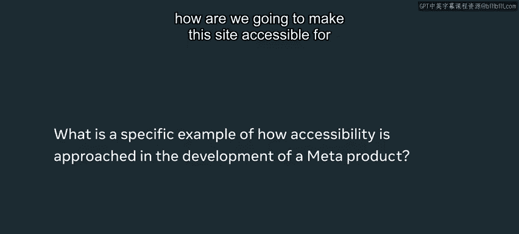
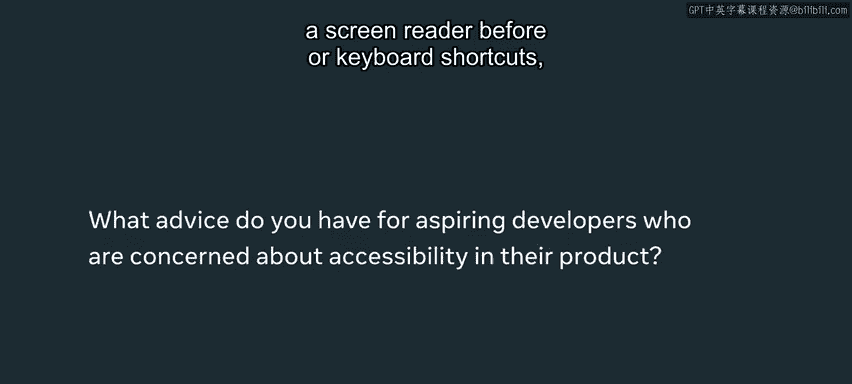
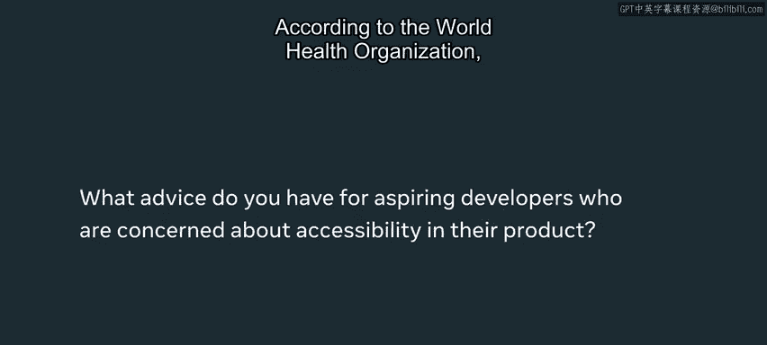

# Meta《前端开发（React／UI、UX／毕业项目／code review）｜Meta Front-End Developer》中英字幕 - P98：15_案例研究-Meta 的无障碍设计.zh_en - GPT中英字幕课程资源 - BV1uJ4m1e7HT

Over 100 million people who use our apps use different font sizes in screen Zoom and around another 250K use screen readers。

 so it's really important that we're giving those people the same valuable experience on Facebookbook。

com that we're giving to everyone else who uses their sites too。

My name is Katie and I'm a software engineer on the React App team at Meta and me and my team work on building new features for Facebook。

com I hope in this video you are in the importance of accessibility and different strategies that you can use when you're building a product and when you're launching it to make sure that it's accessible for everyone。

So there are a few aims that we have when creating an accessible product here at Meta。

 we want our product to be able to work with a screen reader so that nonssideighted people can use Facebookbook。

com the same way that everyone else does We also want to make sure that there are adjustable font sizes for people who might not be able to read small fonts we want to make sure that there's a variety of keyboard shortcuts available to those who are using our apps as well。

Accessibility might not be the first thing you think of when you go to Facebook co。

 but it's certainly top of mind for the engineers and teams here at Me。

 It's something that I as an engineer try to test with every change that I make and it's something that's built in to our core UI components as well when I'm testing accessibility I'm making sure that I'm able to tab through my feature using my keyboard I'm making sure that keyboard shortcuts are set up properly。

 the screen reader is able to properly identify all parts of the page and then there are other sitewide things that we have like variable font sizes that are sort of just given for free when I'm building a new feature。

 As an engineer I'm testing my individual changes but there are a few built-in solutions for making sure that products are accessible across the board。

 For example， when an engineer adds a new button if it's not accessible via a screen reader a red overlay will actually appear on the button that'll flag to the engineer that they're missing an Aria label。

Or some other accessible component in that button。 So it's really easy for engineers to spot when they're missing something related to accessibility After a product is built and launched too。

 we work with accessibility specialists to make sure that our product is meeting the standards for accessibility too。

We rewrote facebook。com a couple years ago and we had to really think about how are we going to make this site accessible for the percentage of people who need to use screen readers and different font sizes。

 one example of how we made facebook。com accessible is we actually made different font sizes。

 default throughout the entire site it's difficult to ask every product team and every engineer to account for different font sizes when they're building their products so luckily a lot of our engineers use the same core components and we actually use a style transform so that we can globally change the size of fonts across our site so now when users want to specify that they want a larger or smaller font it's applied everywhere automatically and engineers don't really need to think about it when they're building their products。

I would say that if you've never used a screen reader before or keyboard shortcuts。

 definitely do your research and look into them according to the World Health Organization or I think around 15% of people have a disability of some form and it's really important that you're giving those people the same quality experience that you're giving all of your other users so it's definitely super important and you want everyone to engage with your product so this is a really important step that you can take to ensure that。

