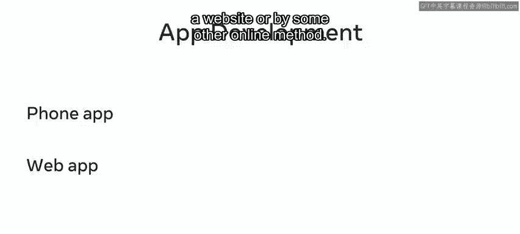
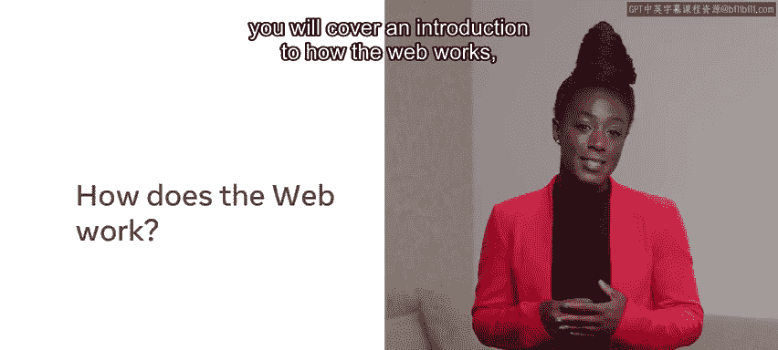
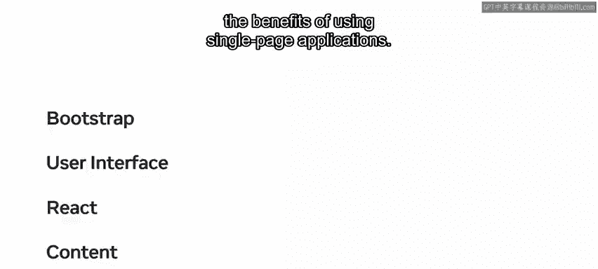
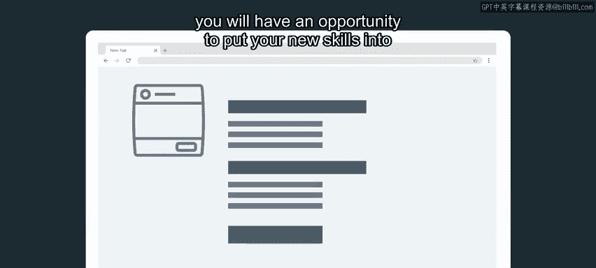

# 前端开发入门：P2：1_简介

## 概述
在本节课中，我们将要学习前端开发的基础知识，了解网络如何运作，并预览整个课程的学习路径。我们将从日常生活中的网络应用开始，逐步深入到构建网站和网络应用所需的核心技术与工具。

---

## 日常生活中的网络应用 🌐
你每天进行的许多活动都可以完全在线完成。你可以使用手机、电脑、平板或其他设备上的应用程序来访问网络，执行诸如购物、预订酒店以及与朋友和同事聊天等任务。

随着远程工作变得越来越流行，你可以在家中舒适地工作、与同事互动并保持高效。这一切的实现，都依赖于互联网基础设施、技术以及构建你所使用应用程序的专业人员的技能。

需要提及的是，当你遇到“应用”这个术语时，它可能指的是手机上的应用，也可能指在网站上运行或通过其他在线方式运行的网络应用。

---

## 课程内容与目标 🎯
上一节我们了解了网络应用的普遍性，本节中我们来看看本课程将具体涵盖哪些内容。

从模块一开始，你将学习网络如何运作，包括探索网页、网络服务器和网络浏览器。你将了解它们各自是什么，以及它们在将互联网带到你面前的过程中扮演什么角色。

你还将获得使用核心互联网技术（如HTML、CSS和JavaScript）的实践机会。你将学习开发者如何将这些技术结合起来，构建功能性和交互性的网站与网络应用。

随着课程的深入，你将探索专业开发者使用的一些工具。你将学习使用最佳实践和标准进行编码的基础知识。例如，你将学习如何使用网络浏览器内置的开发者工具，以及使用被称为集成开发环境（IDE）的行业标准软件进行编码。专业人士使用IDE来更高效地编写代码。

---

## 课程模块详解 📚
以下是本课程各个模块的详细介绍。

### 模块二：HTML与CSS入门
在模块二中，你将通过HTML 5和CSS的介绍开始你的编码之旅。你将学习这两种语言的基础知识，以及它们如何相互配合来布局和样式化网页上的元素。这包括文本、图像和视频等多媒体元素。

此外，为了确保你的网页对所有人都可访问，你将学习如何进行网页无障碍编码。

### 模块三：框架、库与响应式设计
在模块三中，你将学习开发者如何使用框架和库。本模块将重点介绍响应式设计。你将学习如何实现Bootstrap库，以便网页无论使用何种类型的设备都能提供出色的浏览体验。

你还将了解用户界面（UI）设计，以及如何使用常见的UI组件，并通过灵活的Bootstrap网格系统来定位它们。

接下来，你将接触React——一个免费开源的JavaScript库，开发者用它来基于UI组件构建用户界面。然后，你将了解静态内容与动态内容的区别，以及使用单页应用程序的好处。

### 模块四：实践项目
说到内容，在模块四中，你将有机会通过编辑你自己的个人传记网页来实践新学到的技能。

---

## 学习方法与建议 💡
本课程为你提供了网络开发的入门介绍。它是一个课程项目的一部分，旨在引导你走向软件开发职业。你的课程中有许多视频，将逐步引导你实现这个目标。

观看、暂停、回放并重新观看视频，直到你对自己的技能充满信心。然后，通过查阅课程读物来巩固你的知识，并在课程练习中实践你的技能。

在学习过程中，你会遇到几个知识测验，可以自我检查学习进度。

考虑成为一名网络开发者的不止你一人，课程讨论提示使你能够与同学建立联系。这是分享知识、讨论困难和结交新朋友的好方法。

为了在课程中取得成功，你应该尝试为你的学习制定一个时间表。理想情况下，为自己设定一个固定的学习时段和时长。

你可能在本视频中遇到了许多新的技术词汇和术语。如果你现在不能完全理解所有这些术语，请不要担心。随着课程的进行，一切都会变得更加清晰。

---

## 总结
本节课中，我们一起学习了前端开发课程的概览。我们了解了网络在日常生活中的应用，预览了课程将涵盖的从网络基础到HTML、CSS、JavaScript，再到Bootstrap、React等框架和库的核心内容，并明确了通过视频学习、实践练习、参与讨论和制定计划来成功完成课程的方法。现在，你已经准备好开启前端开发的学习之旅了。