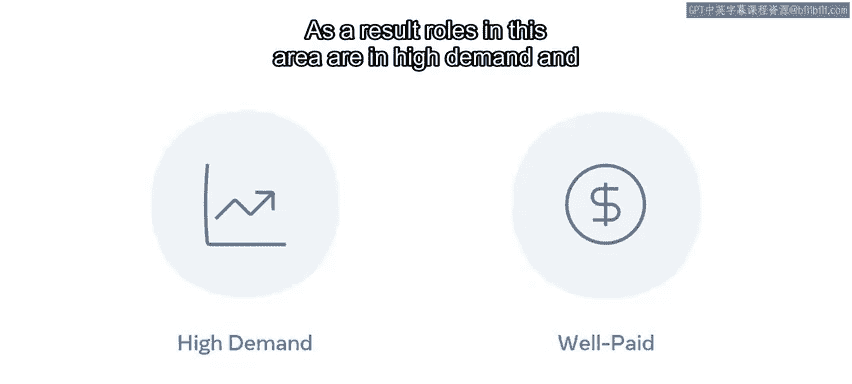

# Meta《前端开发（简介／JavaScript／git／HTML、CSS）｜Meta Front-End Developer》 - P3：2_前端、后端和全栈开发人员角色.zh_en - GPT中英字幕课程资源 - BV1N1421f7K3

When you eat at a restaurant， there are often many cooks preparing in different parts of your meal。

 Similarly， for the websites and applications you use every day。

 Many roles are involved in delivering these projects to users。

If you were to look up a list of high paying I jobs。

 web developer roles would certainly feature prominently and with good reason。

The digital world that we all live in would not be possible without developers creating。

 architecting and maintaining the technology that we use every day on our devices。

But it can be confusing for aspiring developers to understand some of the terminology associated with web development。

😊。

Finding the right area for you will depend on a greater understanding of web developers' roles。

 responsibilities， and technologies。For example， suppose you are a visual person in that case。

 you might want to design a stunning website that offers an excellent experience for its end users。😊。

Or if you're more analytical， you might be interested in working with the technologies that power a high performing ece site。

😊，Likewise， if your interest is mobile devices， your passion may lie in creating the next big social media app。

😊，While job roles and titles may vary， web developer roles are usually split into front end。

 back end and full stack。In this video， you will learn about each of these， their differences。

 and the skills required to gain a job in these areas。😊。

A front end developer is someone that works on all parts of a website or web app that users will interact with This can be anything from the style。

 colors， buttons， menus or user interactions as they click， swipe and interact with the site。

The skills of a front end developer can vary， but they will always focus on three leading technologies。

 H， CSS and Java。 For example， supposeose you are a front end developer assigned the task of adding a newsletter sign up option to the home page of a website In this case。

 you would use HTML to build the display elements such as the input area for the user to type their email address and then the button to click to send it。

You can then use CSS to position color and style these elements on the page。

 and finally you can use JavaScript to process the activity when the user clicks the button。

This could be something like checking the email address is valid and then sending that email address to the website for storage under newsletter members。

While HTML and CSS skills are essential， the most critical skill is usually JavaScript。😊。

It is the powerhouse of frontron end technology。This is mainly because of its versatility and the fact that it is paired with powerful libraries and frameworks such as react by meta。

😊。

These can be used to build rich user interface driven enterprise websites and web apps that are fast。

 secure and highly scalable。😊，The salary of front end developers are competitive and can vary based on experience。

 General， front end developer roles will be available for junior。

 intermediate and senior level professionals。😊，As an aspiring developer。

 this is a great area to get started in。😊，Entry into the job market for a junior position is possible with some fundamental demonstrations of core concepts and skills and an eye catching sample portfolio。

😊，A backend developer works on the parts of a website or web app that the end users don't see。

These activities occur behind the scenes， particularly on the web server。

 in the database or in constructing the architecture。😊。

Backend developers are responsible for creating and maintaining functionality when users request information or when the website needs to communicate to another part of the web architecture for processing。

😊，For example， performing an account login or completing an online purchase using a credit card。

A backend developer will facilitate the interaction of the website and the content stored in database。

As a result， backend development requires different languages， skills and tools。

 While these can vary， they generally consist of knowledge relating to backend programming language。

 database management systems， As and web servers。 Salaries are similar to front end developers and depend on experience。

 Still， the salary may be higher in some instances。 especially for entry and senior level positions。

 This is because getting started with backend technologies requires more set up， configuration。

 resources and general I structural knowledge。

This is in contrast to the front end where you can start learning some elements using only a web browser。

The road to back end development is generally long。

 as you must have a proficient understanding of the needs of front ten technologies。😊。

This can include things like the inner workings of the internet， networks and servers。

It's pretty common for aspiring developers to first start with the front end and then move to the back end once they have acquired specialized knowledge。

 a full stacked developer is someone equally comfortable working with front end and back end technologies。

😊，Full stack developers have skills and knowledge in all areas of the web development project cycle。

 for example， they have relevant expertise in the planning， architecture， design， development。

 deployment and maintenance of the website or web app full stack developer positions are generally at a more senior level。

It can take some time to gain the knowledge， professional experience and skills to become a full stack developer。

😊，As a result， roles in this area are in high demand and are some of the best paid jobs in the IT industry。

