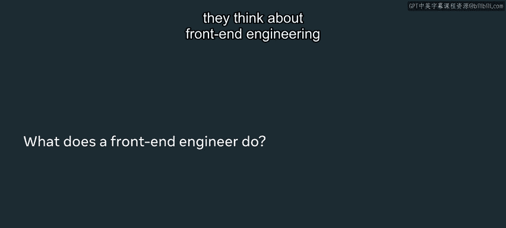
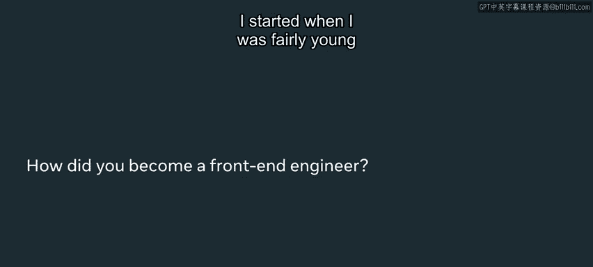
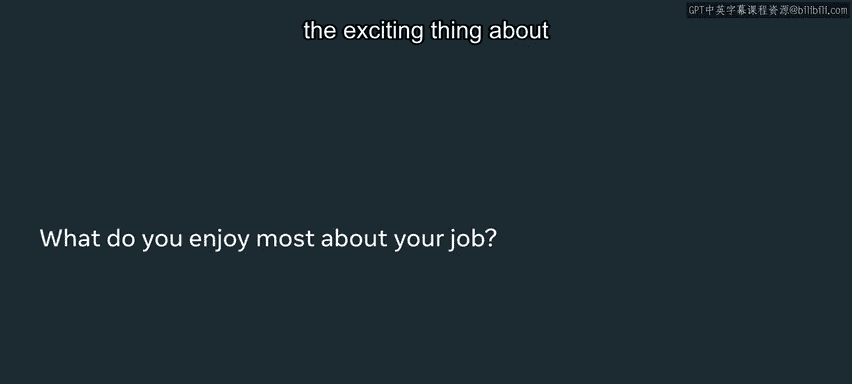
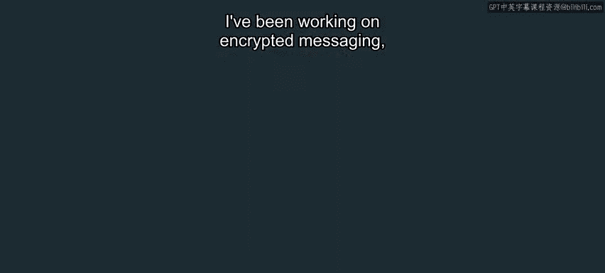
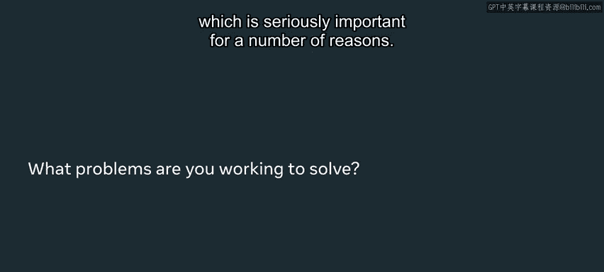
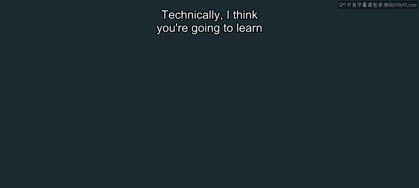
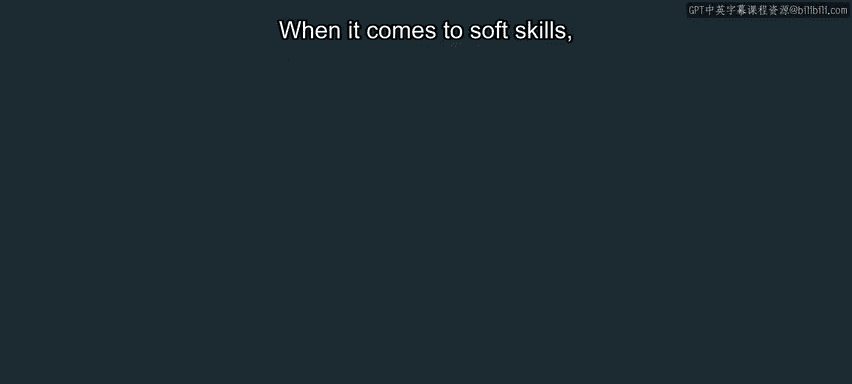
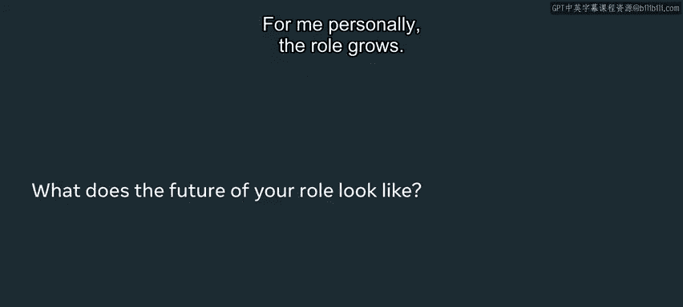

# Meta《前端开发（简介／JavaScript／git／HTML、CSS）｜Meta Front-End Developer》 - P4：3_前端开发人员的一天.zh_en - GPT中英字幕课程资源 - BV1N1421f7K3

I think where front end development's different is you have to work with designers。

 You've got to work with product managers。 It's fundamentally very collaborative。

 It's got like the right brain， algorithmic thinking and how to make things perform and work。

 And then it's got the left brain。 Like， how do you make things usable and enjoyable to use。 Well。

 I sort of found my way into front and engineering。 And now it's like I couldn't imagine leaving in。

😊，Hello， I'm Benedict Tobart， people call me Benny， I'm a software engineer at Nata。

I think a lot of people that get into front in engineering， they don't really think about。

They think about front end engineering as an engineering problem。 You' building stuff。

 You're solving a problem。 When what you're doing is building products for people and you're helping people solve their own problems。

 So there's a lot of collaboration that comes with that working with designers， working with PMs。

 You're not some programmer slouched over a desk， typing away all day。

 It's a highly collaborative environment you're stepping into。

 I started when I was fairly young with building a fan website for a game called Everquest。😊。

So I first started making websites around that time， but I never really considered。

 considered it as a career path。 I actually left building websites and came back to it later in university。

 I think where I really actually started treating it like a career was in my second year of university。

 I had a cool cousin who was a programmer。 And he was like you should do this subject。

 What hooked me initially was that I was。Building something I was excited by。

 I think it's the practicality of solving problems with software that was really appealing。

 A typicalyical day is， I'll start off。Be it working from home or getting into the office and reviewing code。

 helping， you know， giving advice on how things could be built better。

 I often have meetings with designers and product managers on the things that we want to build。

And I support a lot of engineers， you know， solving the problems they have。It's wide and varied。

 And I think that's the excited， exciting thing about getting into software in general。

 There's a lot of space to be。

A different type of engineer。 You could get excited about， you know， solving these really hard。

 technical， challenging problems。But if you're doing it without a purpose， you know。

 I lose motivation。 right， So it's like knowing that there's someone at the end of the the other day。

 I'm hoping helps me focus my energy on the problems that do need to be solved versus the problems that don't。

 So I've been working on encrypted messaging， which， you know， seriously imported。

For a number of reasons， you take it very seriously when you're building those sort of products that you know。

 allow people to communicate safely and privately。 when you're solving a really hard problem。

 It's easy to think you're not making any progress。

 And I think everyone talks about imposter syndrome in the industry。

 So if you're like not making progress and you're putting in these hours。

 you start to think of it should I even be there， can I solve this problem。

 That's like a hard thing to to get over， And that's probably like the worst part of the job。

 technically， I think you're going to learn a lot of what I do in this course。

 going through how to write code， how to make it work， how to make it accessible。

 and to shipping it to people， Javascript， H， Css get。

 these are all foundational that you'll find across every web development company。

When it comes to soft skills， there's a lot of empathy trying to understand other people's perspectives。

 So engineers， you know， we care about performance， we care about accessibility。

 we care about you know， things being correct， and it usually takes engineers a long time to understand。

 you know a designer's perspective or you know， a product manager's perspective because you think so algorithmically。

 you need to solve every problem versus like， you know that 80% user problem。

I work with a fantastic designer who actually jumps in on the dis。

 and I can ask him questions in the code， and he can code a bit。 And' talking about empathy。

 He has it a understanding of the work I do。 And I've got an understanding of the work he does。

 At the end of the day， it's good to recognize it。 You're a software engineer。

 And your job is to like， bring。😊，A lot of their vision to life， right， So， you know， likewise。

 a designer won't get into your code and tell you how you should best architect to structure your code。

 You need to give advice and you're there to support When you find an issue。

 It's highly collaborative。 A good front end engineer will actually be， you know。

 dip their toes into back end。 Proble solving is consistently hard。

 whenever you're learning and pushing yourself。 you're going to run into roadblocks。

 best advice is go easier on yourself。 Go in with the mentality that your goal is to grow and and be it become a software engineer or a better person。

 adopting a growth mindset to developing is going to be critical， find time for yourself。 I mean。

 it's not my place to talk about the psychology of being easy on yourself。

 but that's just as important as any of the engineering stuff you learn。For me personally。

 the role grows like as you build things and you solve problems。

 you get perspective into other problems that and it's this idea of growing your scope。

 you start off。

You know， as an engineer， you solve like， how do you sort a list and how do you drop a list on a page。

 How do you make a button work。 And by the end of it， you're working on encrypted messaging at Ne。

 I think we're at a really exciting point in the industry。

 There are a lot of new exciting technologies There are a lot of new ways and new products that are going to be built in the next next coming years and finding those opportunities and solving new problems。

😊，Yeah， deeply satisfying。