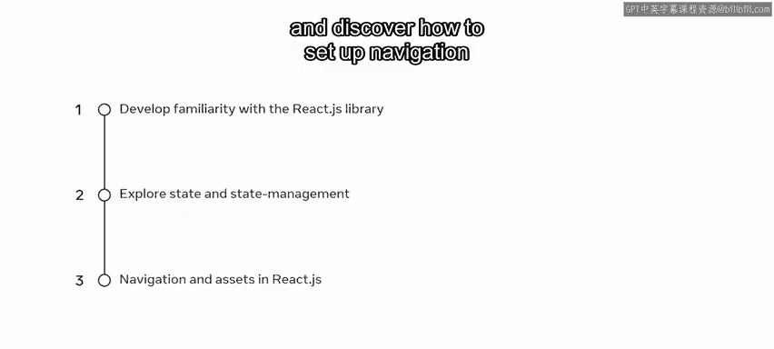
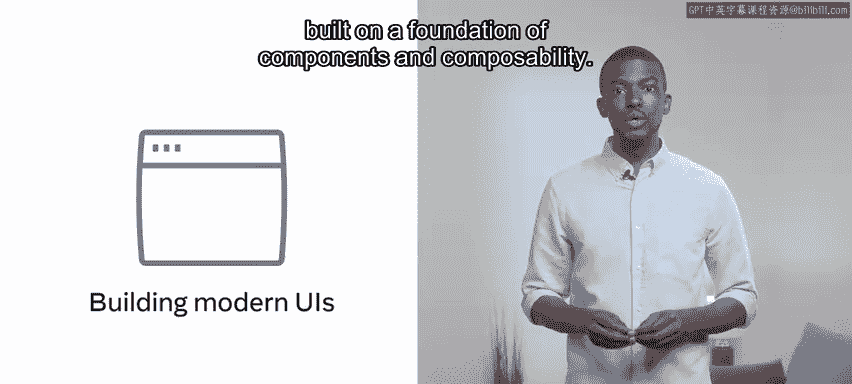
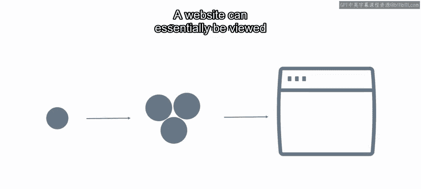
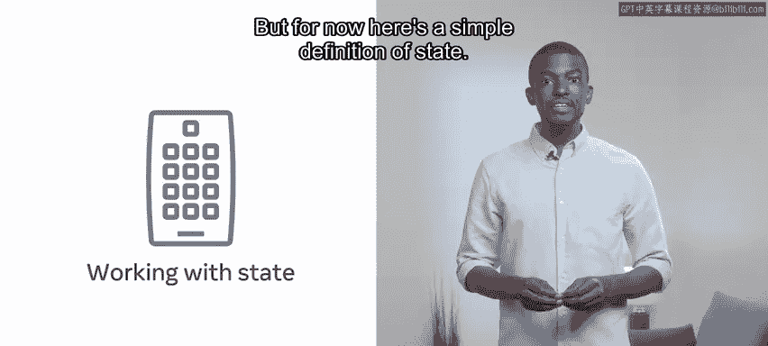
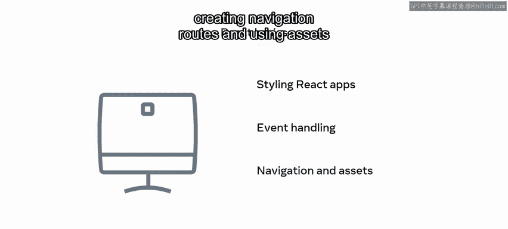

# 1：React 基础课程简介

在本节课中，我们将要学习 React 基础课程的整体介绍，了解课程的核心目标与主要内容。

欢迎来到 React 基础课程。本课程将向你介绍使用 React 的基础知识。在本模块中，你将学习如何熟悉 React 库的基本结构和使用方法，探索状态和状态管理的概念与实际应用，并了解如何在你的 React 应用中设置导航和使用资源。

## 构建用户界面

上一节我们介绍了课程的整体目标，本节中我们来看看 React 的核心应用场景。

你将首先学习如何使用 React 在网站前端构建现代用户界面（UI）。

这涉及到用户界面（UI）中独立部分的概念。这些独立的 UI 部分通常被称为**组件**。你将在本模块的后面更详细地探索组件。目前，你只需要知道每个网站的 UI 都是建立在组件和可组合性的基础之上。

简单的组件组合成更复杂的组件，最终合并形成一个网站。因此，一个网站本质上可以被看作是一个高度复杂的组件。

网站 UI 中的组件并不局限于 React。但 React 如此受欢迎的部分原因在于它简化了构建和组合组件的过程。React 高效地做到了这一点，并且不会对你的浏览器资源产生重大影响。

## 理解与应用状态

了解了组件是构建 UI 的基础后，接下来我们将探讨 React 应用中的另一个核心概念。

本课程将讨论的另一个主要主题是在 React 应用中处理**状态**。随着课程的深入，你将学到更多关于状态的知识。但现在，这里有一个关于状态的简单定义。

状态，简单来说，就是你的应用在任意给定时间点正在处理的所有变量的所有值。用公式可以表示为：

**应用状态 = { 变量1: 值1, 变量2: 值2, ... }**

## 课程涵盖的其他主题

除了组件和状态，本课程还将涵盖一系列构建完整应用所需的关键技能。

随着课程的进展，你还将学习如何为你的 React 应用添加样式，这包括复用通用样式；设置你的应用以响应诸如点击和用户提交数据等事件；创建导航路由和使用资源。

以下是本课程将涵盖的主要技能点列表：

*   为 React 应用添加样式。
*   处理用户交互事件。
*   创建应用内的导航。
*   在应用中使用图片等资源。

## 课程项目与实践

最后，你将通过一个实践项目来巩固所学知识。

你将以一个作品集项目结束本课程，在那里你将应用你新学到的知识。

我希望你和我一样对开始这门 React 基础课程感到兴奋。让我们开始吧。

本节课中我们一起学习了 React 基础课程的概览，明确了我们将要学习的核心内容包括：使用组件构建用户界面、理解和应用状态管理、样式设计、事件处理、导航与资源使用，并最终通过一个项目来实践所有技能。