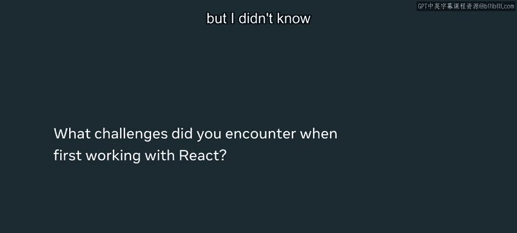
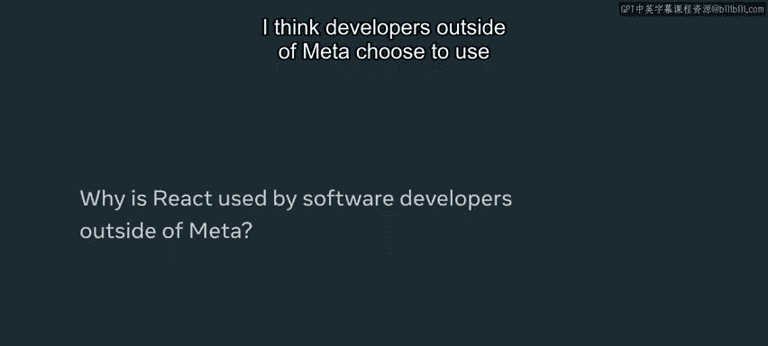
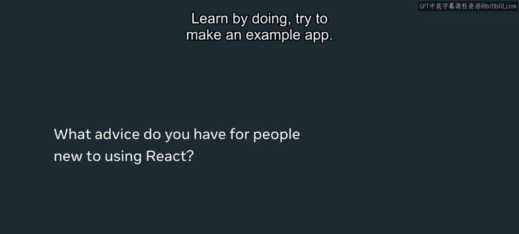

# 3：为什么选择React 🎯

在本节课中，我们将探讨React在技术领域被广泛采用的原因，并了解它为何成为构建现代用户界面的强大工具。我们将从开发者的实际经验出发，分析React的核心优势、适用场景以及它如何解决前端开发中的关键问题。

---

## 无处不在的React

React在技术世界中无处不在，在你的职业生涯中你将有机会持续使用它。因此，掌握React是一项非常有价值的技能。

我的名字是凯蒂，我是Meta公司React应用团队的一名软件工程师。我们的工作是使用React为facebook.com构建新功能。

我第一次接触React是在大学的一个高级设计项目中。当时我们正在为一个正在构建的应用程序寻找一个优秀的客户端库，而React似乎是**最容易使用**和**构建速度最快**的选择。

那时我已经获得了Meta的工作，但我并不知道我将在Meta从事什么工作。因此，能够提前获得使用React的经验是很酷的。我意识到我真的很喜欢用它工作，并且后来在日常工作中也能继续使用它。

---

## 从面向对象到组合思想

在学校里，你往往会做很多使用**继承**的面向对象编程。而React完全不使用那种方式，它使用一种叫做**组合**的概念。

起初，这种思维方式有点难以理解。但React拥有**大量的文档**和**强大的社区**，因此很容易上手，并且你可以从许多不同的地方获得支持。你可以去YouTube看视频、阅读文档，或者查看其他使用React的开源项目。有如此多的资源可供利用。

我认为Meta之外的开发者选择使用React的原因与我们在Meta内部的原因相同：它**超级容易学习和上手**。

---

## 构建高度自定义的UI

使用React，你能够创建真正**自定义的用户界面**。我们每天都在facebook.com上构建许多不同的功能，这些功能需要大量的自定义组件和UI。因此，拥有React提供的灵活性是非常好的。

如果你的用户界面非常**自定义**，并且你希望在选择为应用或网站集成的其他库方面拥有很大的**灵活性**，那么React将是最佳选择。

React只是一个前端库，你还需要与其他第三方库进行交互。如果你希望拥有与Redux或其他第三方库集成的灵活性，React是你的完美选择。

---

## 卓越的代码复用性

如果你的UI很复杂，并且希望在许多不同的页面中**复用代码**，React也非常出色。因此，如果你正在构建一个拥有大量功能、跨越众多不同页面的复杂网站，我认为它是一个绝佳的选择。

我认为React很好地解决了**代码复用性**的问题。在Meta，我们有一套核心的UI组件，实际上可以在整个网站中复用。这意味着我们能够为这些核心UI组件构建很多功能，比如**无障碍访问**。

我认为我们能够在整个网站保持高质量标准，正是因为我们到处复用组件，并且我们甚至能够在Facebook、Instagram和Messenger之间共享代码。我认为这是React一个非常独特的部分。

这真的很有趣，因为如果我在一个核心UI组件中发现了一个bug并修复了它，我不仅为我的一个用例修复了它，而是为整个网站的所有用例修复了它。所以我认为这是一种非常聪明的利用工程努力的方式：你修复一次bug，就解决了所有地方的问题。

---

## React vs. Angular

可以说，React最大的竞争对手是**Angular**。Angular与React的不同之处在于，它是一个用于应用或网站的**完整解决方案**。

使用Angular时，你基本上不需要集成第三方库。而React只是一个客户端库，所以你需要自己解决如何进行**路由**和**服务器-客户端通信**。

我认为React在创建这些复杂的自定义UI方面提供了**更多的灵活性**，而Angular则通过开箱即用的解决方案，让创建单页面Web应用变得更加容易。

---

## 给初学者的建议

**通过实践来学习**。尝试制作一个示例应用，但不要一开始就去尝试创建你听说过的最复杂的应用。我建议从简单的开始，确保你使用了最佳实践。

持续参考文档，检查你是否以正确的方式使用**Hooks**等等。学习过程应该会相当顺利。我认为React的一大好处就是它非常容易上手和学习。

React有很多不同的部分和概念需要学习，但最终这一切都非常值得，因为你将在日常工作中（希望在你的整个职业生涯中）持续使用React，并且有一个庞大的社区在你身后，随时准备帮助你解答关于React的问题。

---

## 总结

本节课中，我们一起学习了选择React作为前端开发库的核心原因。我们了解到React因其**易学性**、**灵活性**、强大的**社区支持**和卓越的**代码复用能力**而受到广泛青睐。它特别适合构建需要高度自定义UI和复杂交互的现代Web应用。通过组合而非继承的思想，以及丰富的生态系统，React帮助开发者高效地构建和维护高质量的应用程序。对于初学者而言，从简单的项目开始，遵循最佳实践，并充分利用丰富的学习资源，是掌握React的有效途径。