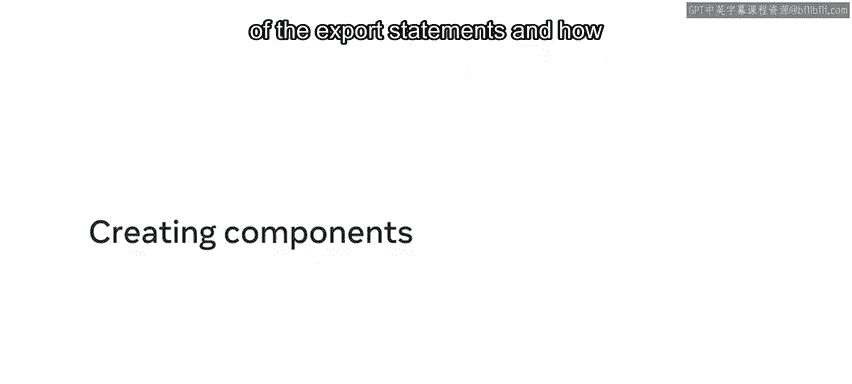
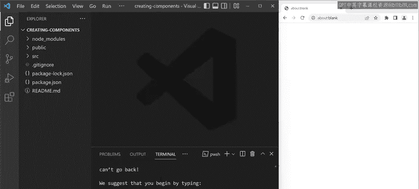
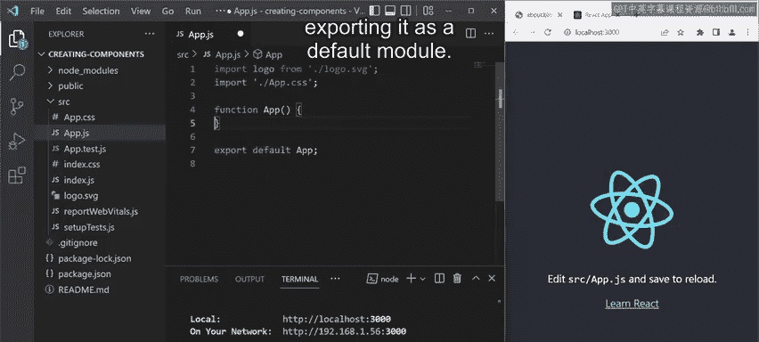
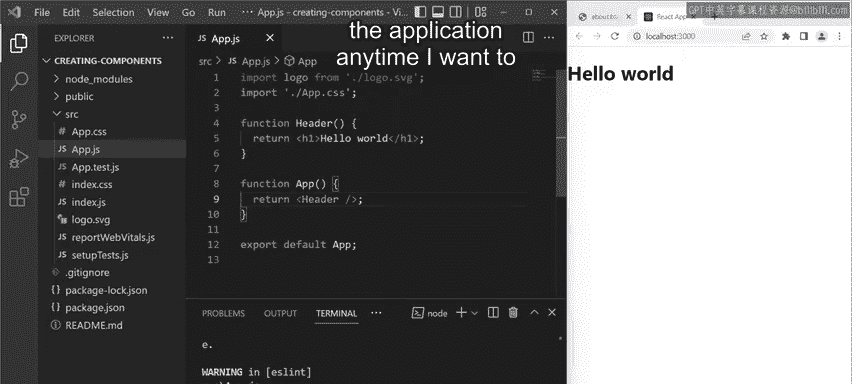
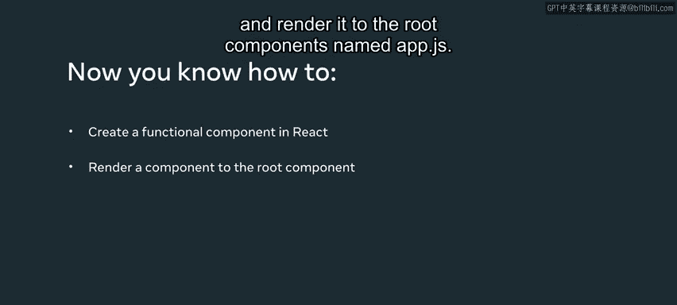

# 6：创建React组件 🧩

在本节课中，我们将深入学习React中的组件概念，并从头开始创建一个组件。你将了解`export`语句的概念，以及如何使用组件来创建可复用的代码块。

## 概述

我们将通过一个简单的例子，演示如何在React应用中创建和渲染一个功能组件。首先，我们会初始化一个新的React应用，然后清理默认代码，最后创建并组合两个组件。

---

## 创建React应用

首先，我打开了VS Code，并在内置终端中打开了目标文件夹。为了创建一个新的React应用，我执行了以下命令：

```bash
npx create-react-app .
```



这个命令中的点号（`.`）指示VS Code在当前文件夹中运行此命令。换句话说，我使用`create-react-app`在当前文件夹内为我构建一个新的应用。按下回车键执行命令。


等待应用构建完成。这个过程可能需要几分钟。构建完成后，我可以通过输入以下命令来启动应用：



```bash
npm start
```


很好，我的React应用已经启动，并在浏览器中加载了`localhost:3000`，这是本地服务器。现在，在VS Code的左侧窗格中，我看到了所有生成的文件和文件夹，例如`node_modules`、`public`、`src`以及`package.json`等文件。你将在后续课程中了解更多关于这些文件的信息。目前，我们只需要在`src`文件夹中工作，因此不必担心其他文件和文件夹。

## 清理初始代码

为了专注于学习如何构建组件，我们需要一个干净的起点。最简单的方法是移除`app.js`文件中函数内的所有代码。

以下是清理后的`App`组件代码：

```javascript
function App() {
  return (
    <div>
    </div>
  );
}

export default App;
```

你可以说这是最简单的组件。我声明了一个`App`函数，并将其作为默认模块导出。




保存文件后，我注意到应用页面现在是空白的。

## 创建新组件

现在，让我创建另一个组件，它包含一些我想在浏览器中显示的文本。为此，我创建了一个名为`Header`的函数。

在函数体内，我返回一个包含问候文本的JSX元素。代码如下：

```javascript
function Header() {
  return (
    <h1>Hello world</h1>
  );
}
```

我的代码看起来不错，但屏幕仍然是白色的。这是因为我还未从`App`函数中渲染任何内容。

## 渲染组件

为了在页面上显示内容，我需要返回到`App`函数并调用`Header`函数。我使用JSX元素语法来渲染一个组件，即我的函数名。

在`App`函数的`return`语句中，我输入函数名`Header`，并用尖括号括起来，记得在右尖括号前添加斜杠。

```javascript
function App() {
  return (
    <div>
      <Header />
    </div>
  );
}
```

请注意，渲染组件的语法与HTML中的自闭合标签非常相似。按`Ctrl+S`（Mac上是`Command+S`）再次保存所有内容。

很好，我的代码现在可以工作了。我注意到浏览器中显示了一个带有“Hello world”文本的HTML标题。



## 组件复用性

恭喜！在这个视频中，你学会了如何创建一个功能组件。这个名为`App`的组件调用了另一个名为`Header`的组件，后者显示了一个带有文本的HTML标题。

目前，`Header`组件的代码与`App`组件存在于同一个文件中。为了使`Header`组件独立且可复用，我需要将其放置在自己的文件中。这样，我就可以在应用中的任何需要显示带文本的标题元素时，多次复用这个组件。你很快将学习如何做到这一点。



---


## 总结

在本节课中，我们一起学习了如何在React中创建功能组件并将其渲染到根组件`App.js`中。我们掌握了以下核心步骤：
1.  使用`create-react-app`初始化项目。
2.  清理默认代码以获得干净的起点。
3.  创建新的功能组件（如`Header`）。
4.  在主组件（`App`）中使用JSX语法渲染子组件。


通过将组件分离到不同文件，我们可以提高代码的模块化和可复用性，这是构建复杂React应用的基础。