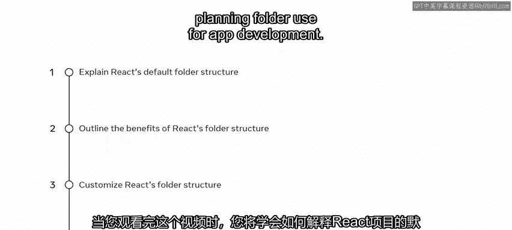
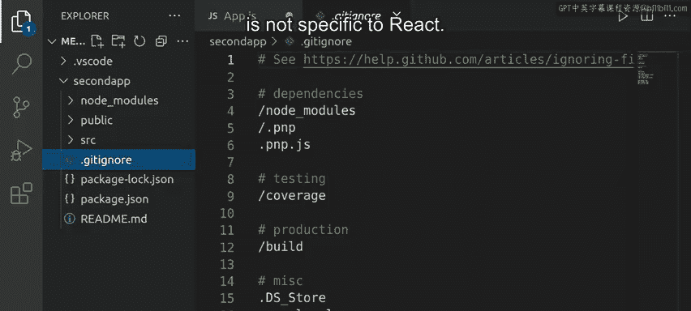

# 7：6_React项目结构 📁

在本节课中，我们将学习React项目的默认文件夹结构，了解各个文件和文件夹的作用，并探讨如何根据项目需求自定义结构。

---



## 概述

一个组织良好的项目结构对于React应用的开发至关重要。它能使组件和资源易于访问和维护。本节将带你了解使用`create-react-app`命令生成的默认项目结构，并解释其核心组成部分。

## 默认项目结构剖析

当你使用 `npx create-react-app` 命令创建一个新的React应用时，项目会自动生成一个特定的文件和文件夹结构。让我们来逐一探索。

### 核心文件夹

项目根目录下通常包含三个主要文件夹：`node_modules`、`public` 和 `src`。

#### 1. `node_modules` 文件夹

你可以将这个文件夹视为你React应用中所有模块的仓库。当你安装特定的NPM包时，`node_modules`文件夹会自动添加。

*   **作用**：存放项目依赖的所有第三方包（库或模块）。
*   **注意**：你通常不需要手动修改此文件夹，它是项目正常运行所必需的。

#### 2. `public` 文件夹

此文件夹包含将直接展示给用户的静态资源。

以下是`public`文件夹内常见的文件：

*   **`index.html`**：这是最重要的文件。React应用的内容会被注入到这个HTML文件`body`内的一个特定`div`元素中。应用的所有更新都会反映在这个`div`里。
*   **`favicon.ico`**：显示在浏览器标签页上的网站图标。
*   **`logo192.png` / `logo512.png`**：用于不同场景的应用图标。
*   **`manifest.json`**：当你的React Web应用被安装到设备（如手机主屏幕）时，此文件提供应用的元数据（如名称、图标）。
*   **`robots.txt`**：用于指导搜索引擎如何抓取你的网站页面。

#### 3. `src` (Source) 文件夹

这是你作为React开发者将花费最多时间的文件夹。它包含了确保React应用运行所需的所有核心组件和逻辑文件。

以下是`src`文件夹内默认生成的一些关键文件：

*   **`index.js`**：这是整个`src`文件夹中最重要的文件。它导入并渲染React应用的根组件（通常是`App`组件），是应用的入口点。
    ```javascript
    import React from 'react';
    import ReactDOM from 'react-dom/client';
    import './index.css';
    import App from './App';

    const root = ReactDOM.createRoot(document.getElementById('root'));
    root.render(<App />);
    ```
*   **`App.js`**：这是应用的根组件。你将从这里开始构建你的应用界面。
*   **`App.css`**：包含`App.js`组件的样式。
*   **`index.css`**：包含应用于整个应用的全局样式。
*   **`App.test.js`** / `setupTests.js` / `reportWebVitals.js`：这些文件与应用的测试和性能报告相关。

**重要提示**：除了`index.js`，`src`文件夹中的其他默认文件（如`logo.svg`、测试文件）都可以安全删除，只要你同时移除引用它们的代码。React对如何在`src`文件夹内组织文件没有强制要求，这给了开发者很大的灵活性。

### 根目录下的其他文件

除了上述文件夹，项目根目录下还有一些重要的配置文件。

以下是这些文件的说明：

*   **`.gitignore`**：用于版本控制（如Git），指定哪些文件或文件夹不应被提交到代码仓库（例如`node_modules`）。此文件并非React特有。
*   **`README.md`**：一个Markdown文件，用于描述项目信息。在GitHub等代码托管平台上非常有用。
*   **`package.json`**：列出了项目的信息、依赖项和可运行的脚本（如`npm start`、`npm run build`）。NPM依赖此文件来管理项目。
    ```json
    {
      "name": "my-react-app",
      "scripts": {
        "start": "react-scripts start",
        "build": "react-scripts build"
      },
      "dependencies": {
        "react": "^18.2.0"
      }
    }
    ```
*   **`package-lock.json`**：锁定所有依赖包的确切版本，确保在不同机器上重建项目时依赖版本一致。通常不应手动修改。



## 自定义项目结构

上一节我们介绍了默认结构，本节中我们来看看如何根据项目规模进行自定义。一个常见的做法是在`src`文件夹内创建新的子文件夹来组织代码。

以下是一种常见的自定义文件夹结构示例：

*   **`components/`**：存放可复用的UI组件（如`Button.jsx`、`Header.jsx`）。
*   **`pages/`** 或 **`views/`**：存放与路由对应的页面级组件（如`HomePage.js`、`AboutPage.js`）。
*   **`assets/`**：存放静态资源，如图片、字体、样式文件。
*   **`utils/`** 或 **`helpers/`**：存放工具函数和辅助代码。
*   **`hooks/`**：存放自定义的React Hooks。
*   **`context/`** 或 **`store/`**：存放状态管理相关的代码（如React Context, Redux store）。
*   **`services/`** 或 **`api/`**：存放与后端API交互的代码。

**规划文件夹结构的好处**：
*   **提高可维护性**：相关文件集中存放，易于查找和修改。
*   **增强可读性**：项目结构清晰，新团队成员能快速理解。
*   **促进代码复用**：将通用组件分离，便于在不同地方调用。
*   **便于团队协作**：明确的规范减少冲突和 confusion。

## 总结

本节课中我们一起学习了React项目的核心结构。我们首先剖析了由`create-react-app`生成的默认文件夹（`node_modules`， `public`， `src`）和根目录配置文件的作用。然后，我们探讨了如何根据实际需求在`src`文件夹内自定义结构，例如创建`components`、`pages`等子文件夹，并理解了提前规划文件夹结构对应用开发带来的诸多好处。记住，虽然React提供了灵活性，但一个清晰、一致的项目结构是构建可维护大型应用的基础。