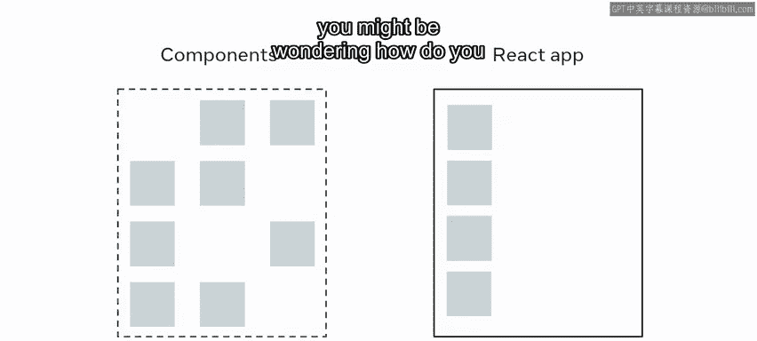
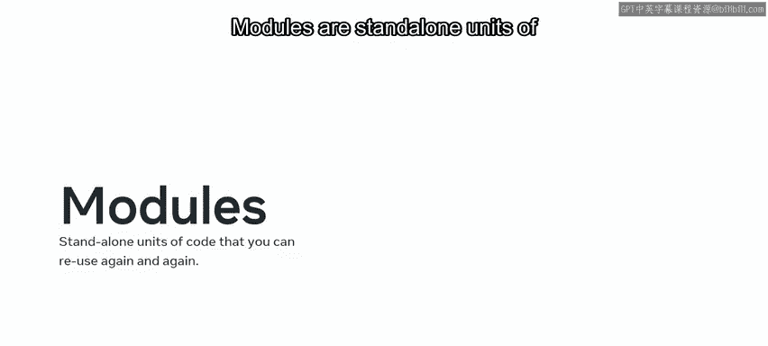
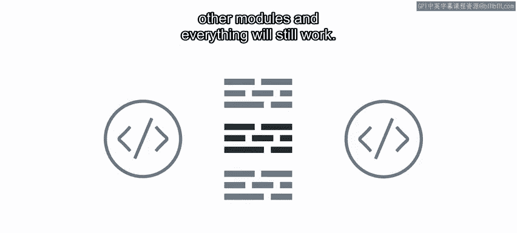
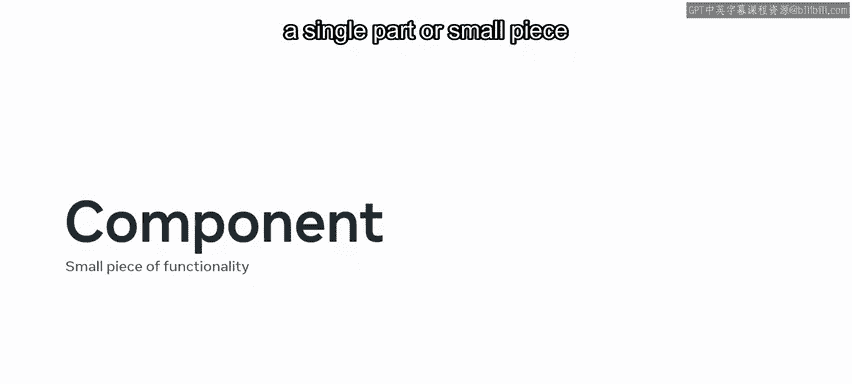
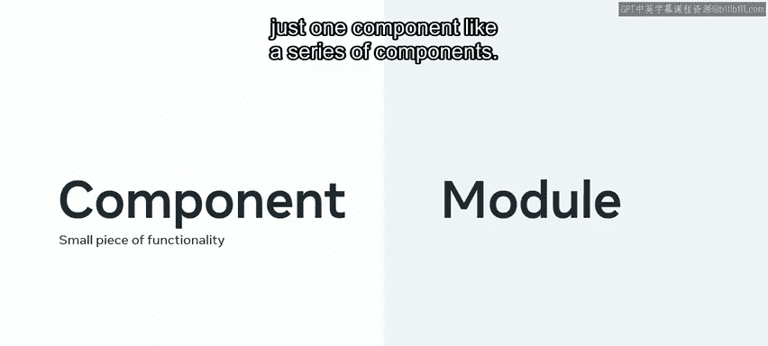
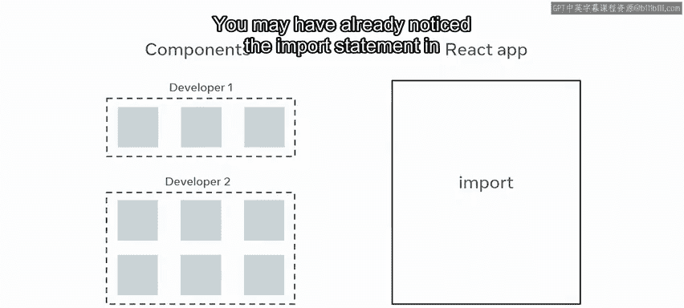
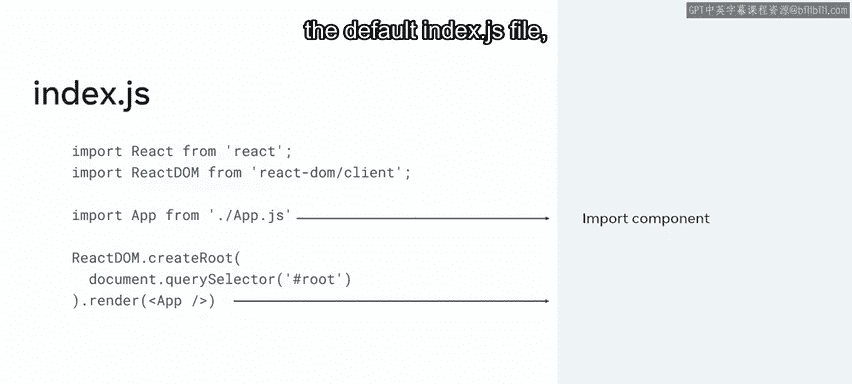
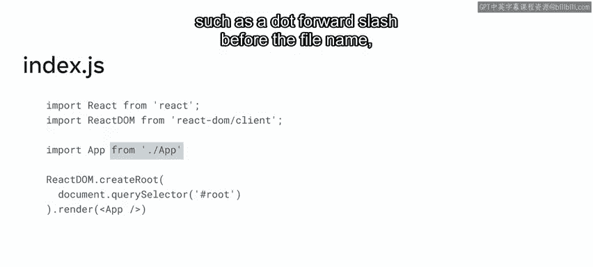
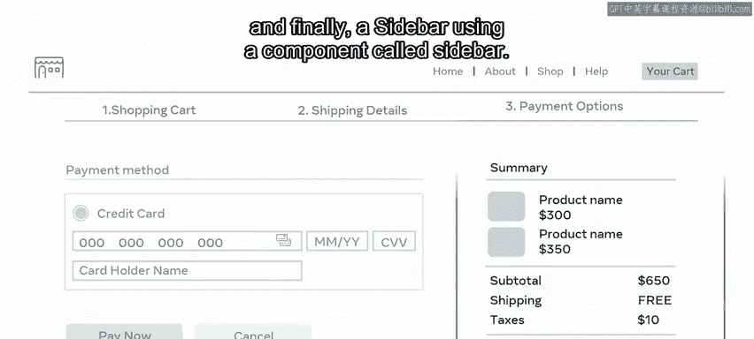
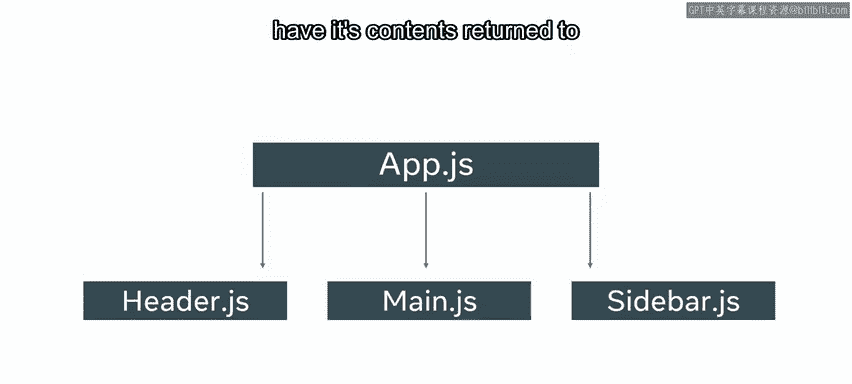

# 8：导入组件 📦

在本节课中，我们将要学习 React 中组件化架构的一个核心优势，即如何通过模块化的方式组织和管理组件。我们将重点探讨模块的概念，以及如何使用 `import` 和 `export` 语句来实现组件间的通信与复用。

---

基于组件的架构优势之一，是你的应用被分割成独立的、自包含的组件。

正如你已经了解到的，这些组件可以用来构建基于可复用代码块的强大用户界面。

为了创建一个功能完整的 React 应用，你需要创建一系列组件。但是，当应用被分解成多个不同的组件时，你可能会想知道如何定位并将它们全部集成到你的应用中。在本视频中，你将学习模块的概念，以及如何通过将组件放入一个 `components` 文件夹来管理你的 React 组件。

最后，你将探索 `import` 和 `export` 语句的结构。作为一名开发者，你经常需要一种方法来使用和复用那些可能在其他地方定义或由他人创建的组件。例如，你是否还记得 JavaScript 中的模块概念？模块是独立的代码单元，你可以反复复用。独立性意味着你可以将它们添加到你的程序中，移除它们，或用其他模块替换它们，而一切仍能正常工作。在 React 中，你可以利用这个 JavaScript 特性，通过将组件放在它们自己的文件中来分离它们。然后，你可以使用 `import` 和 `export` 语句让这些文件彼此通信。

---

### 理解导出（Export）语句 📤

`export` 语句用于使一个模块对另一个模块可用。

将每个 JavaScript 文件视为一个模块会很有帮助。

为了让函数和变量对其他文件可用，你需要导出它们，这使得它们可以通过 JavaScript 中的 `import` 语句被访问。在 JavaScript 中，有两种类型的导出：**默认导出**和**命名导出**。

*   **默认导出**：当函数名与文件名相同时使用。
*   **命名导出**：当你希望函数名与文件名不同时使用。

此时，你可能想知道模块和组件之间有什么区别，因为它们本质上都是 JavaScript 文件。你的想法是对的。虽然它们有相似之处，但可以这样理解：**组件**是一个单一的部分或小块功能，比如一个按钮；而**模块**则可以看作是比单个组件更大的东西，比如一系列组件。

这种将代码分割成多个模块的技术被称为**模块化编程**，它补充了 React 基于组件的架构。

---

### 导入（Import）语句的应用 📥

为了帮助你更好地理解，让我们探索以下场景。

假设你是一名开发者，目前正在使用 React 构建一个应用程序，并且有几个组件需要被包含在应用中。

一些必需的组件已经由你的同事创建好了，因此你需要一种方法将它们导入到你的应用中。为此，你需要使用称为“导入”的操作。

在 React 中，你使用 `import` 语句将组件导入到你的应用程序中。

你可能已经在默认的 `index.js` 文件中注意到了 `import` 语句，在那里 `App` 组件被渲染。

在 React 中导入一个组件，你需要使用关键字 `import`，后跟你想要导入的组件名。

然后使用关键字 `from` 来指定组件所在的位置。

你需要在文件名前使用一个文件路径序列，例如一个点加斜杠（`./`），但文件扩展名不是必需的。

现在你了解了 `import` 和 `export` 语句的语法。

---

### 组织你的 React 组件结构 🗂️

让我们探索一下如何在 React 中构建你的组件结构。

请记住，组件本质上就是一个 JavaScript 文件。React 对于如何将文件放入文件夹没有严格的规定，但是，有一些常见的方法你可能需要考虑。

一种方法是将所有组件放在一个名为 `components` 的文件夹中。这允许你通过将相似的文件分组在一起来构建你的项目。

例如，假设你正在为一个电子商务应用构建一个支付页面，该页面包含三个部分，每个部分在 React 中都将由一个组件表示：

以下是这些组件的示例：
1.  一个标题部分，使用一个名为 `Header` 的组件。
2.  一个支付部分，使用一个名为 `Main` 的组件。
3.  最后，一个侧边栏，使用一个名为 `Sidebar` 的组件。

每个组件将被调用，并将其内容返回到我们应用的根组件，即 `App.js`。

---

在本视频中，你探索了模块的概念以及 `import` 和 `export` 语句的结构。

你还学习了如何通过将 React 组件放入一个 `components` 文件夹来管理它们。