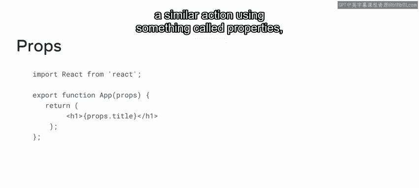
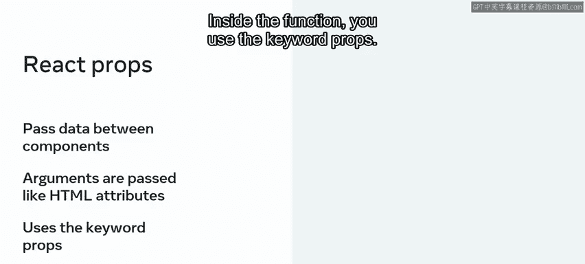
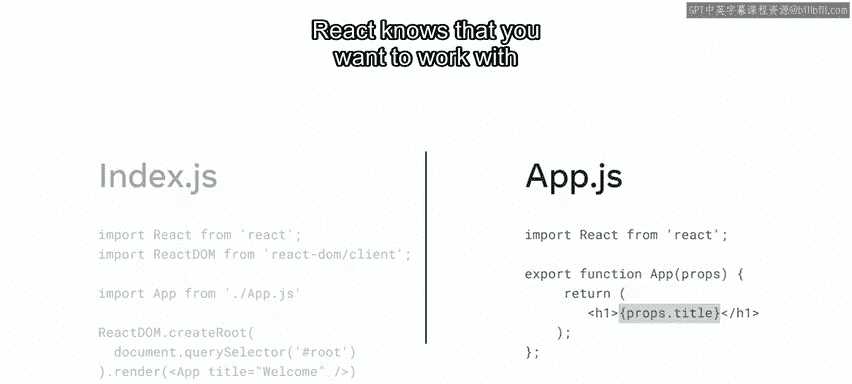
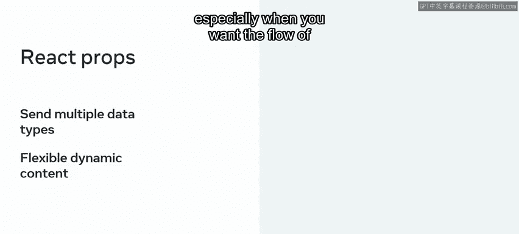
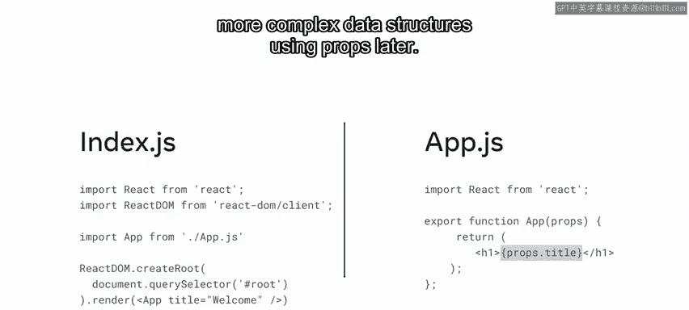
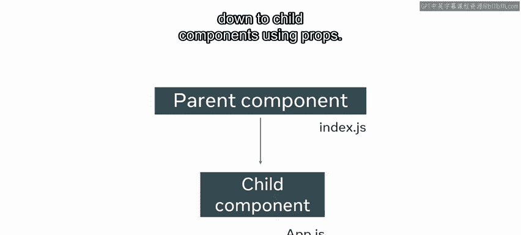
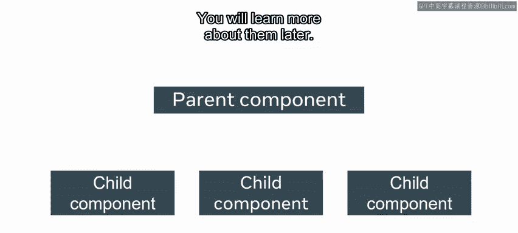
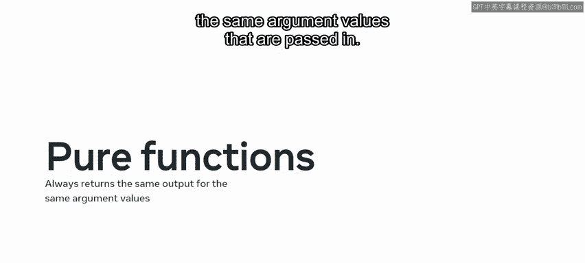
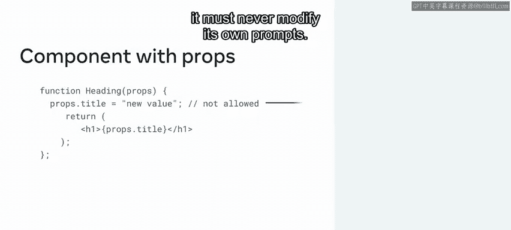

# 9：组件 Props 原则

在本节课中，我们将要学习 React 中一个核心概念：Props。Props 是组件之间传递数据的主要方式，理解它们的工作原理对于构建动态和可复用的 React 应用至关重要。

## 概述：什么是 Props？

现在，您应该已经熟悉 React 中函数组件的概念。它们类似于 JavaScript 函数，是可复用的代码块。

回想一下，在 JavaScript 中，您可以通过声明参数来使函数更加灵活，这样在调用函数时就可以传入值作为参数。



在 React 中，您可以使用一种称为“属性”的特性来执行类似的操作，它被表示为 **props**。


在本视频中，您将了解 props 对象，以及开发者如何使用它在组件之间传递数据。然后，您将探索组件层次结构，并了解为什么组件被称为具有父子结构。

## 预备知识：JavaScript 对象

在开始学习 props 之前，让我们回顾一下另一个 JavaScript 功能，它将帮助您理解 props 的工作原理。它叫做 JavaScript 对象。

在 JavaScript 中，对象是一种特殊的变量，可以包含多个值。当您需要存储不同类型但相关的数据组时，可以使用对象，每种数据类型被称为对象的属性。

例如，假设您创建一个名为 `fruit` 的对象，它包含 `type`、`quantity` 和 `colour` 属性。请记住，这些属性由键值对组成，您可以使用点表示法访问对象的属性。

```javascript
const fruit = {
  type: 'apple',
  quantity: 5,
  colour: 'red'
};

console.log(fruit.type); // 输出：apple
```

在 React 中，您可以使用类似的技术，通过属性对象（简称 props）将数据从一个组件传递到另一个组件。

## rops 的核心概念

Props 允许您将数据从一个组件传递到另一个组件。将 props 视为组件可以接受的参数会很有帮助，它们使用 JSX 语法传递，很像 HTML 属性。在函数内部，您使用关键字 `props`。




## 实践：传递和接收 Props

现在您已经熟悉了 props 的概念，让我们通过一个例子来探索如何向组件发送一些 props 并在 React 应用中打印它们。

假设您在 `index.js` 文件中打开了 React 应用的默认代码。您调用了 `App` 组件。在 `App` 组件中，您返回一个带有静态标题文本的 H1 标题。虽然这段代码可以工作，但您可以通过使用 props 使这个标题变得动态。

现在让我们探索创建此功能的语法。在根组件 `index.js` 中，您将要传递给 `App` 组件的值以 HTML 属性的形式作为参数发送。

接下来，在 `App` 组件中，您使用 `props` 对象来接受这个参数。为此，您需要在函数声明的括号内添加关键字 `props`。

最后，要访问此对象的属性，您使用点表示法来引用作为 HTML 属性参数传递的对象属性名称。

再次提醒，请务必将您的代码用花括号括起来，这样 React 就知道您要处理的是 props 对象，而不是静态文本。

以下是代码示例：

```jsx
// 在 index.js 中（父组件）
ReactDOM.render(
  <App title="我的动态应用" />,
  document.getElementById('root')
);



// 在 App.js 中（子组件）
function App(props) {
  return (
    <h1>{props.title}</h1>
  );
}
```


## rops 的数据类型

因为 props 本质上是一个 JavaScript 对象，所以它可以接受多种数据类型，从简单的类型（如字符串和整数）到更复杂的类型（如函数、数组和对象）。



因此，props 允许开发者在创建和使用组件时具有更大的灵活性，特别是当您希望应用中的数据流是动态的时候。




虽然我们刚刚探索了一个动态打印标题的基本示例，但稍后您将有机会使用 props 练习更复杂的数据结构。


## 组件层次结构与数据流

现在您已经熟悉了 props 如何在组件之间发送数据。让我们更详细地探索这种数据流。

当两个组件相互通信时，发送 props 数据的组件称为**父组件**，接收 props 数据的组件称为**子组件**。

正如您从之前的例子中学到的，这种父子关系允许父组件使用 props 将数据向下传递给子组件。一个父组件也可以将相同的数据发送给多个子组件。



然而，重要的是要知道这种通信是**单向数据流**。


## rops 的局限性



使用 props 无法从子组件向父组件进行通信。相反，开发者会使用其他方法。现在不用担心这个，您将在以后了解更多。


尽管 props 在 React 中是一个非常强大的工具，但它们确实有一些限制。例如，您刚刚了解到无法使用 props 将数据从子组件发送回父组件。

另一个重要的限制与所谓的**纯函数**有关。在编程中，纯函数是指对于传入的相同参数值，总是返回相同输出的函数。

现在不必过于担心纯函数，只需记住：在 React 中，当您使用 props 声明一个组件时，它绝不能修改自己的 props。







## 总结

在本节课中，我们一起学习了 props 如何用于向组件传递数据。

您发现 props 是一个特殊的 React 对象，其工作方式类似于 JavaScript 对象，并且可以通过点表示法访问其属性。

您还了解了开发者为什么使用 props，以使他们的应用更加动态和灵活。

最后，您探讨了使用 props 的一些限制：不能使用它们将数据发送回父组件，并且使用 props 的函数绝不能修改自己的 props。