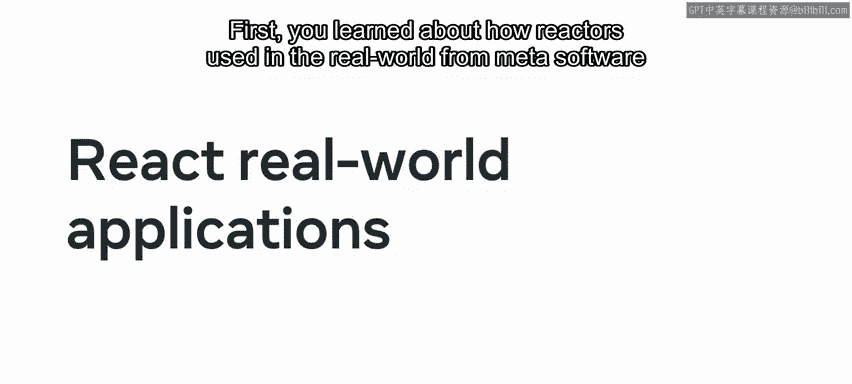
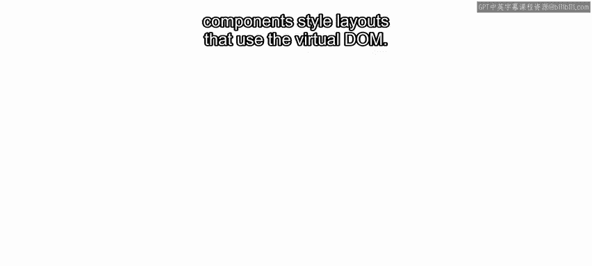
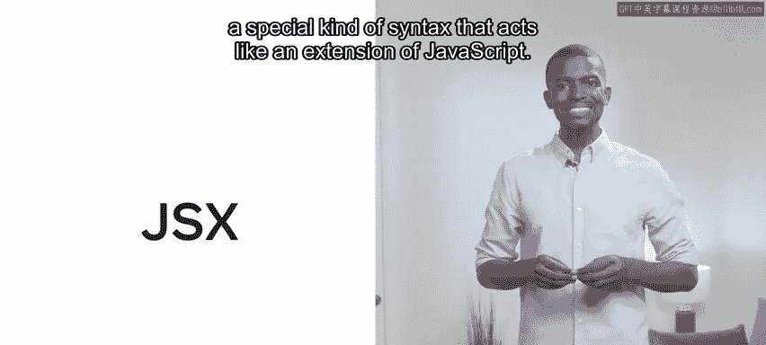
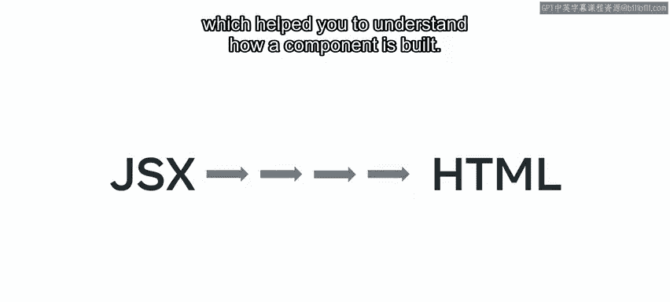
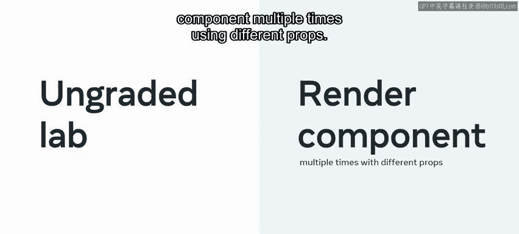
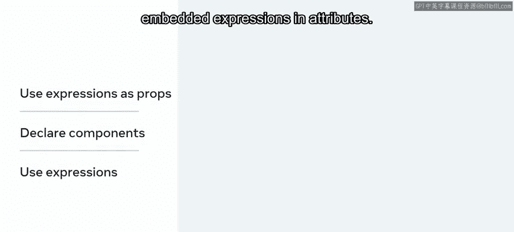
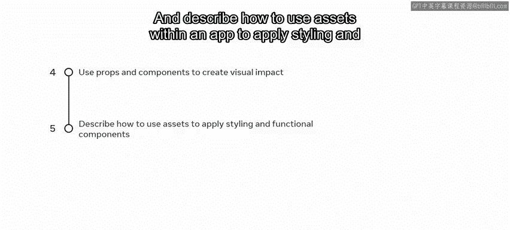

# 15：模块总结 🎉

在本节课中，我们将回顾并总结整个关于React组件的模块内容。我们将梳理从React基础概念到实际组件创建与应用的完整学习路径，帮助你巩固所学知识。

## 模块概述



本模块旨在让你掌握React.js的基本结构与使用方法，目标是使你能够使用React构建单页应用程序。现在，让我们回顾一下各节课程是如何实现这一目标的。

## 课程内容回顾

以下是本模块涵盖的核心课程内容。

### 第一课：React与现实世界及基础准备

首先，你从Meta软件工程师Katie那里了解了React在现实世界中的应用。接着，为了给动手实验打下基础，课程快速回顾了HTML、CSS和JavaScript的基础知识。然后，你学习了如何在VS Code中设置项目以及如何使用JavaScript模块。

### 第二课：React组件与JSX 🧩



上一节我们介绍了开发环境设置，本节中我们来看看React的核心——组件。



在这一课中，你被引入了**基于组件的架构**。这是一种基于可复用代码组件（如React库）构建软件的设计哲学。你学习了组件类型、使用虚拟DOM的组件样式布局，以及如何创建构成UI设计基础的组件。



此外，你还深入了解了**JSX**。JSX是一种特殊的语法，类似于JavaScript的扩展。

```jsx
// JSX示例：在JavaScript中编写类似HTML的代码
const element = <h1>Hello, world!</h1>;
```

你学习了如何**转译**它，换句话说，就是将JSX转换为HTML，这帮助你理解了组件是如何构建的。

在未评分的实验中，你学习了如何在App组件内部构建一个新组件并使其在屏幕上渲染，以及如何将组件保存到自己的文件中，并将其导入到父组件中以便在屏幕上渲染。

### 第三课：组件的使用与样式 🎨

上一节我们探讨了组件的创建，本节中我们来看看如何使用和美化它们。



你学习了如何使用**属性**将数据从一个组件传递到另一个组件，这项能力在未评分的实验中得到了测试。

在另一个未评分的实验中，你学习了如何使用不同的**props**多次渲染同一个组件。你还进一步学习了如何使用JSX及其**嵌入表达式**，以及如何以功能完善且外观良好的方式为JSX元素添加样式。

作为本课的一部分，你学习了：
*   使用和操作组件中的**props**。
*   使用函数表达式和箭头函数定义组件。
    ```jsx
    // 函数表达式组件
    const MyComponent = function(props) {
      return <div>{props.content}</div>;
    };
    // 箭头函数组件
    const MyArrowComponent = (props) => <div>{props.content}</div>;
    ```
*   在JSX表达式中调用函数。
*   使用表达式作为props。
*   声明需要props的组件，并在属性中使用表达式和嵌入表达式。



## 学习成果总结

完成本模块后，你现在能够：
*   解释React及其组件架构背后的概念。
*   创建服务于特定目的的组件。
*   创建组件文件夹，并演示如何在该文件夹内创建和导入文件。
*   使用和操作组件中的props以影响视觉结果。
*   描述如何在应用程序中使用资源来为功能组件应用样式。

## 结语



这是你React之旅一个良好的开端。恭喜你完成本模块的学习，请准备好迎接下一个模块的挑战。