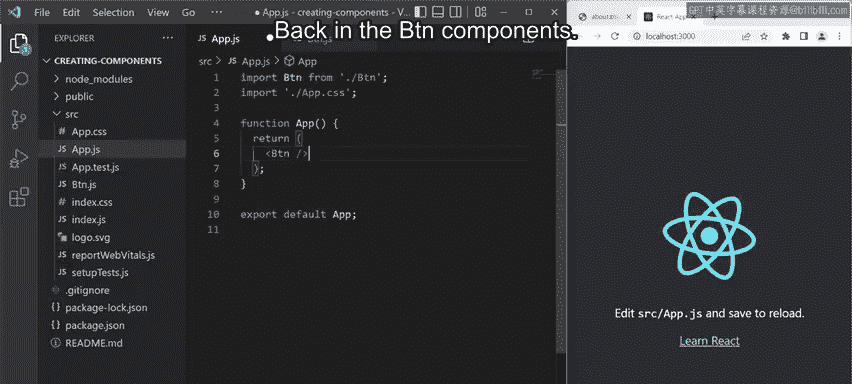
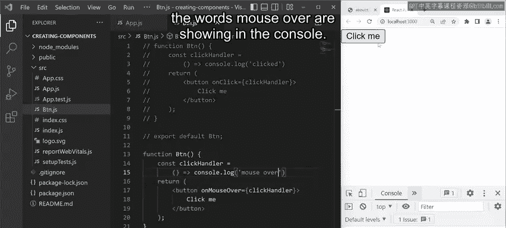
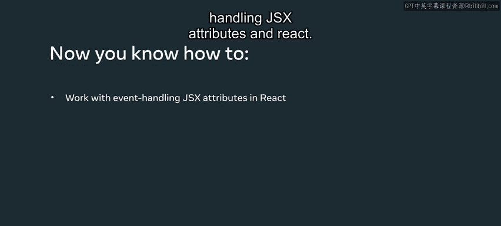

# 17：16_常见事件处理


## 概述

在本节课中，我们将学习如何在React组件中处理多种事件。我们将从创建一个简单的按钮组件开始，逐步介绍如何为其添加点击和鼠标悬停事件处理功能。

## 创建基础按钮组件

首先，我在`src`文件夹中添加了一个名为`Btn`的新组件。目前，它只是一个带有默认导出的空函数。



为了简化演示，我清理了`App.js`文件的`return`语句：删除了logo导入语句，改为导入`Btn`组件，并移除了`return`语句中的原有内容，最后添加了`Btn` JSX元素以便渲染。

回到`Btn`组件，我在`return`语句中添加了一个按钮，按钮文字为“click me”。保存文件后，按钮成功渲染在屏幕上。

## 处理点击事件

现在，我想处理这个按钮的点击事件。为此，我添加了`onClick`合成事件，其语法为：一个等号，一对花括号，花括号内是名为`clickHandler`的表达式。

在`return`语句中，我将代码分布在多行以提高可读性。

这样设置后，每当用户点击按钮，都会执行名为`clickHandler`的表达式。接下来我需要定义这个`clickHandler`。

我将其设置为一个函数表达式：使用`const`变量关键字将其命名为`clickHandler`，然后为其分配一个箭头函数。

至此，我设置了一个点击处理器，它接收从按钮触发的点击事件，并通过在控制台输出单词“clicked”来处理它。

保存更改后，在浏览器中打开开发者工具，定位并激活控制台选项卡，同时将视图聚焦在按钮上。

当我点击按钮时，控制台会为每次点击事件显示“clicked”一词。

## 处理其他类型事件

上一节我们介绍了如何处理点击事件，本节中我们来看看如何处理其他类型的事件，例如鼠标悬停事件。

在`Btn.js`文件中，我选中组件内的所有代码，右键点击选择“复制”命令。接着，使用快捷键`Ctrl + K, C`（Mac上是`Command + K, C`）注释掉所有高亮代码。

在这段被注释的代码下方，我按下`Ctrl + V`粘贴之前复制的代码。

现在，我将展示如何处理不同的事件。让我将`onClick` JSX事件处理属性替换为另一个属性，从而处理不同的事件。

例如，我可以将`onClick`属性替换为`onMouseOver`属性，并相应地将事件处理函数更新为输出“mouse over”。

保存更改并等待应用重新编译。这次，当我将鼠标悬停在按钮上时，控制台会显示“mouse over”一词。

## 核心概念与代码示例

以下是事件处理的核心步骤：

1.  **在JSX中添加事件属性**：在元素上使用如`onClick`或`onMouseOver`等属性。
    ```jsx
    <button onClick={clickHandler}>Click me</button>
    ```

2.  **定义事件处理函数**：通常使用箭头函数来定义处理逻辑。
    ```javascript
    const clickHandler = () => {
        console.log('clicked');
    };
    ```

## 总结





本节课中，我们一起学习了如何在React中处理事件。你学会了如何为JSX元素添加`onClick`和`onMouseOver`等事件处理属性，并定义对应的函数来处理这些事件。记住，React中的事件命名采用驼峰式，并且你直接将函数引用（而不是函数调用）传递给事件属性。