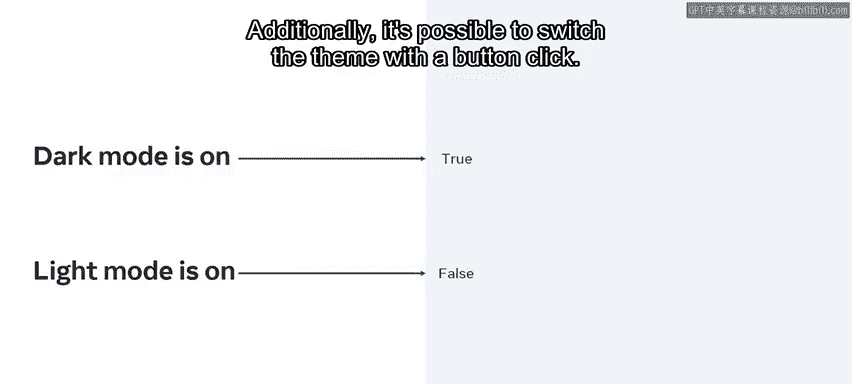
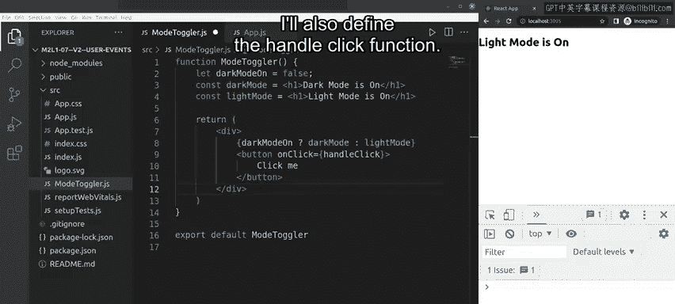

# 19：用户事件处理 🎯

在本节课中，我们将学习如何通过用户触发的事件来切换布尔状态变量的值，以及如何在单个JSX元素上处理多个事件。我们将通过一个具体的组件示例，结合状态管理、样式设置和三目运算符的使用，来演示事件处理的核心概念。

## 概述

接下来我们将探索的代码示例，与课程中之前接触的组件有所不同。这个示例展示了事件处理、状态管理、样式应用以及三目运算符如何协同工作。假设我们有一个组件，它使用状态来记录暗黑模式是否开启的布尔值。根据这个变量的值是`true`还是`false`，组件将渲染一个包含文本的H1标题，主题可能是暗色或亮色。此外，我们还可以通过点击按钮来切换主题。

现在，让我们深入演示事件处理的具体过程。

## 构建ModeToggler组件 🛠️

我将通过一个示例来演示事件处理，以便你能实际了解如何使用事件为应用添加额外功能。我将构建一个名为`ModeToggler`的组件。

在VS Code的侧边资源管理器中，我右键点击`src`文件夹，选择“新建文件”命令。我将文件命名为`ModeToggler.js`。目前，它只是一个空的函数声明和默认导出。

我按下`Ctrl+S`（在Mac上是`Cmd+S`）保存更新。回到`App`组件，我更新其`return`语句以渲染这个新的`ModeToggler`组件。我同时需要在`App`组件的第一行导入它，并保存`App.js`的更改。

现在，我为`ModeToggler`组件返回一些JSX代码，并添加一个`return`语句。在这个语句中，一个JSX表达式包裹着一个三目运算符，用于检查`darkModeOn`的值是`true`还是`false`。如果是`true`，它将返回存储在`darkMode`变量中的内容；如果是`false`，则返回存储在`lightMode`变量中的内容。

然而，我还没有定义要评估的这些值，所以如果现在保存代码，会抛出错误。

## 定义状态与变量 📝

我通过在`return`语句上方声明三个变量来定义这些值：
*   `darkModeOn`，其值为`true`。
*   `darkMode`，其值为包裹在H1标签中的文本“dark mode is on”。
*   `lightMode`，其值为包裹在H1标签中的文本“light mode is on”。

保存更改后，我在浏览器中看到了句子“dark mode is on”。

让我解释一下发生了什么。`darkModeOn`变量被设置为`true`。为了快速测试，我可以将三目运算符中`darkModeOn`变量名直接替换为值`true`。由于这个值是`true`，所以存储在`darkMode`中的值将被渲染。如果我将`true`改为`false`，那么存储在`lightMode`中的值将被显示。现在，我将测试词`false`替换回我们的变量`darkModeOn`，保存并再次测试。现在屏幕上显示的是“light mode is on”。

## 添加按钮与点击事件 🖱️

我添加一个带有`onClick`事件的按钮，用于处理将`darkModeOn`变量的值从`true`切换到`false`。

在这个三目运算符语句下方，我添加一个带有`onClick`事件处理器的按钮。同时，我将定义`handleClick`函数。

## 实现事件处理函数 ⚙️

我的函数从获取`darkModeOn`的值开始，并使用感叹号（即逻辑非运算符）将其更改为相反的布尔值。然后，我将这个值赋给`darkModeOn`变量作为新值。

为了更清楚地解释：例如，如果`darkModeOn`的值是`true`，那么`!darkModeOn`将被求值为`!true`（即`false`）。这个`false`将被赋值给`darkModeOn`变量，从而使其变为`false`。

现在，我为`handleClick`函数添加其余代码，这是一个`if`语句。逻辑是：如果`darkModeOn`被设置为`true`，则在控制台记录“dark mode is on”；否则记录“light mode is on”。我本可以用不同的方式编写这段代码，但我选择了一种能清晰展示正在发生什么的方式。这对于任何技能水平的开发者来说都是良好的实践，便于自己和他人日后轻松检查代码。

保存后，一旦应用重新编译，如果我点击“click me”按钮，我将在控制台看到相应的字符串输出。

## 发现问题与思考 🤔

这引出了一个有趣的结论：虽然控制台日志在更新，但屏幕上的实际H1标题并没有任何变化。当然，我可以通过手动将`false`改为`true`，然后保存应用并等待重新渲染来更新它，以确认我的更改确实发生了，因为之前显示“light mode is on”的标题现在变成了“dark mode is on”。但一旦我点击按钮，控制台日志会改变，然而网页应用中的标题并没有反映这个变化。

为什么会这样？要理解这一点，你需要更深入地了解React中的数据流，并观察它如何在组件间移动。幸运的是，你很快将会学到这些。

## 总结

干得不错！现在你应该能够演示如何通过用户触发的事件来切换布尔状态变量的值，以及如何在单个JSX元素上处理多个事件了。我们通过构建一个主题切换组件，实践了状态定义、条件渲染和事件处理函数的编写。虽然目前UI还不会随状态自动更新，但这为我们接下来学习React的核心概念——状态（State）与数据流——奠定了重要的基础。