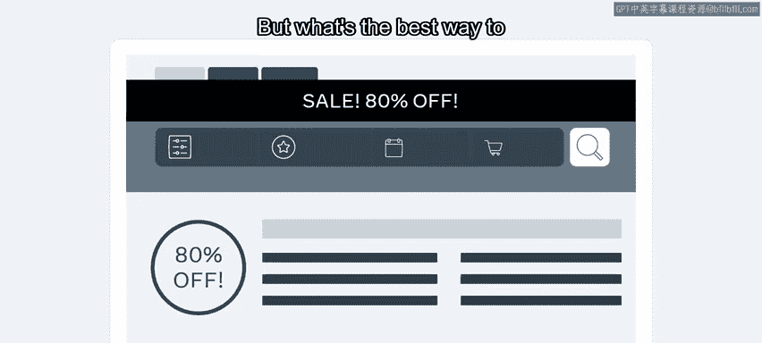
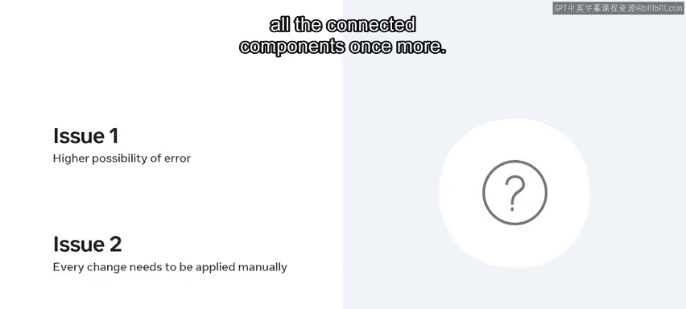
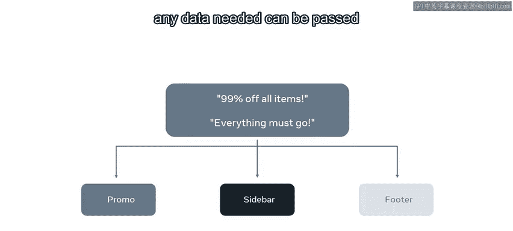
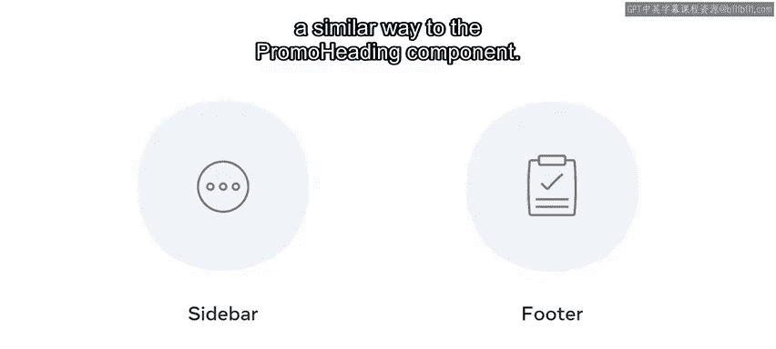
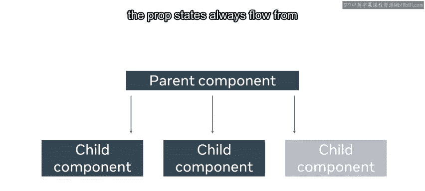
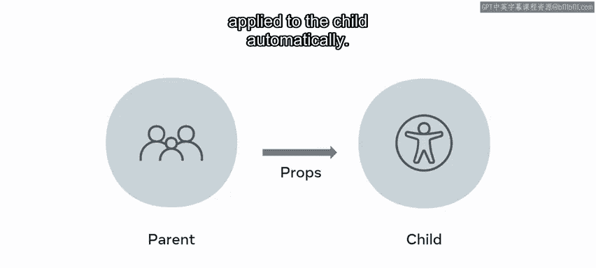

# 20：父子数据流 👨‍👦



在本节课中，我们将要学习 React 中一个核心概念：父子组件之间的数据流。我们将探讨如何通过父组件向子组件传递数据，从而避免代码重复，并实现数据的高效更新。

想象一下，你正在为一家在线零售商工作，该零售商经常打折以保持库存流动。促销信息会在网站的多个位置公布。那么，保持这些信息更新的最佳方式是什么？

例如，单独更新每个项目将是繁琐且耗时的。幸运的是，我们可以在一个单一位置更改信息，并让其他所有内容自动更新以匹配。这个想法说明了父子关系。在本视频中，你将探索这个概念在 React 中的应用。

## 理解父子组件关系

让我们从两个将在同一个应用中使用的组件示例开始。

首先是 `Promo` 组件，它将返回你稍后将创建的 `PromoHeading` 组件的内容。

以下是构建 `Promo` 组件的代码：

```jsx
function Promo() {
  return (
    <div>
      <PromoHeading />
    </div>
  );
}
export default Promo;
```

接下来，让我们编写 `PromoHeading` 组件：

```jsx
function PromoHeading() {
  return (
    <h1>80% off sale</h1>
  );
}
export default PromoHeading;
```

现在，你已经创建了 `Promo` 组件，它调用 `PromoHeading` 组件中的函数来返回文本“80% off sale”。在这个例子中，`Promo` 组件被称为**父组件**，而它渲染的 `PromoHeading` 组件被称为**子组件**。

## 应对更复杂的需求

现在，假设折扣增加到 99%，你需要更新代码来反映这一点。一种方法是更新 `PromoHeading` 组件中 `<h1>` 标签内的文本。这是一个快速的修复，因为只需要处理一个更改。

然而，让我们探索一个更复杂的情况。这次，你的经理要求你在网站的侧边栏和页脚组件中也调用 `PromoHeading` 组件，而不仅仅是在 `Promo` 组件中。他们还希望显示两条消息：“99% off all items”和“Everything must go”。

这些新要求意味着，仅仅更新子组件的方法将不再那么有效。为什么呢？因为这意味着你现在必须用相同的数据更新多个组件。这不符合“DRY”（不要重复自己）的通用编程原则，该原则旨在减少不必要的代码重复。

此外，请考虑以下可能性：在多个组件中输入相同文本时，你可能会犯打字错误。另外，如果你的老板决定再次更改折扣呢？这意味着你将不得不再次更改所有相关组件中的文本。



## 建立单一数据源

那么，与其一遍又一遍地编写相同的代码，不如改变你的方法。你可以建立一个**单一数据源**，其中包含存储文本值的两个字符串：“99% off all items”和“Everything must go”。这将包含在父组件中，以便任何需要的数据都可以通过 **props** 传递给子组件。

现在，让我们使用这种方法来更新 `Promo` 组件。首先，你创建一个单一数据源：一个名为 `data` 的 JavaScript 对象。



```jsx
const data = {
  heading: "99% off all items",
  callToAction: "Everything must go"
};
```

接下来，你更新 `Promo` 组件，将 `data` 对象的 `heading` 和 `callToAction` 值传递给 `PromoHeading` 组件。这被称为**从父组件向子组件传递数据**。

```jsx
function Promo() {
  return (
    <div>
      <PromoHeading 
        heading={data.heading}
        callToAction={data.callToAction}
      />
    </div>
  );
}
```

回到 `PromoHeading` 组件内部，你更新它以接受来自其父组件的数据。为此，你需要首先删除 `return` 语句中现有的 `<h1>`，然后添加一个新的 `<h1>` 用于显示 `props.heading`，以及一个 `<h2>` 用于显示 `props.callToAction`。

```jsx
function PromoHeading(props) {
  return (
    <div>
      <h1>{props.heading}</h1>
      <h2>{props.callToAction}</h2>
    </div>
  );
}
```

现在，这个组件接受一个 `props` 对象，具体来说是它的两个属性：`heading` 和 `callToAction`。`props` 对象的值是在父组件中确定的，当你添加到应该渲染的特定 JSX 元素时。这是在你于 `Promo` 组件内部渲染 `PromoHeading` 时实现的，在这里你使用普通 JavaScript 的点表示法语法访问 `data` 对象上的属性。

了解了这一点，你现在可以以类似 `PromoHeading` 组件的方式编写 `Sidebar` 组件和 `Footer` 组件。



## 数据流的单向性



请记住，在 React 中，**props 数据总是从父组件流向子组件**。这种单向数据流确保了数据的可预测性和可维护性。

使用 props 可以帮助你避免在多个地方更改数据。相反，你只需在数据源（即父组件）处进行更改，更新将自动应用于子组件。



## 总结

本节课中，我们一起学习了如何建立父子组件关系，以便数据从父组件流向子组件。通过将数据存储在父组件中，你可以动态地将其传递给子组件，而无需单独更新每个子组件。这种方法遵循了 DRY 原则，提高了代码的复用性和可维护性，是构建高效 React 应用的关键。