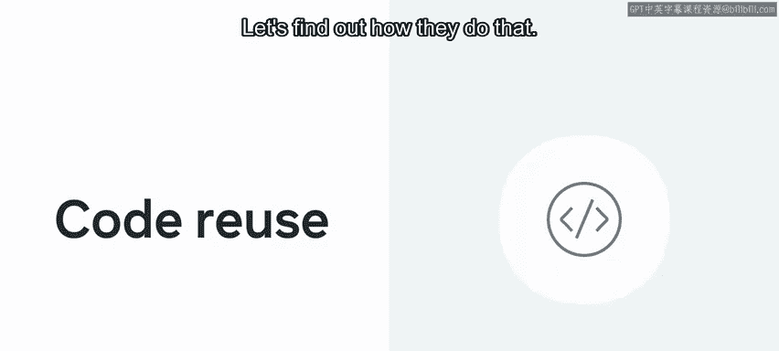
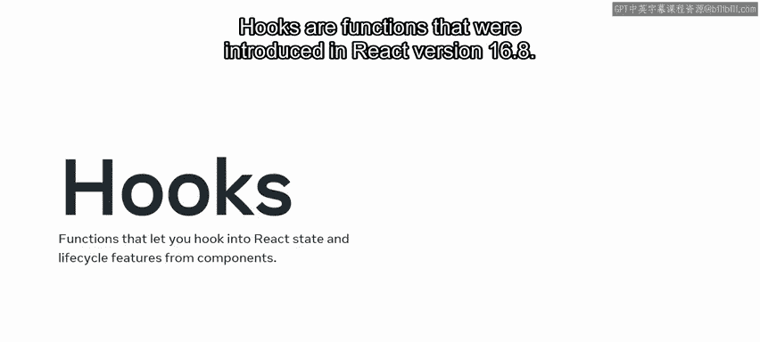
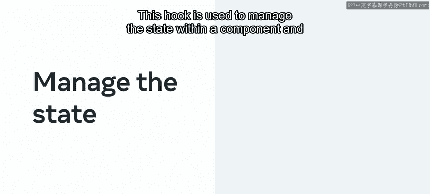
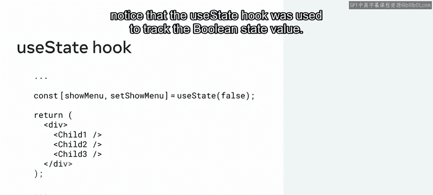
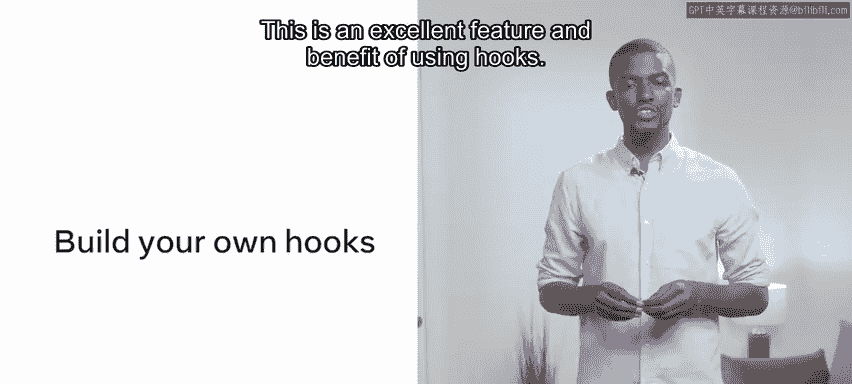
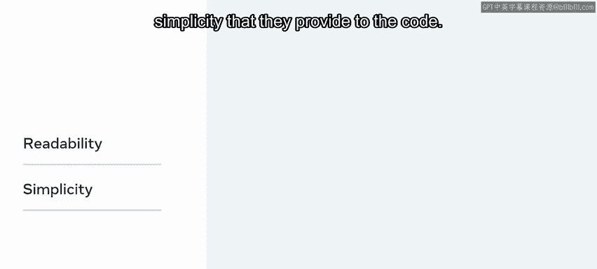

# 22：什么是钩子（Hooks）🔧

在本节课中，我们将要学习React中一个非常重要的概念——钩子（Hooks）。你将了解钩子是什么、它们如何被使用，以及为什么它们对构建交互式React应用如此有用。

到目前为止，你可能已经学习了一些React中重要且有用的核心概念。现在，你已经准备好学习如何为组件添加交互性、在React组件内维护状态，并探索钩子的世界了。

## 钩子解决的问题 🤔

上一节我们介绍了React组件的基础。本节中我们来看看，随着你作为React开发者的成长，你很快会使用具有状态逻辑的复杂组件。跨组件跟踪状态可能变得相当繁琐，而这正是React钩子可以大显身手的地方。

钩子的一个关键好处是，它们解决了组件间不必要的代码重复问题。让我们看看它们是如何做到的。

## 钩子是什么？🔗

钩子是React 16.8版本中引入的函数。它们让你能够从函数组件中“钩入”React的状态（state）和生命周期（lifecycle）特性。

以下是钩子的核心定义：
```javascript
// 钩子是让你在函数组件中使用React状态和生命周期特性的函数。
```





## 探索`useState`钩子 📝



让我们观察一个具体的钩子示例。你将仔细研究`useState`钩子的一个实例，因为它是最常用的钩子之一。这个钩子用于管理组件内部的状态并跟踪它，并且它直接内置于React中。

要使用它，你需要做的第一件事是从`react`中导入`useState`，以便它可供使用。

```javascript
import { useState } from 'react';
```

下一步是在组件内声明一个状态变量。你可以为状态变量和设置状态的函数提供任何名称。对于这个例子，让我们将状态变量称为`showMenu`，将设置状态的函数称为`setShowMenu`。

```javascript
const [showMenu, setShowMenu] = useState(false);
```

## 理解`useState`语法 🧩

如果你学过JavaScript，这种语法可能会让你感到有些熟悉。你可能想知道这段代码到底做了什么。实际上，它做的事情你可能以前就遇到过。

请注意，约定是使用数组解构来命名状态变量和设置函数。当你使用`useState`声明一个状态变量时，它会返回一个包含两个项的数组（一对值）。如果没有数组解构，代码会变得冗长而繁琐，因为通过索引访问数组项会更令人困惑和乏味。数组解构是首选，它显著简化了代码。

现在你有了一个名为`showMenu`的新状态变量。`useState`然后将`showMenu`的初始值设置为`false`。

## `useState`的作用总结 📋

以下是调用`useState`钩子所完成的两件事：

1.  **创建一个状态变量**：它创建一个具有初始值的状态变量，代表当前状态。在这个例子中就是`showMenu`。
2.  **创建一个设置函数**：它创建一个函数来设置该状态变量的值。在这个例子中就是`setShowMenu`。

函数`setShowMenu`用于通过向其传递布尔值来更新`showMenu`的值。你为状态变量使用什么名称并不重要，你可以根据你的组件和用例来定义它们。`useState`钩子应该在组件的顶层被调用。

## 状态变量的数据类型 📊

在这个例子中，注意到`useState`钩子被用来跟踪布尔状态值。你可以使用`useState`钩子来跟踪任何类型的数据。它可以是字符串、数字、数组、布尔值或对象。



例如，你甚至可以跟踪一个按钮被按下的次数。

```javascript
const [clickCount, setClickCount] = useState(0);
```

## 自定义钩子 🛠️

除了React开箱即用的钩子之外，你还可以构建自己的钩子，这将允许你将自定义的组件逻辑提取到可重用的函数中。



这是使用钩子的一个极佳特性和好处。钩子最大的好处在于它们为代码提供的可读性和简洁性。



## 课程总结 🎯

本节课中我们一起学习了React钩子的基础知识，并探索了`useState`钩子。你现在理解了使用钩子的好处，以及如何在你的React应用中使用它们。钩子通过提供一种清晰、简洁的方式来管理状态和副作用，极大地简化了函数组件的开发。