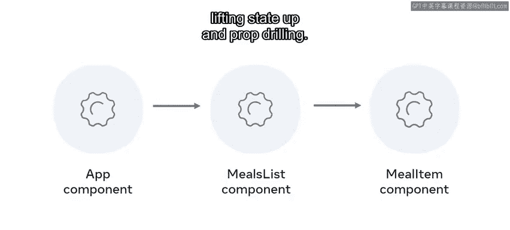
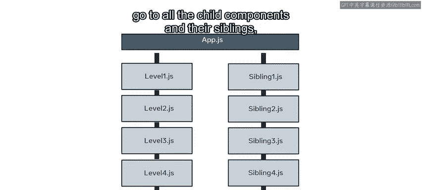
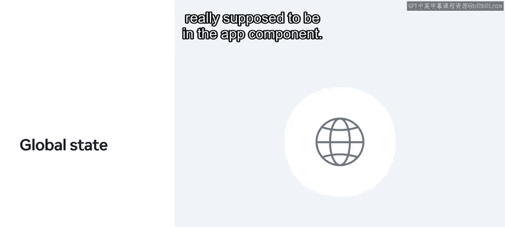
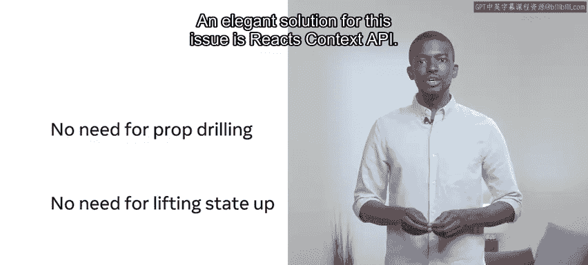
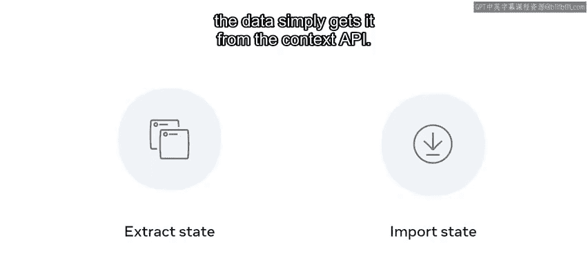

# 25：管理状态 🧠

在本节课中，我们将要学习如何在复杂的React应用中管理状态。随着应用规模的增长，跨组件管理状态会变得复杂。我们将探讨状态管理的概念，并介绍一些在React应用中管理状态的解决方案。

## 状态管理的场景 🍽️

为了说明一个需要管理状态的场景，我们考虑一个帮助用户监控饮食摄入、促进健康生活的小型React应用。这个应用追踪每日的餐食计划，用户可以点击每顿已消费的餐食。应用随后会更新显示当天还剩多少餐需要消费。

该应用由三个组件构成：一个名为`App.js`的根组件，以及两个子组件：`MealList`和`Counter`。

## 组件结构分析 🔍

上一节我们介绍了应用的基本场景，本节中我们来详细看看每个组件。

首先，`App`组件导入`MealList`和`Counter`组件，并将它们渲染到屏幕上。

接下来，`MealList`组件使用`useState`钩子来列出一天的餐食，这些餐食存储在一个数组中。数组元素保存在`todayMeals`变量中，然后`meals`状态变量被初始化为持有这个值。换句话说，`meals`状态变量持有这个数组。

最后，`Counter`组件追踪用户今天允许食用的餐食数量。

## 状态共享的问题 ❓

虽然这个组件结构看起来不错，但存在一个问题。`Counter`组件需要从`MealList`组件获取状态信息，但这两个组件都由`App`组件渲染。换句话说，`MealList`和`Counter`组件是兄弟关系，而非父子关系。

这就引出了一个问题：如何将状态信息从`MealList`组件传递到`Counter`组件，因为`Counter`组件并非`MealList`组件的子组件？

## 解决方案：状态提升 ⬆️

让我们探讨一个可能的解决方案。首先，你可以通过将返回值提取到其自己的组件中来简化`MealList`组件。然后，你可以使用单独的组件来显示不同的餐食项。我们称这个新组件为`MealItem`。

为了实现这一点，你可以使用被称为“状态提升”的实践。这意味着你将状态从`MealList`上移到`App`组件。

然后，你可以通过props传递状态，使用`MealList`组件作为状态数据传递到其目的地`MealItem`组件的桥梁。接着，你只需要在`Counter`组件中计算可用的数据。

现在，状态已经上移到了`App`组件，而`MealList`组件变成了状态数据传递到其目的地`MealItem`组件的管道。

## 属性钻取的问题 🚧

你现在必须问的问题是：属性钻取有什么问题？

属性钻取是一个常用术语，用于描述必须通过props在多层组件中传递状态，从父组件到子组件，再到该子组件的子组件，依此类推。

需要注意的是，如果源数据发生变化，你将不得不将这些变化传递到整个属性钻取的结构中。这使事情变得复杂，因为状态更新会传递到所有子组件及其兄弟组件，然后这些组件都需要更新以反映状态的变化。

此外，随着应用的增长，问题会变得更大，你可能会在`App`组件中保存大量的状态。请记住，这些状态中的大部分并不真正应该放在`App`组件中。这是因为这些状态是关于像`MealItem`这样的组件的。

## 全局状态的视角 🌍

从全局状态的角度来看，这是另一种表述此问题的方式。每当我有状态可能需要在应用中的多个地方使用时，这就是一个全局状态问题。

## 优雅的解决方案：Context API 🎯

针对这个问题，一个优雅的解决方案是React Context API。理解Context API的一种方式是，它消除了中间人。不再需要属性钻取和状态提升。

相反，需要数据的组件直接从Context API获取它。

实现这一点的方式是将状态提取到一个单独的文件中，该文件在Context中保存状态。然后，任何需要它的文件只需导入并使用它。

## 总结 📝

本节课中我们一起学习了React中的状态管理。我们探讨了在兄弟组件间共享状态时遇到的问题，介绍了通过“状态提升”和属性钻取的解决方案及其局限性。最后，我们了解了React Context API如何作为一种更优雅的方案，通过提供全局状态管理来避免复杂的属性钻取，从而简化组件间的数据传递。