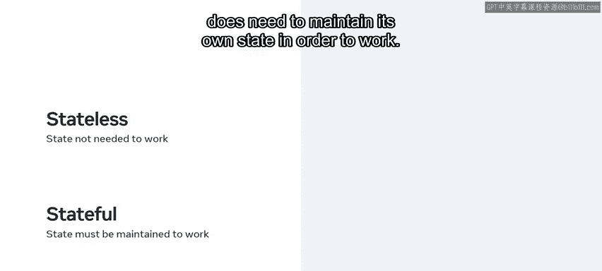
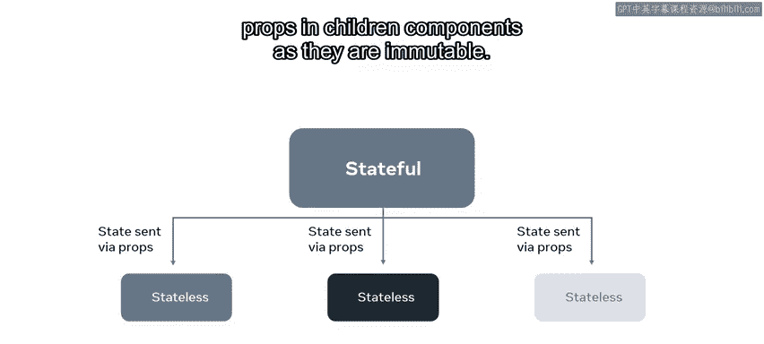
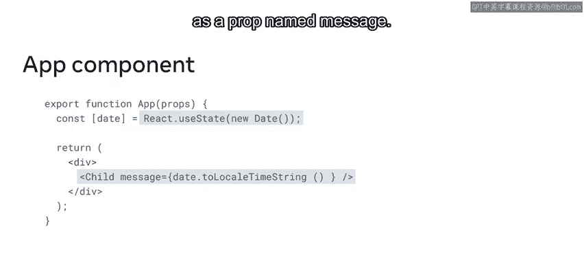
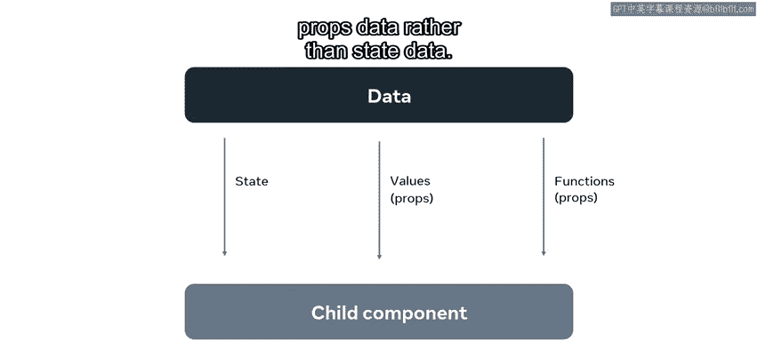
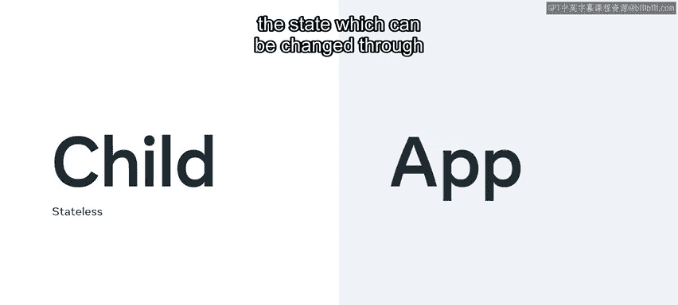

# 27：有状态与无状态组件 🧩

在本节课中，我们将学习 React 中**有状态组件**与**无状态组件**的核心区别，以及如何根据应用需求做出合适的选择。理解这一概念对于构建高效、可维护的 React 应用至关重要。

生活中很少存在能满足所有需求的完美解决方案。例如，在选择交通工具时，小型汽车通常更省油，但空间有限；而 SUV 能容纳更多乘客，但油耗较高。😊

做出最佳选择始于明确你的具体需求。在编程中选择有状态或无状态组件时，道理也是如此。

通过本课学习，你将能够描述不同类型状态之间的差异，根据给定需求选择最佳类型，并解释 React 的动态特性如何促使结构化决策影响应用复杂度。

## 核心概念定义 📖

有状态组件与无状态组件的主要区别在于：**有状态组件**将状态作为内部数据存储，其状态会根据应用构建方式（通常是用户操作的结果）而改变。而**无状态组件**不存储状态，任何变化都必须通过 **props** 继承。

上一节我们介绍了基本定义，本节中我们来看看如何在实际开发中做出选择。

## 选择规则 📋

以下是决定组件应为无状态还是有状态时可参考的规则：

*   **使用无状态组件**：当你的组件无需维护自身状态即可正常工作时。
*   **使用有状态组件**：当你的组件需要维护自身状态才能正常工作时。

这听起来可能过于简化，但让我们深入探讨为何这条通用规则已足够。

## 常见的组件组织模式 🏗️

React 中组织组件的一种常见模式是：让一个有状态组件作为父组件，然后将其状态传递给多个无状态子组件，子组件接收状态并将其渲染到屏幕上。

子组件之所以是无状态的，是因为它们没有自己的状态，仅通过 **props** 接收父组件传递下来的状态。

请记住，永远不应在子组件中更改 **props** 的值，因为它们是**不可变的**。

现在你已了解基本逻辑，让我们通过一个具体示例来分解这种模式的实际应用。

## 示例分析 🔍

我们从两个组件开始：`App` 组件和 `Child` 组件，后者返回一条消息。

在 `App` 组件中，`useState` Hook 定义并保存了将作为 **props** 对象传递给子组件的状态。

`App` 组件渲染 `Child` 组件，并以字符串格式将数据作为名为 `message` 的 prop 传递给它。

有一点需要牢记，并且常被 React 初学者忽视：**prop 并不总是必须传递状态**。

除了状态，JavaScript 值和函数也可以传递给子组件。这仍然是数据，但它是 **prop 数据**而非 **state 数据**。

在 `Child` 组件中，有一个 `H1` 元素。该元素的内容将是传入组件的 `message` prop。

请注意，**props** 在组件中不会被更改或更新，因为它们是**不可变的**，意味着无法被改变。由于 `Child` 组件不存储任何状态，因此它是一个**无状态组件**。其所有数据都来自传入组件的 **props**。

`App` 组件存储了这些状态，这些状态可以通过事件和函数进行更改，因此它是一个**有状态组件**。

## 总结 📝

本节课中，我们一起学习了如何根据具体需求，在 React 应用中选择使用有状态或无状态组件。你也观察到，尽管无状态组件不能直接传递状态，但它仍然可以触发更新其他组件状态的操作。掌握这一区别，将帮助你设计出更清晰、更高效的组件结构。