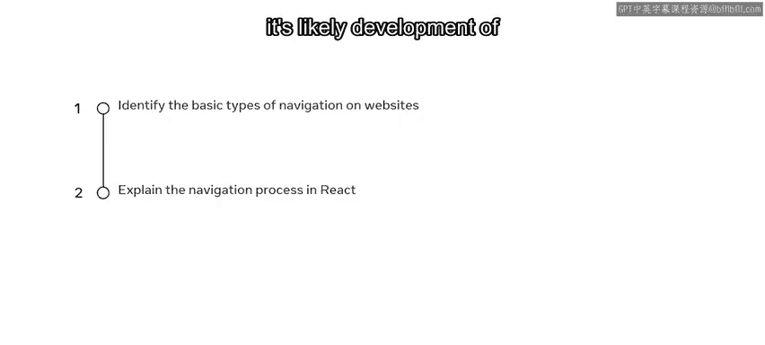
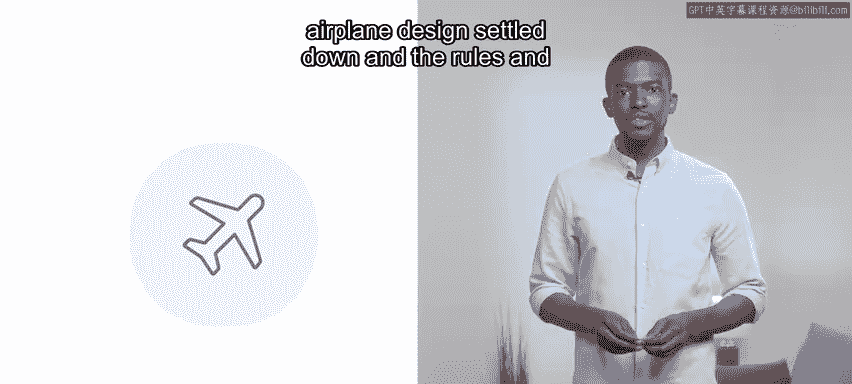
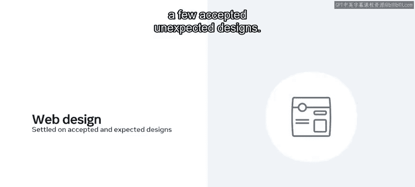
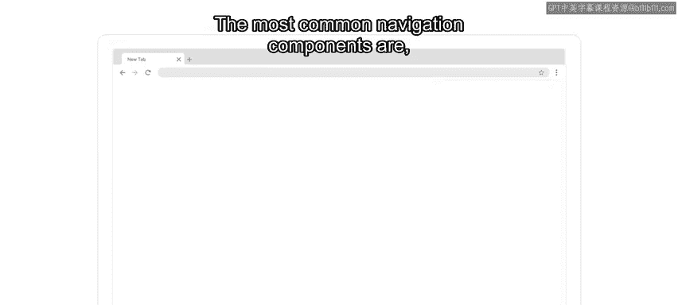
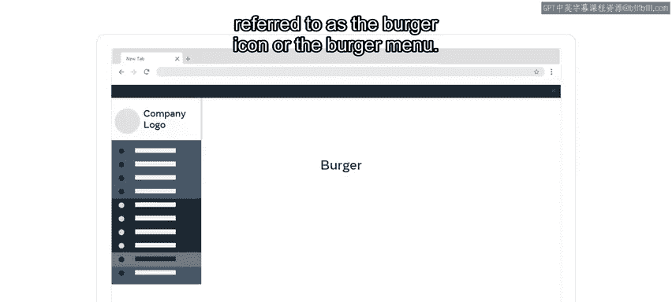
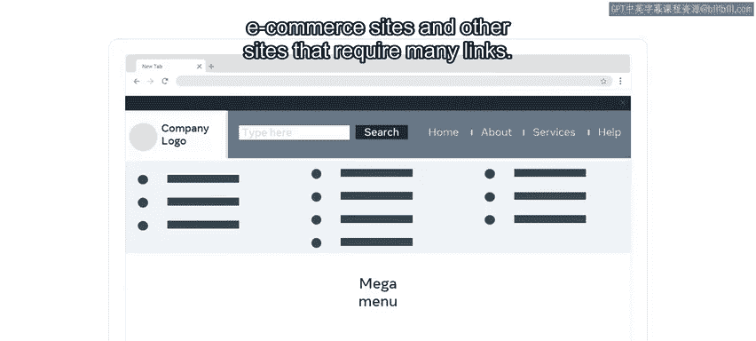
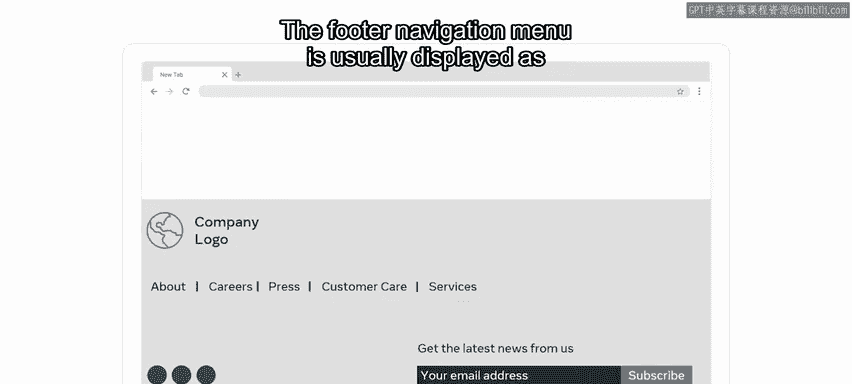
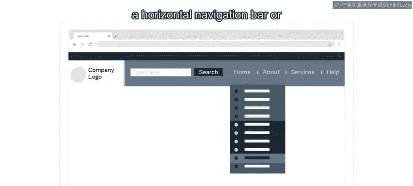
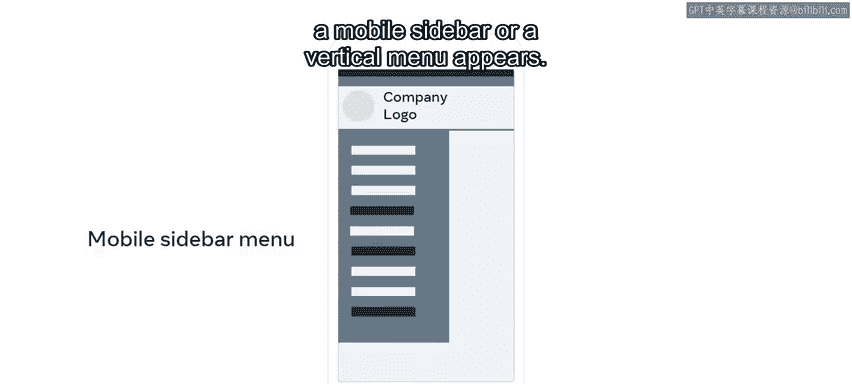
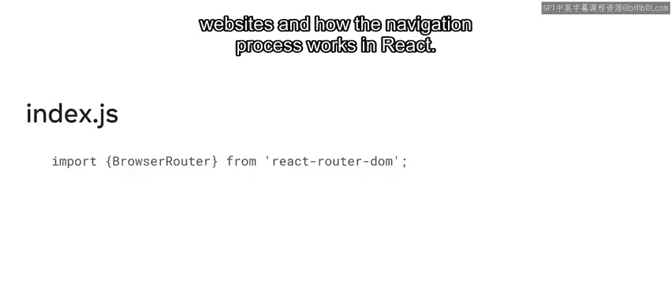

# 29：基本导航类型 🧭

在本节课中，我们将要学习网站导航的基本类型，并了解在React中导航过程是如何工作的。

## 概述

在互联网早期，设计没有真正的标准。这意味着开发者常常进行大量实验。当时存在各种设计和尝试，但最终，Web开发社区确立了一些最佳实践。如今，网络已成为一个成熟的媒介。

## 从历史看发展

上一节我们提到了Web设计的演变，本节中我们来看看一个有趣的类比。回顾网页布局和导航的历史，很可能类似于历史上其他伟大发明的发展过程。

例如，莱特兄弟于1903年在北卡罗来纳州基蒂霍克首次飞行后，工程师们有几十年的时间都在试验不同的设计。当时，拥有两到三组机翼的飞机是主流。最终，在最初的探索阶段之后，飞机设计趋于稳定，飞机制造的规则和最佳实践得以确立。

就像飞机建造规则的发展一样，在早期Web的实验性年代之后，网页设计和开发社区也确立了一些被广泛接受和预期的设计模式。

## 现代导航的核心原则

现代网站导航用户界面的重点是**实用性**。史蒂夫·克鲁格关于用户体验的著名书籍《Don‘t Make Me Think》总结了开发者今天遵循的规则。

作为网页开发者和设计师，遵循已确立的最佳实践是你的责任。例如，方向盘不属于洗衣机，老式电话拨号盘也不属于汽车。同样，你也不应该通过提供那些看起来和感觉上很聪明，但与用户习惯完全不同的导航方式来迷惑你的网站访问者。

## 常见的导航类型

所以你可能会想，什么是被接受的现代网站导航？它在React中又是如何工作的？

网站导航是任何网站中允许你从单个组件浏览该网站各个页面或链接的部分。这种用户界面模式有几种实用的实现方式。

以下是几种最常见的导航组件：

*   **水平导航栏**：通常被称为导航栏。
*   **垂直导航菜单**：也被称为侧边栏导航。
*   **隐藏在按钮后的菜单**：通常由一个有三条水平线的图标表示，因此被称为汉堡图标或汉堡菜单。
*   **页脚导航菜单**：通常显示为包含链接的几个视觉列。

所有这些提到的菜单模式通常可以在同一页面的不同部分同时使用。

## 组合与响应式导航

此外，更复杂的导航用户界面可以在单个组件中包含多种导航方法。例如，你可能有一个带有下拉菜单项的水平导航栏。如果你使用较小的分辨率，导航栏会显示为汉堡菜单图标。

当你点击汉堡菜单图标时，会出现一个移动侧边栏或垂直菜单。

## React中的导航机制

好了，现在你已经熟悉了React应用中可用的一些导航类型，让我们来探索它们是如何实现加载不同页面的。

如果你将用React构建的网站导航与用HTML和CSS构建的进行比较，你可能发现视觉上没有区别。虽然视觉上一切看起来都一样，但在代码层面，React处理页面间导航的方式是不同的。

这是因为整个应用都加载在一个单一的`
`中。所以你实际上并不是像使用HTML文件中的超链接那样访问不同的页面。相反，那个单一`
`的内容由React控制，它基于虚拟DOM的变化，要么更新现有视图，要么加载一个全新的视图，给用户一种访问了完全不同URL的印象。

回想一下，在HTML中，开发者可以使用列表来制作导航菜单。每个列表项包含一个指向HTML文件的超链接，然后用一些CSS来为菜单添加样式，例如使用`display: inline`属性让列表水平显示。

为了帮助说明在React中页面间导航是如何工作的，可以想想电梯内部按钮的工作原理。按下按钮会带你到选定的楼层。类似地，网站上的每个链接在你点击时都会带你到一个不同的页面。

然而，如果你在一个“React电梯”里，就好像电梯从未移动过。相反，当你在这个React电梯里按下一个按钮时，那个指定楼层的整个构造会被注入到这个不可能建筑的一个单一楼层中。

这意味着React本身只负责单个页面的视觉效果，但没有关于页面间导航的概念。然而，这个功能并不是React库本身提供给开发者的。为了实现这种多页面网站的“错觉”，你需要将`react-router`库添加到你的React项目中。你可以再次使用`import`语句来添加它，我们很快会学习更多关于如何操作的内容。

## 总结

本节课中，我们一起学习了网站导航的基本类型，并了解了在React中导航过程的工作原理。关键在于理解React通过控制单一容器内的内容更新来模拟多页面体验，这通常需要借助`react-router`这样的库来实现。