# 38：37_React 基础课程回顾 📚

在本节课中，我们将回顾你在React基础课程中学到的所有关键主题。我们将系统地梳理从React简介到组件、数据状态管理，再到导航与资源使用的核心知识，帮助你巩固所学内容，为接下来的评估做好准备。

---

## 开篇介绍 🎯

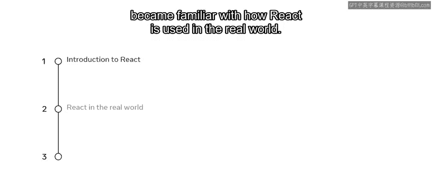

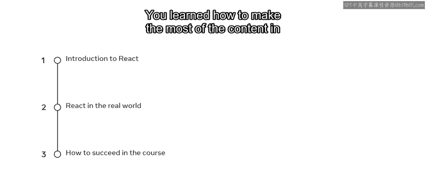

在课程的开篇，你学习了React的简介。你了解了React是什么，熟悉了React在现实世界中的应用场景，并掌握了如何高效利用课程内容以确保达成学习目标。

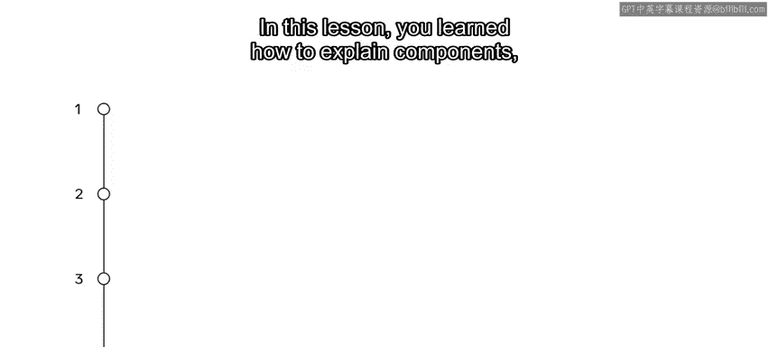

## 第一模块：React组件 🧩

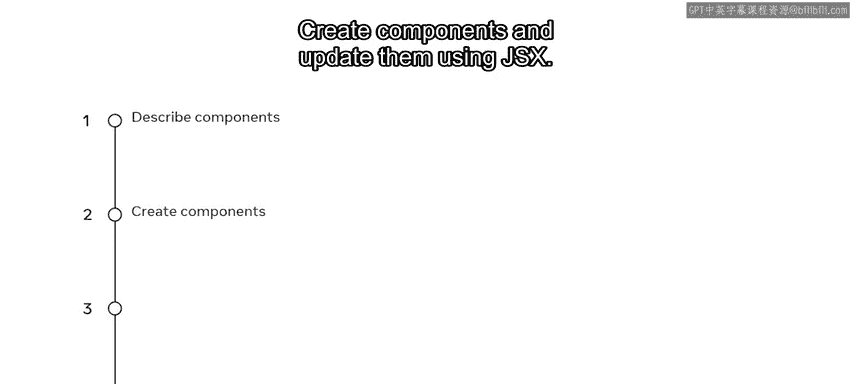

上一节我们介绍了课程概览，本节中我们来看看React的核心构建块——组件。

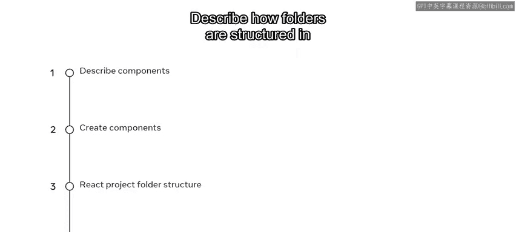

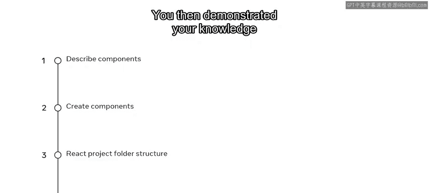

在这一课中，你学习了如何解释组件、其架构以及它们是如何被渲染的。

以下是你在组件部分掌握的核心技能：
*   解释组件及其架构。
*   使用JSX创建和更新组件。
*   描述React项目的文件夹结构及其对开发的益处。
*   演示如何导入组件。

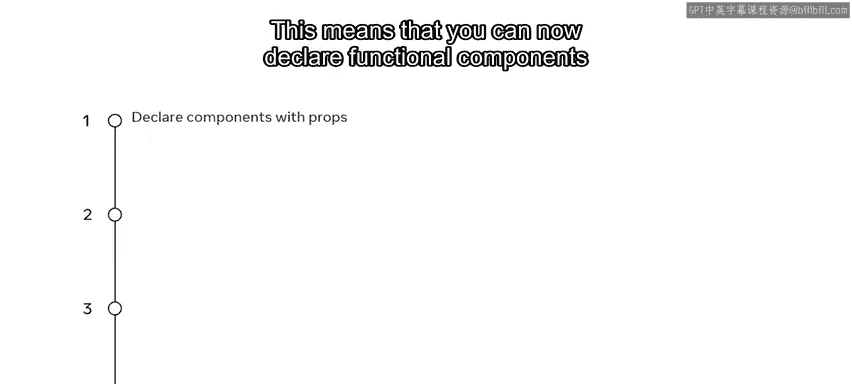

## 深入使用组件 🔧

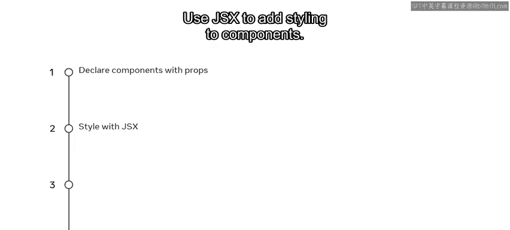

在学习了组件基础后，下一课我们更深入地探索了组件的使用方法。

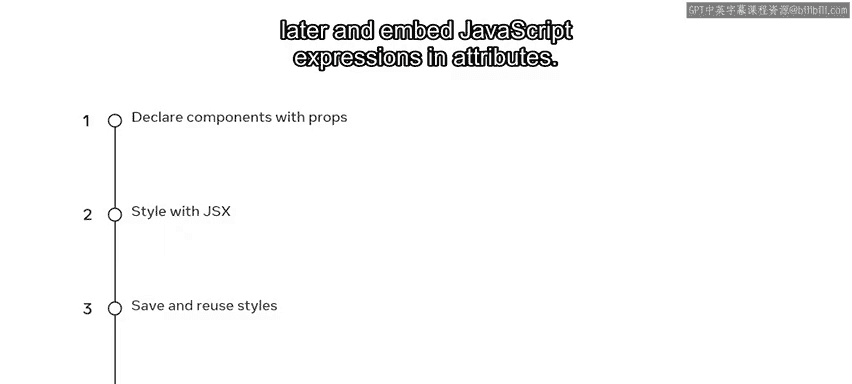

这意味着你现在可以：
*   声明带**props**的函数式组件，并将其传递给其他组件。
*   使用JSX为组件添加样式。
*   保存样式以便后续复用。
*   在属性中嵌入JavaScript表达式。

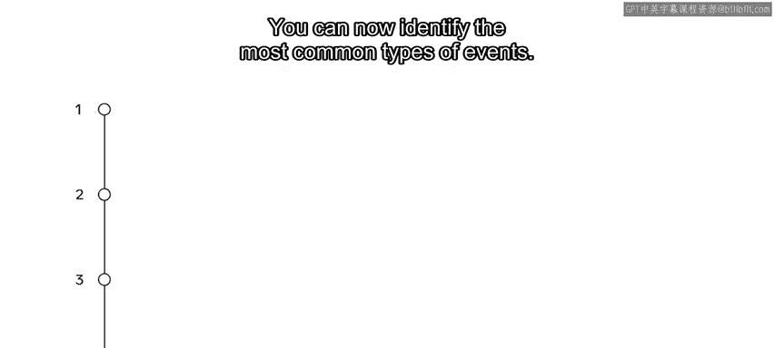

## 第二模块：数据与状态 📊

接下来，我们开始了专注于React中数据和状态角色的第二模块。

在本模块的第一课，你学习了动态事件及其处理方法。

你现在可以：
*   识别最常见的事件类型。
*   在代码中使用一些常用的事件处理器。
*   使用不同类型的语法编写事件处理器。
*   演示对用户触发事件概念的理解。

随后，你学习了数据与事件之间的关系。

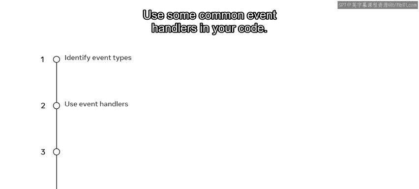

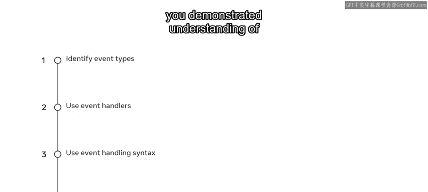

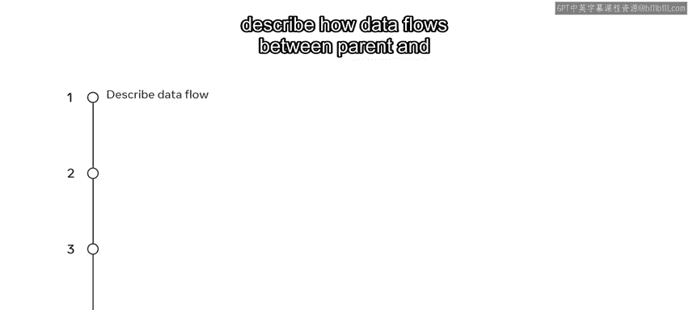

因此，你现在可以：
*   描述数据如何在父组件和子组件之间流动。
*   解释React中**状态（state）**的概念及其管理方式。
*   了解**Hooks**，并知道可以使用它们来扩展状态的功能。
*   识别有状态组件和无状态组件的一些常见用例。

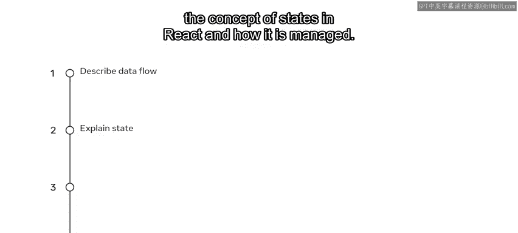

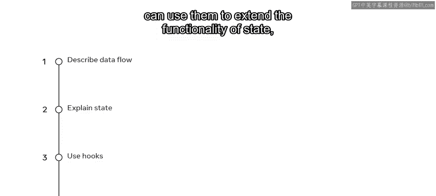

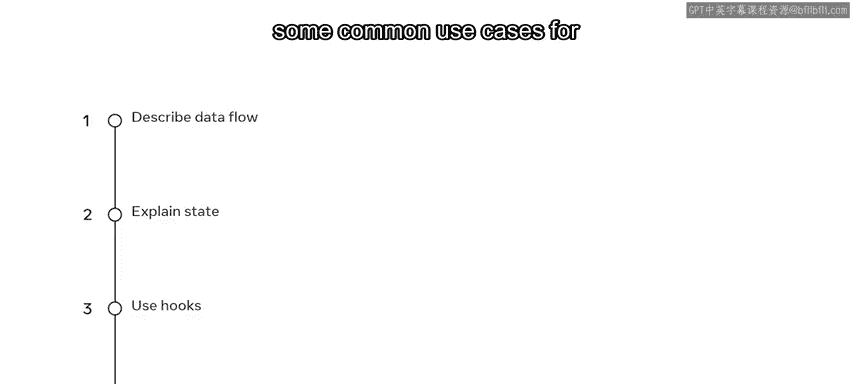

## 第三模块：导航、更新与资源 🗺️

在第三模块中，你学习了React中的导航、更新和资源。

通过完成第一课，你现在可以：
*   识别网站上的基本导航类型。
*   在React Router库中创建基本的导航路由。
*   解释如何有条件地渲染组件。
*   使用几种不同的方法来设置条件渲染逻辑。

在本模块的最后一课，你探索了React中的资源及其使用方法。

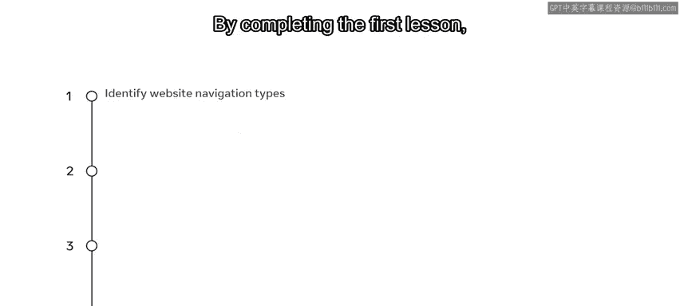

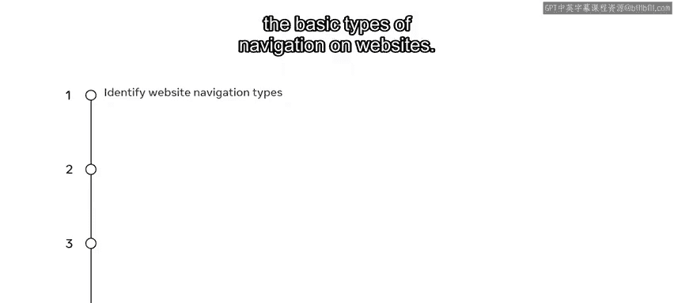

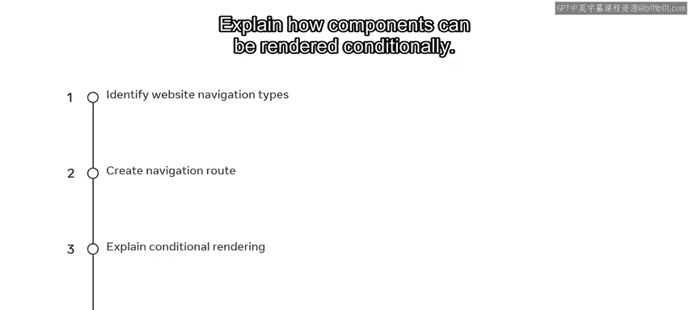

你现在可以：
*   解释什么是资源以及存储它们的最佳方式。
*   使用嵌入在数据文件中的资源。
*   在组件中使用音频和视频资源。

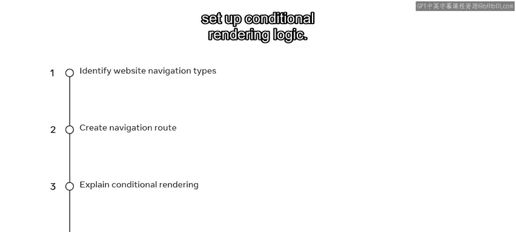

---

## 总结 🎉

本节课中，我们一起回顾了React基础课程的全部关键内容。我们从React简介开始，逐步深入到组件创建、数据流与状态管理，最后涵盖了导航和资源使用。你已经掌握了构建React应用的基础知识。课程回顾到此结束，现在是时候在分级评估中尝试运用你所学的知识了。祝你顺利！