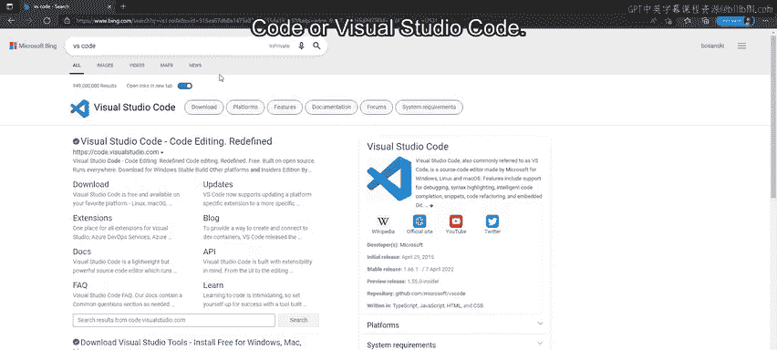
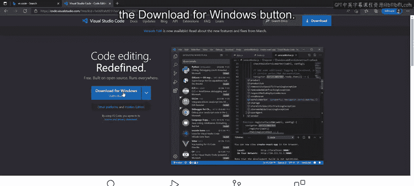
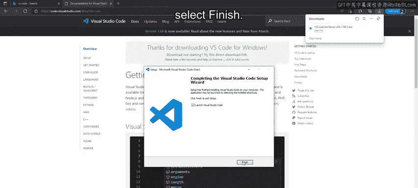
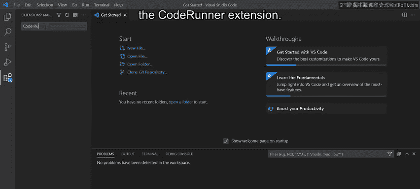
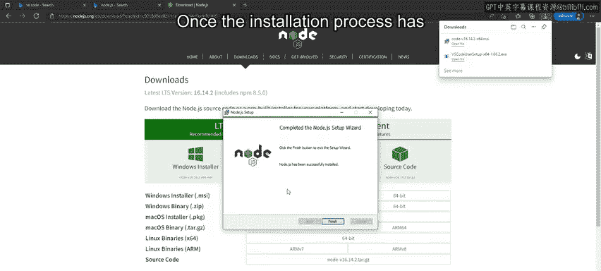
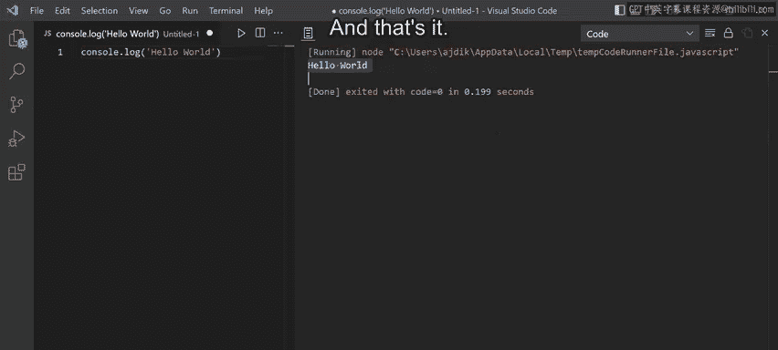

# 41：设置 VS 代码 🛠️

在本节课中，我们将学习如何为 JavaScript 开发设置必要的软件环境。具体来说，我们将安装 Visual Studio Code 编辑器、Node.js 运行时以及一个名为 Code Runner 的扩展。完成设置后，你将能够创建并运行一个简单的 JavaScript 文件。

---

## 下载与安装 VS Code



首先，我们需要获取并安装代码编辑器 Visual Studio Code。



1.  打开浏览器中的搜索引擎，搜索“VS code”或“Visual Studio Code”。
2.  点击第一个链接，进入官方网站 `code.visualstudio.com`。
3.  在网站主页上，选择“Download for Windows”按钮。
4.  下载完成后，点击文件开始安装过程。
5.  阅读并同意许可协议，然后点击“下一步”。
6.  接受默认的安装目标位置和开始菜单文件夹。
7.  在“选择其他任务”页面，建议勾选以下选项：
    *   创建桌面快捷方式
    *   将“通过 Code 打开”操作添加到 Windows 文件资源管理器上下文菜单
    *   将“通过 Code 打开”操作添加到 Windows 文件资源管理器目录上下文菜单
8.  点击“下一步”，然后点击“安装”。
9.  安装完成后，勾选“启动 Visual Studio Code”并点击“完成”。

VS Code 程序将在新窗口中打开，并显示“开始”页面。

---

## 安装 Code Runner 扩展



上一节我们安装了 VS Code 编辑器，本节中我们来看看如何为其添加一个能快速运行代码的扩展。

1.  在 VS Code 窗口的最左侧，点击最底部的图标以打开扩展面板。
2.  在扩展面板的搜索框中，输入“code runner”进行搜索。
3.  从搜索结果中找到“Code Runner”扩展，点击“安装”按钮。



---

## 安装 Node.js

为了能够运行 JavaScript 代码，我们还需要安装 Node.js 运行时环境。



1.  返回浏览器，搜索“node.js”。
2.  访问官方网站 `nodejs.org`。
3.  点击直接的下载链接，确保下载的是 Windows 版本。
4.  下载完成后，点击“打开文件”启动 Node.js 安装向导。
5.  点击“下一步”，接受许可协议。
6.  点击“安装”开始安装过程。
7.  安装完成后，点击“完成”关闭安装向导。

---

## 配置 VS Code 与运行代码

现在，所有必要的软件都已安装完毕。让我们回到 VS Code 进行最终配置并运行我们的第一段 JavaScript 代码。

首先，确认 Code Runner 扩展已安装完成。你可以在扩展面板看到“此扩展已在全局启用”的提示信息。

接下来，我们创建一个 JavaScript 文件并运行它：

1.  在 VS Code 左侧，双击“资源管理器”区域中的“文件”标签页，或通过“文件”菜单选择“新建文件”。
2.  点击右下角的“选择语言模式”，然后从列表中选择“JavaScript”。你也可以在搜索框中输入“JS”来快速筛选。
3.  关闭扩展面板，点击顶部菜单栏的“查看”，选择“终端”以打开终端面板。
4.  如果需要清空终端，可以输入命令 `clear` 并按回车键。
5.  将鼠标悬停在终端面板的标题栏上，点击并拖动到窗口右侧，将其停靠在右边。
6.  现在，在新创建的 JavaScript 文件中，输入以下代码：
    ```javascript
    console.log('Hello World');
    ```
    在这段代码中，`console.log()` 是一个 JavaScript 函数，用于将括号内的信息输出到控制台。
7.  要运行这段代码，可以点击编辑器右上角的“播放”图标（由 Code Runner 提供），或者使用快捷键 `Ctrl + Alt + N`。
8.  运行后，“Hello World”这行文字将出现在右侧的输出面板中。

---



## 总结

本节课中，我们一起学习了如何为 Windows 操作系统设置 JavaScript 开发环境。你掌握了安装 Visual Studio Code 编辑器、Node.js 运行时和 Code Runner 扩展的步骤。同时，你也学会了在 VS Code 中创建新的 JavaScript 文件，并使用 Code Runner 扩展来运行文件。最后，我们通过 `console.log(‘Hello World’)` 这行代码，实践了如何向控制台输出信息。现在，你的开发环境已经准备就绪，可以开始编写 JavaScript 代码了。