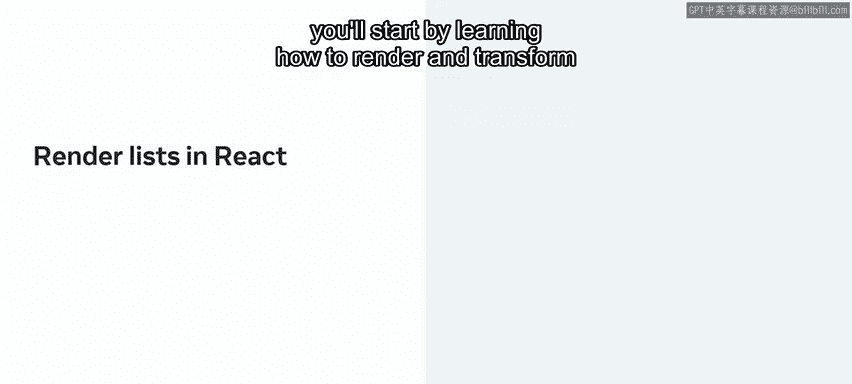
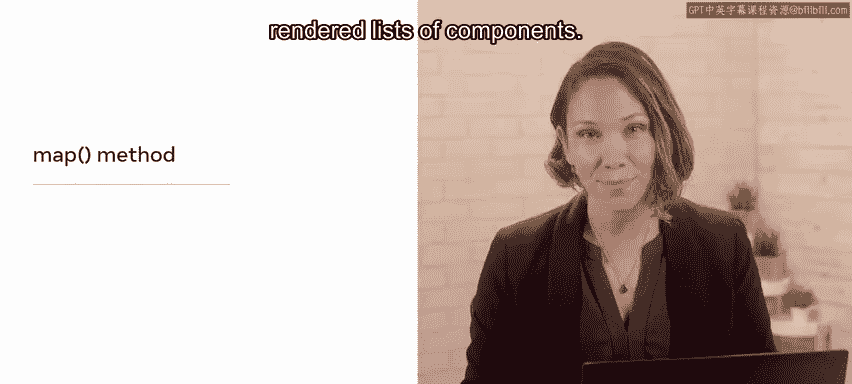
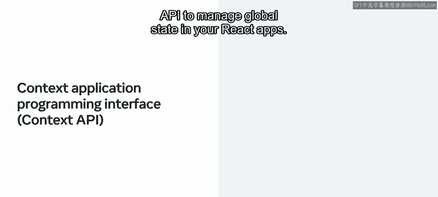
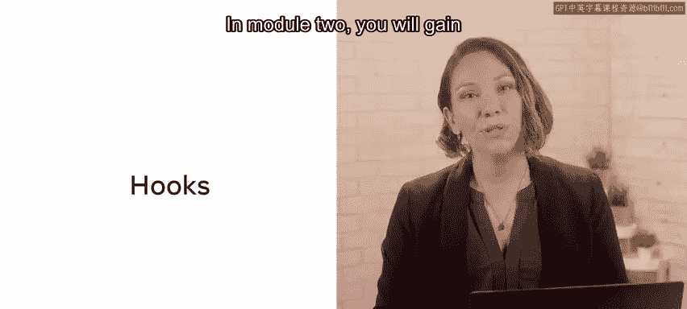
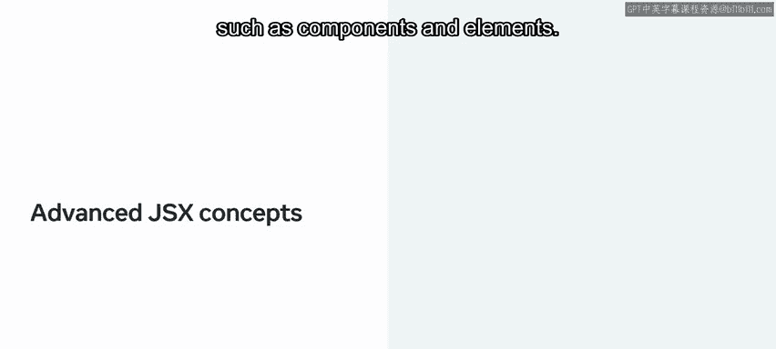
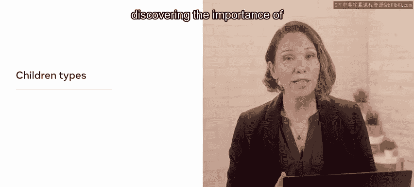

# 42：0_简介

## 概述 📋

在本节课中，我们将要学习《Meta前端开发（React/UI、UX/毕业项目/代码审查）》系列课程中，关于高级React概念的简介。本课程是React基础课程的延续，旨在深入探讨更复杂的React主题。

## 课程内容概览

上一节我们介绍了本课程的整体定位，本节中我们来看看课程将涵盖的具体模块和核心技能。

以下是本课程将学习的几个关键模块及其主要内容：

*   **模块一：列表、表单与状态管理**
    *   学习如何使用`map`方法渲染和转换列表。
    *   理解列表转换中不可或缺的`key`标识符。
    *   深入学习受控组件，重点是创建受控表单组件并实现一个反馈表单。
    *   复习props和state的知识。
    *   探索在某些情况下，React Context作为局部状态管理的可行替代方案。
    *   通过实际例子学习使用Context API来管理React应用中的全局状态。

*   **模块二：深入理解Hooks**
    *   学习React Hooks的用途和使用目的。
    *   掌握在React中使用Hooks的规则。
    *   学习如何在React中构建自定义Hooks。
    *   例如，你将学习`useState`、`useEffect`和`useReducer`等Hooks的用途及使用方法。

*   **模块三：高级JSX概念与性能优化**
    *   介绍与React中使用的JSX相关的各种高级概念，例如组件和元素。
    *   探索JSX中的`children`类型。
    *   发现组件组合和`children`属性的重要性。
    *   学习如何在JSX中操作`children`以及React中的扩展运算符。
    *   介绍创建高阶组件和渲染属性的过程与目的，从横切关注点开始。
    *   涵盖React应用性能优化、测试与调试等重要主题。
    *   学习使用React测试库编写集成测试，重点测试表单行为并探索测试的实际应用。

在整个学习过程中，你将通过一个名为“Little Lemon”的餐厅实例，实践基于理论概念的实际例子，并参与活动来测试你的知识和技能。

在最后一个模块中，你将有机会在一个实验项目中展示你的学习成果和高级React技能，即编写你自己的作品集应用。你还将通过一个分级评估来展示你对这些主题的掌握程度。

## 总结 🎯

本节课中我们一起学习了高级React课程的整体框架和内容规划。本课程将从列表渲染、表单处理、状态管理进阶到Hooks的深入使用，再到高级JSX模式、性能优化与测试，最终通过实践项目巩固所学。希望你对即将开始的学习旅程充满期待，让我们开始吧。