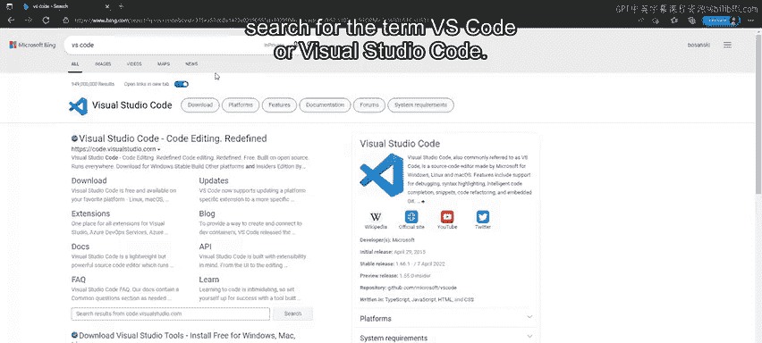
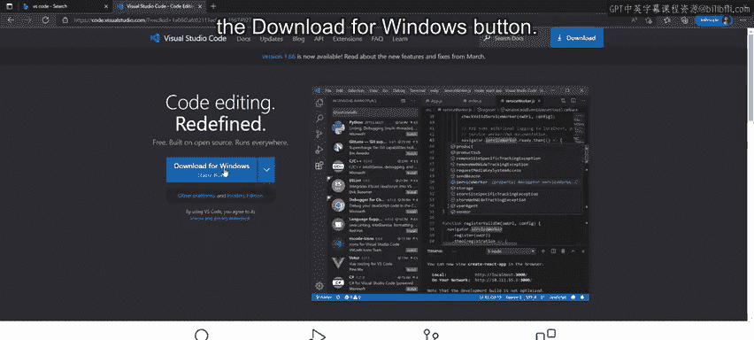
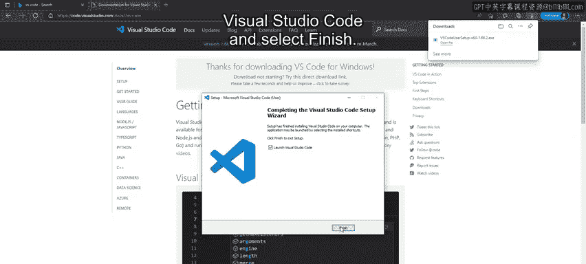
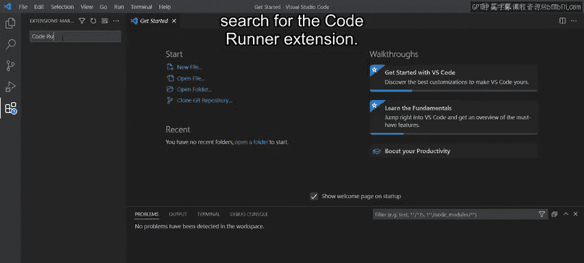
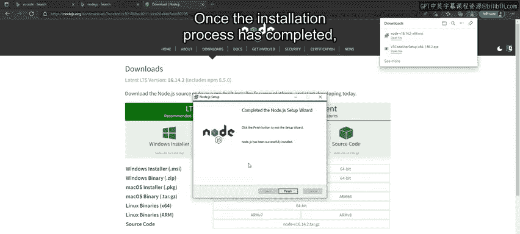
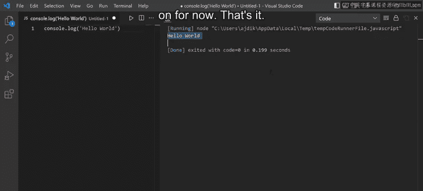

# 44：设置 VS Code（可选）🛠️

在本节课中，我们将学习如何为JavaScript开发设置必要的软件环境。具体来说，我们将安装Visual Studio Code编辑器、Node.js运行时以及一个名为Code Runner的扩展插件。完成设置后，你将能够创建并运行一个简单的JavaScript文件。

---

## 下载与安装 VS Code



首先，我们需要获取并安装代码编辑器Visual Studio Code（简称VS Code）。



1.  打开你的浏览器，使用搜索引擎搜索“VS Code”或“Visual Studio Code”。
2.  点击搜索结果中的第一个链接，进入官方网站 `code.visualstudio.com`。
3.  在网站主页上，点击“Download for Windows”按钮。
4.  下载完成后，点击下载的文件开始安装。
5.  阅读并同意许可协议，点击“Next”。
6.  接受默认的安装路径和开始菜单文件夹。
7.  在“选择其他任务”界面，建议勾选以下选项：
    *   创建桌面快捷方式
    *   将“通过Code打开”操作添加到Windows文件资源管理器上下文菜单
    *   将“通过Code打开”操作添加到Windows文件资源管理器目录上下文菜单
8.  点击“Next”，然后点击“Install”开始安装。
9.  安装完成后，勾选“启动Visual Studio Code”并点击“Finish”。

此时，VS Code将会启动并显示“开始”页面。

---

## 安装 Code Runner 扩展

上一节我们成功安装了VS Code，本节中我们来看看如何为其添加一个能快速运行代码的扩展。

1.  在VS Code窗口的最左侧，点击最底部的图标（方块形状）以打开“扩展”面板。
2.  在扩展市场的搜索框中，输入“Code Runner”进行搜索。
3.  在搜索结果中找到“Code Runner”扩展，点击“Install”按钮进行安装。



安装过程中，扩展面板会显示进度。安装完成后，通常会看到“此扩展已在全局启用”的提示信息。



---

## 安装 Node.js

为了能够运行JavaScript代码，我们还需要安装Node.js运行时环境。

1.  返回浏览器，搜索“Node.js”。
2.  访问官方网站 `nodejs.org`。
3.  点击直接的下载链接，确保下载的是Windows版本。
4.  下载完成后，点击“打开文件”启动Node.js安装向导。
5.  点击“Next”，阅读并接受许可协议。
6.  点击“Install”开始安装过程。
7.  安装完成后，点击“Finish”关闭安装向导。



---

## 创建并运行你的第一个JavaScript文件

现在所有必要的工具都已就绪，让我们来创建并运行一个简单的JavaScript程序。

以下是配置工作区和编写代码的步骤：

1.  在VS Code中，点击左侧活动栏的“资源管理器”图标（或使用快捷键 `Ctrl+Shift+E`）。
2.  点击“打开文件夹”选择一个项目文件夹，或者直接点击“新建文件”图标。
3.  将新文件命名为 `hello.js`。VS Code通常会根据 `.js` 后缀自动识别为JavaScript文件。如果没有，你可以点击右下角的“选择语言模式”，然后搜索并选择“JavaScript”。
4.  在新文件中输入以下代码：
    ```javascript
    console.log('Hello World');
    ```
    这行代码的作用是向控制台输出一条信息。`console.log()` 是JavaScript中的一个内置函数，用于在控制台（通常是终端或开发者工具）打印信息。
5.  要运行这段代码，你可以点击编辑器右上角的“播放”按钮（由Code Runner扩展提供），或者使用快捷键 `Ctrl+Alt+N`。
6.  代码运行后，输出结果会显示在VS Code底部的“输出”面板中。你应该能看到“Hello World”这行文字。

---

## 调整工作区布局（可选）

为了使开发体验更舒适，你可以调整VS Code的界面布局。

1.  点击顶部菜单栏的“查看”，选择“终端”，或使用快捷键 `` Ctrl+` `` 打开集成终端。
2.  若要清理终端屏幕，可以输入命令 `cls` 并按回车键。
3.  你可以拖动终端面板的标题栏，将其停靠在窗口的右侧。
4.  同样，你也可以拖动面板之间的分隔线来调整它们的大小。



---

本节课中我们一起学习了如何为Windows系统设置完整的JavaScript开发环境。你成功安装了Visual Studio Code编辑器、Node.js运行时以及Code Runner扩展。现在，你能够创建新的JavaScript文件，并使用Code Runner扩展来运行代码，同时也了解了 `console.log()` 函数的基本用途。准备工作已完成，可以开始愉快的编程之旅了。🚀