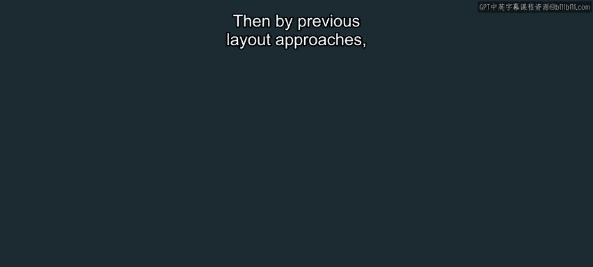
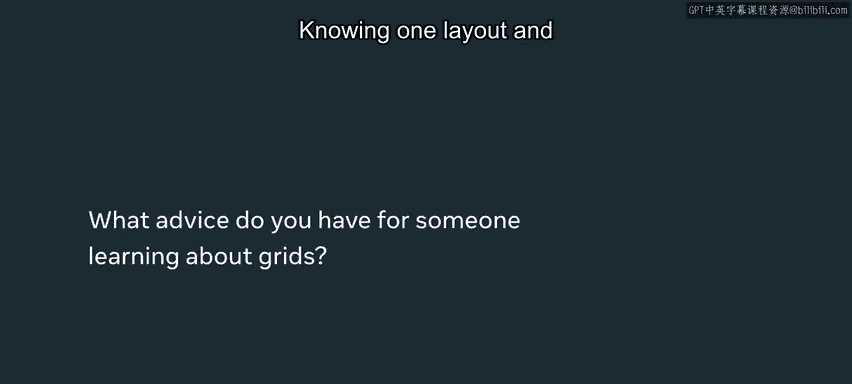

# 45：网格布局

## 概述

在本节课中，我们将要学习CSS网格布局。这是一种强大的CSS布局规范，能够帮助开发者以网格形式排列网页元素。我们将了解其基本概念、优势以及如何在实际项目中应用它来创建响应式且结构清晰的界面。

## 网格布局简介

上一节我们介绍了前端开发中布局的重要性。本节中我们来看看一种专门用于解决复杂布局问题的工具：CSS网格布局。

CSS网格布局是一种CSS规范，它允许你将项目排列在网格中。在过去，实现复杂的网格布局是一项非常困难的任务。使用网格布局，你可以直接指定某个项目位于网格的特定部分、特定的行或列。

**核心概念公式**：`display: grid;`

## 网格布局的优势

了解其定义后，我们来看看为什么网格布局如此有用。它主要解决了响应式设计和布局计算两大难题。

CSS网格布局能帮助你构建更具响应性的应用程序。与之前需要大量JavaScript计算来获取图像宽度、高度和定位的布局方法相比，网格布局简化了这一过程。

使用CSS网格，通常只需一行代码就能实现高性能、响应式且可靠的布局。

## 网格布局的实际应用

理解了优势，现在让我们看看它在实际网站构建中是如何被使用的。

在构建网站时，你通常会将多种不同的布局组合在一起。例如，你可能在某个位置使用基于表格的响应式网格布局，而在另一个位置使用包含嵌套网格的其他布局。

学习如何排列项目至关重要，这使你能够以灵活的方式构建应用并定义其布局。例如，你可以指定一个元素在作为页脚时出现在屏幕底部，或作为标签栏时出现在屏幕顶部。

## 学习网格布局的意义

那么，为什么值得花时间学习网格布局呢？以下是几个关键原因。

大多数网站都可以简化为网格结构。深入理解一种布局的工作原理，能够让你更容易地掌握未来可能需要的其他布局技术。

从一种布局开始并扎实掌握，是学习其他布局引擎的绝佳基础。即使你未来想从Web开发扩展到iOS或Android平台，它们也拥有各自的布局引擎，此时你已建立的核心概念将大有裨益。

## 总结

本节课中我们一起学习了CSS网格布局。我们了解到它是一种强大的CSS规范，能够简化复杂网格结构的创建，并提升应用的响应性。更重要的是，掌握网格布局为你打下了一个坚实的基础，你可以凭借这个基础去学习其他布局规范，并构建下一代应用程序。

希望你现在对如何在应用中使用网格布局及其用处有了良好的理解。请记住，它只是浏览器中可用的更广泛的布局规范集合中的一员。