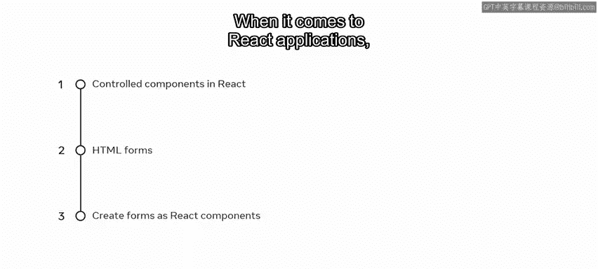
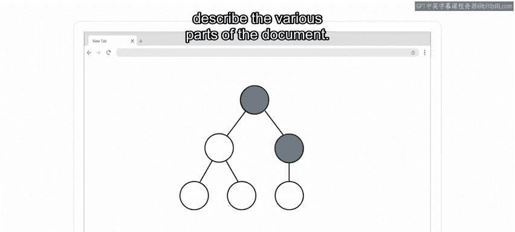
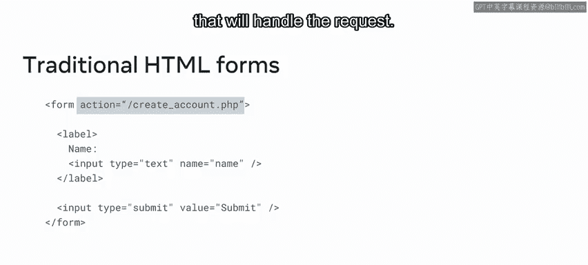
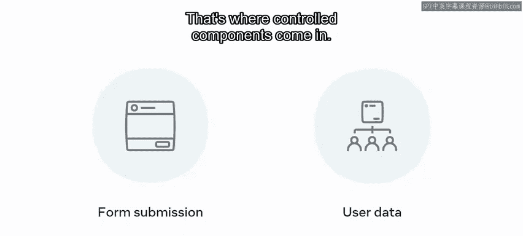
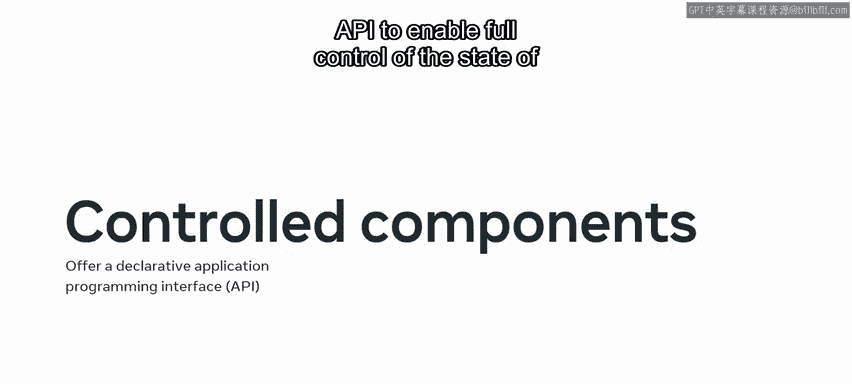
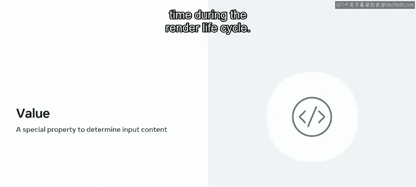
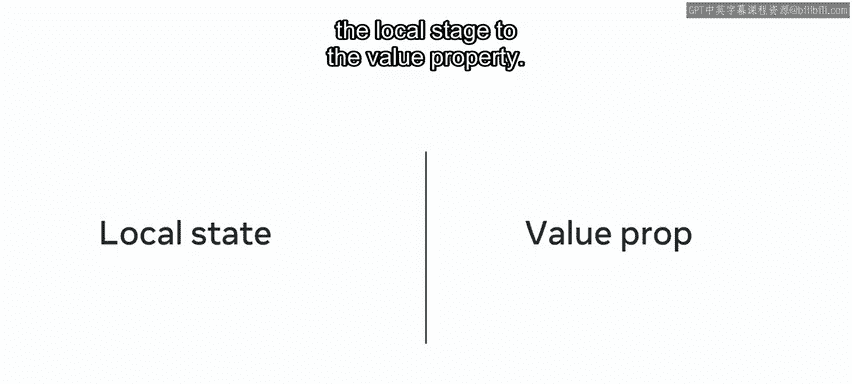
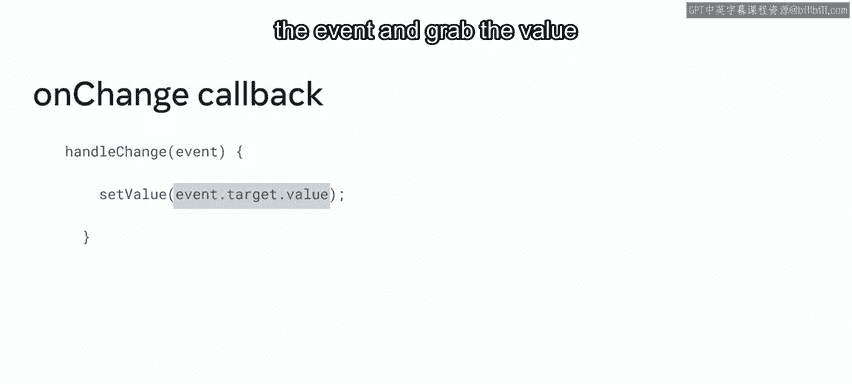
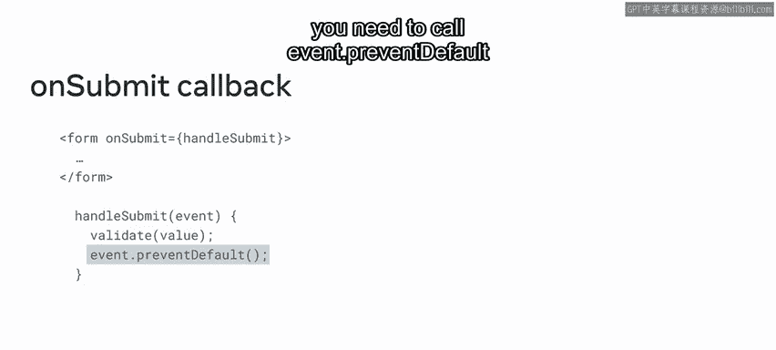

# 50：什么是受控组件 📝

在本节课中，我们将学习React中一个重要的概念——**受控组件**。我们将了解它是什么，为什么需要它，以及如何在表单处理中使用它。通过本教程，你将掌握如何让React完全控制表单元素的状态。

---

当你在互联网上浏览时，有很大概率会遇到表单。即使你没有意识到，从简单的电子邮件输入和订阅新闻通讯，到更复杂的表单，例如在你最喜欢的社交媒体平台上创建账户，表单无处不在。因此，你可能会发现自己需要经常在应用程序中实现表单。

## HTML表单与React表单的区别



上一节我们提到了表单的普遍性。本节中，我们来看看React应用中的表单与传统HTML表单有何不同。



在React应用中，HTML表单的工作方式与其他DOM元素不同。你可能还记得，DOM是一个逻辑上的树状结构，代表HTML文档，它使用节点来描述文档的各个部分。



传统的HTML表单在DOM内部保持一些内部状态，并且在提交时具有一些默认行为。这通常通过`action`属性完成，该属性指向将处理请求的端点。

但是，如果你想要更精细的控制级别呢？例如，小柠檬餐厅的顾客可以通过网站上的表单预订餐桌。想象一下，如果有一个函数可以处理表单的提交，并访问用户输入到其中的数据。

## 什么是受控组件？🎯

这就是受控组件发挥作用的地方。受控组件是一组组件，它们提供了一个声明式的应用程序编程接口（API），允许你在任何时间点使用React状态完全控制表单元素的状态，而不是依赖于DOM元素的原生状态。React状态成为**单一数据源**，始终控制着你表单元素的显示值。

实现这种状态委托的方式是通过`value`属性。`value`是React添加到大多数表单元素的一个特殊属性，用于在渲染生命周期的任何时间点确定输入内容。因此，为了创建一个受控组件，你需要结合使用本地状态和`value`属性。





## 如何构建受控组件 🛠️

了解了受控组件的定义后，现在我们来具体看看如何构建一个。

最初，你将本地状态分配给`value`属性。但是，你如何从输入框中输入的每个新字符获取更新呢？



为此，你需要第二个属性来完成受控组件的设计：`onChange`回调函数。`onChange`回调接收一个`event`参数，这是一个表示刚刚发生动作的事件对象，类似于DOM元素上的事件。为了从每次按键获取新值，你需要从事件中访问`target`属性，并从该对象中获取`value`，它是一个字符串。



以下是构建受控输入组件的核心代码示例：

```jsx
import { useState } from 'react';

function ControlledInput() {
  const [inputValue, setInputValue] = useState('');

  const handleChange = (event) => {
    setInputValue(event.target.value);
  };

  return (
    <input
      type="text"
      value={inputValue}
      onChange={handleChange}
    />
  );
}
```



## 处理表单提交 ✅

最后，为了在表单提交时能控制表单值，你可以在表单HTML元素上使用`onSubmit`属性。`onSubmit`回调也接收一个类似DOM的事件作为参数。在那里，你可以访问你的表单值，以执行提交前必须进行的任何所需逻辑，例如验证输入值。此外，如果你想阻止默认的HTML表单行为，你需要在`onSubmit`回调内部调用`event.preventDefault()`。

以下是处理表单提交的示例：



```jsx
function ControlledForm() {
  const [formData, setFormData] = useState({ email: '' });

  const handleChange = (event) => {
    setFormData({ ...formData, [event.target.name]: event.target.value });
  };

  const handleSubmit = (event) => {
    event.preventDefault(); // 阻止默认提交行为
    console.log('提交的数据：', formData);
    // 在这里执行验证或发送数据到服务器等逻辑
  };

  return (
    <form onSubmit={handleSubmit}>
      <input
        type="email"
        name="email"
        value={formData.email}
        onChange={handleChange}
      />
      <button type="submit">提交</button>
    </form>
  );
}
```

---

## 总结 📋

本节课中，我们一起学习了React中**受控组件**的概念及其在表单处理中的应用。你探索了HTML表单的基本概念，并了解了如何将表单创建为React组件。

你已经掌握了一种称为“受控组件”的技术，它使React能够成为表单输入状态的单一数据源。React提供了大多数输入类型的受控版本，并推荐使用受控组件来实现表单。

然而，请记住，仍然有一些表单元素保持**非受控**状态，类似于它们的DOM对应物。随着你学习的深入，你将更深入地了解受控和非受控表单元素。